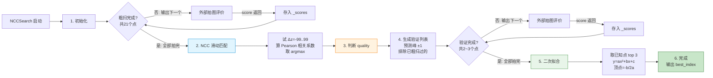

# NCC 模板匹配搜索流程图

## 验证环节详解

以 0729 数据为例，粗扫 21 个点、NCC 预测峰=68：

| 步骤 | 操作 | 说明 |
|---|---|---|
| 1 | 生成候选列表 [67, 68, 69] | 预测峰 ±1 |
| 2 | 排除已评价的 68 | 粗扫时 step=5，index=68 是 65→70 之间但 68 不在粗扫列表中... |
| | 实际 0729 粗扫位置: 0,5,10,...,95,99 | 68 不在其中 → 不需要排除 |
| 3 | 验证列表 = [67, 68, 69] | 3 个点都需拍图 |
| 4 | 拍 67 → score=4582 → 存入 | |
| 5 | 拍 68 → score=5659 → 存入 | 最高分 |
| 6 | 拍 69 → score=5495 → 存入 | |
| 7 | 验证完成 → 进入二次拟合 | |

> 如果粗扫步长=10 且粗扫点包含 70，则验证列表 [67,68,69] 中 68 和 70 以外的都需要拍。可能只有 2 个点。
