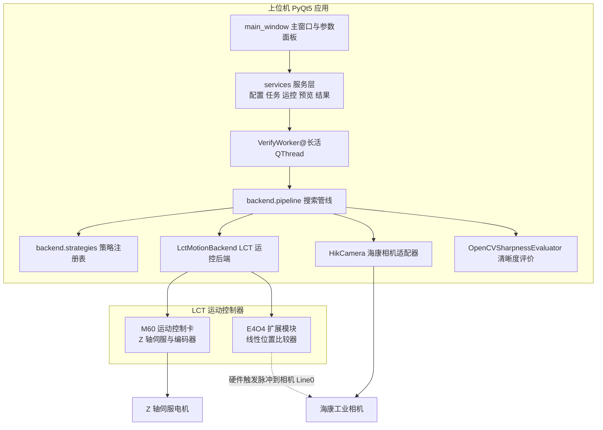
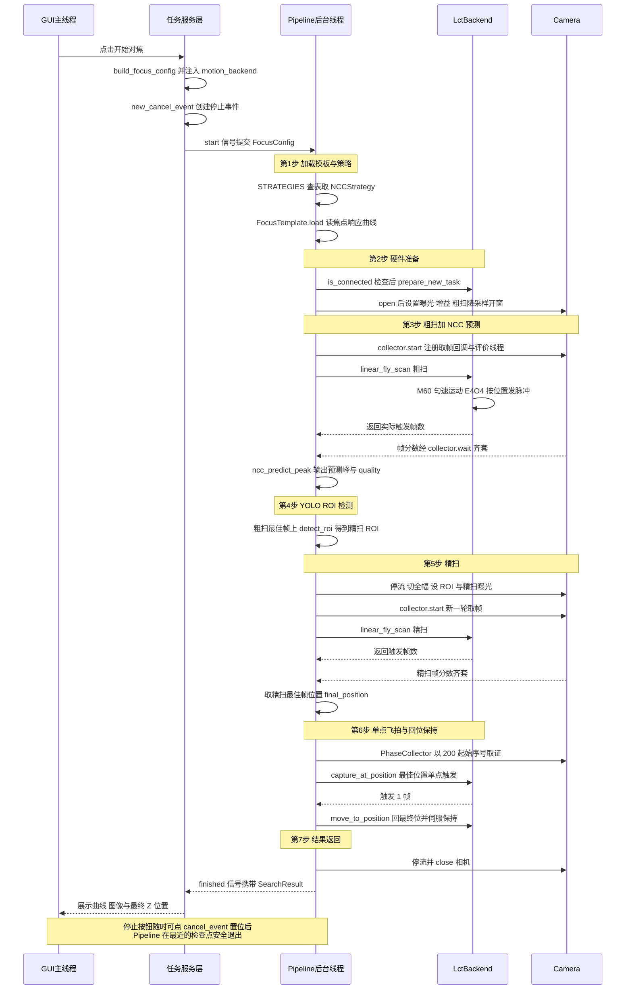

# 01-系统总览与主链路

本章是全书总纲。读完本章你会知道：

- Autofocus 要解决什么问题，为什么选择"飞拍 + 模板匹配"这条技术路线；
- 软硬件如何连接：GUI → 管线 → LCT 运控（M60 + E4O4）+ 海康相机；
- 一次 NCC 对焦任务从点击按钮到输出结果的**端到端总时序图**（全手册唯一一张）；
- 七步主流程每一步的目的与关键调用，后续章节分别在哪里展开；
- 哪些代码是遗留/实验品，读代码时可以直接跳过；
- 贯穿全系统的几条硬性约定（帧位换算、帧序号分段、丢帧即失败、取消机制等）。

---

## 1. 系统使命与工作原理

**使命：工件高度随机变化时，用最少的采图次数找到最佳对焦 Z 位置，并把 Z 轴驱动到位保持。**

系统工作在显微视觉场景：工件每次上料的高度不可预测，物面到镜头的离焦量随之漂移。朴素做法是对全行程做等步长扫描（每档停轴拍一张），采图次数 = 行程 / 步距，动辄数百帧、耗时数十秒。Autofocus 的核心思路是**用先验知识减少采图**：

1. **离线标定**：对同一种工件做一次全扫，得到"Z 位置 → 清晰度"的焦点响应曲线，保存为模板（`FocusTemplate`）；
2. **在线粗扫 + 模板匹配**：换一件同种工件后，只做一次大步长粗扫，把粗扫曲线与模板曲线做 NCC 互相关平移匹配，直接预测出真实峰位（算法原理见 `app/docs/NCC模板匹配对焦搜索v1实现方案.md`）；
3. **小范围精扫**：在预测峰 ± 半宽内做小步距精扫，锁定最佳帧；
4. **单点取证 + 回位**：在最佳位置单点飞拍一张最终图，再回到该位置伺服保持，供下游成像使用。

**【飞拍模式】** 是上述一切的性能前提：Z 轴**不停轴**，以受控速度匀速穿过扫描区间；E4O4 模块内置线性位置比较器，按编码器位置每前进一个步距就输出一个硬件脉冲触发相机曝光。运动连续、触发精确，一次扫描的耗时只取决于行程和速度，而不是帧数 × 单帧曝光周期。

失败的兜底也来自模板：当粗扫曲线与模板匹配度低（`quality=mismatch`）或预测峰贴边（`quality=boundary`）时，精扫区间降级为以粗扫峰为中心、总宽 2 个粗扫步距的窗口——峰在内部时 ±1 个粗扫步距，峰贴粗扫端点时向内 2 个粗扫步距（app/backend/pipeline.py:53 compute_interval），保证任务仍能给出一个可信位置（注意 app/backend/pipeline.py:477 的降级日志写"±2×粗扫步距"，与函数实现不符，以实现为准）。

---

## 2. 软硬件拓扑

图 1-1 系统软硬件拓扑

要点：

| 组件 | 说明 |
| --- | --- |
| GUI 主线程 | `app/gui/main.py` 启动，`app/gui/main_window.py` 组装界面；只画界面，不做任何耗时操作 |
| services 服务层 | `app/gui/app/services/`，把 GUI 与后端隔开：配置构建、任务提交、运控连接、实时预览、结果呈现 |
| VerifyWorker | QObject，常驻于 FocusTaskService 持有的长活 QThread 中，任务是它领走的（app/gui/app/workers/verify_worker.py:14 VerifyWorker；app/gui/app/services/focus_task_service.py:64 _create_worker()） |
| backend.pipeline | 七步主流程编排，纯 Python，不 import Qt |
| LctMotionBackend | 封装 M60 运动控制卡与 E4O4 比较器（app/motion/lct/backend.py:20 LctMotionBackend） |
| HikCamera | 海康 MvSDK 适配器，负责枚举、开流、曝光/增益/开窗/降采样（app/camera/camera_adapter.py:42 HikCamera） |
| E4O4 → Line0 | E4O4 按"每前进一个步距输出一个脉冲"配置比较器；相机侧设为 Line0 硬件触发模式（app/camera/camera_adapter.py:829 set_trigger_mode），脉冲不经上位机软件 |

运控与相机是两条独立通道：上位机只对 M60 下达"起点、终点、速度"的运动指令、对 E4O4 下达"触发起点、终点、步距"的比较器配置；曝光时机完全由硬件脉冲决定。这是飞拍精度与节拍的根基，机制细节 → 详见《05-LCT运控接口调用手册》与《04-相机接口调用手册》。

---

## 3. 端到端总时序图

图 1-2 是全手册唯一一张端到端时序图，展示一次 **NCC 策略、real 模式**的对焦任务从点击到输出的完整链路。参与者"任务服务层"合并了 FocusRunService、FocusTaskService 与 VerifyWorker 三个 GUI 侧服务。

图 1-2 一次 NCC 对焦任务的端到端时序

时序图中的"任务服务层"内部展开（符号均已核实）：

1. FocusRunService 校验配置、注入运行期资源（app/gui/app/services/focus_run_service.py:40 FocusRunService.start，:53 注入 motion_backend，:107 注入 cancel_event）；
2. FocusTaskService 把任务提交给长活 QThread（app/gui/app/services/focus_task_service.py:107 FocusTaskService.start）；
3. VerifyWorker 在后台线程调用管线（app/gui/app/workers/verify_worker.py:49 VerifyWorker.run），经 app/verify_ncc_full.py:5 的再导出进入 backend.pipeline.run_search。

线程与取消机制的完整契约 → 详见《06-线程模型与并发契约》。

---

## 4. 七步流程概览

主流程入口是 app/backend/pipeline.py:265 run_search()。七步概览见表 1-1，每一步的逐行细节在 03 章。

表 1-1 run_search 七步流程概览

| 步骤 | 目的 | 主要调用 | 细节指向 |
| --- | --- | --- | --- |
| ① 模板与策略加载 | 按配置选定搜索策略，读入离线标定的焦点响应曲线模板 | app/backend/pipeline.py:268 STRATEGIES 查表；app/focus_template.py:102 FocusTemplate.load() | 03 章 |
| ② 硬件准备 | 确认运控已连接并复位任务态；相机开流、设曝光、粗扫降采样开窗 | app/motion/lct/backend.py:41 prepare_new_task()；app/camera/camera_adapter.py:54 open()；app/backend/camera_utils.py:180 set_coarse_frame() | 03 章（04/05 章接口） |
| ③ 策略预测（粗扫 + NCC） | 大步长飞扫全行程，与模板曲线互相关，预测真实峰位 | app/backend/strategies.py:36 SearchContext.coarse_scan()；app/backend/ncc.py:5 ncc_predict_peak() | 03 章 |
| ④ YOLO ROI 检测 | 在粗扫最佳帧上检测工件框，换算为传感器坐标 ROI；检测失败降级为居中固定 ROI | app/backend/detection.py:27 detect_roi()；app/backend/camera_utils.py:223 box_to_roi()、:252 fallback_roi() | 03 章 |
| ⑤ 精扫 | 在预测峰 ± 半宽区间小步距飞拍，锁定清晰度最佳帧 | app/backend/pipeline.py:507 run_phase(phase_name="fine", start_index=100) | 03 章 |
| ⑥ 单点飞拍 + 回位保持 | 最佳位置单点触发取证一张；随后回到该位置并伺服保持 | app/motion/lct/backend.py:668 capture_at_position()；app/motion/lct/backend.py:240 move_to_position() | 03 章（机制 05 章） |
| ⑦ 结果返回 | 组装类型化结果回传 GUI 展示 | app/backend/pipeline.py:670 返回 SearchResult；app/backend/result.py:8 SearchResult | 07 章 |

两点补充：

- 每个扫描阶段（粗扫/精扫）都由 app/backend/pipeline.py:74 run_phase() 统一执行"启动采集 → 飞拍 → 等帧 → 稳定期 → 严格张数校验"的闭环，任何一环失败该阶段立即中止并清理；
- `dl`（深度学习单帧）策略不走 NCC：第 ③ 步直接给出最终位置，跳过精扫（app/backend/pipeline.py:456 分支），验证计划见 `app/docs/深度学习单帧对焦验证计划.md`。

---

## 5. 主链路代码地图

表 1-2 主链路模块清单（按调用层次排列）

| 层 | 路径 | 职责 | 关键入口符号 |
| --- | --- | --- | --- |
| GUI 入口 | app/gui/main.py | 启动 Qt 应用与主窗口 | :18 main() |
| 主窗口 | app/gui/main_window.py | 界面组装、按钮绑定、结果落位 | :178 停止按钮绑定 request_cancel() |
| 状态控制 | app/gui/app/services/controller.py | 任务状态机与取消事件 | :11 AppController；:48 new_cancel_event()；:54 request_cancel() |
| 配置构建 | app/gui/app/services/config_service.py | 从界面收集参数构建 FocusConfig | :120 build_focus_config()（→ 07 章） |
| 任务启动 | app/gui/app/services/focus_run_service.py | 校验配置、注入运行期资源、提交任务 | :40 FocusRunService.start() |
| 任务线程 | app/gui/app/services/focus_task_service.py | 管理长活后台 QThread 的启停 | :19 FocusTaskService |
| 后台 Worker | app/gui/app/workers/verify_worker.py | 在后台线程执行管线并回发信号 | :14 VerifyWorker；:49 run() |
| 运控服务 | app/gui/app/services/motion_service.py | LCT 连接的连接/回零/伺服与生命周期 | :17 MotionService；:66 backend |
| 实时预览 | app/gui/app/services/live_view_service.py | 非任务期的相机实时预览 | （→ 02 章） |
| 结果呈现 | app/gui/app/services/result_presenter.py | 把 SearchResult 画到曲线与图像面板 | （→ 02 章） |
| 搜索管线 | app/backend/pipeline.py | 七步编排、阶段校验、异常清理 | :265 run_search()；:74 run_phase()；:754 run_calibrate() |
| 策略层 | app/backend/strategies.py | 策略注册表与策略基类、粗扫封装 | :150 STRATEGIES；:160 NCCStrategy；:36 SearchContext.coarse_scan() |
| NCC 预测 | app/backend/ncc.py | 粗扫曲线与模板的互相关平移匹配 | :5 ncc_predict_peak() |
| ROI 检测 | app/backend/detection.py | YOLO 检测与降级逻辑、模型单例 | :27 detect_roi() |
| 帧采集 | app/backend/collector.py | 相机回调收帧 + 评价线程 + 张数统计 | :32 PhaseCollector；:171 wait() |
| 相机工具 | app/backend/camera_utils.py | 开窗/降采样/ROI 对齐/帧位换算 | :138 set_full_frame()；:180 set_coarse_frame()；:280 frame_positions() |
| 结果类型 | app/backend/result.py | SearchResult / CalibrateResult 数据类 | :8 SearchResult；:28 CalibrateResult |
| 配置类型 | app/backend/config.py | FocusConfig：管线全程的唯一配置载体 | FocusConfig（→ 07 章） |
| 焦点模板 | app/focus_template.py | 焦点响应曲线的生成与 JSON 序列化 | :21 from_fullscan()；:102 load() |
| 运控后端 | app/motion/lct/backend.py | M60 + E4O4 的运动与比较器编排 | :20 LctMotionBackend；:429 linear_fly_scan()；:668 capture_at_position()；:240 move_to_position() |
| 运控底层 | app/motion/lct/m60_api.py、e4o4_api.py | 两块卡的 SDK 薄封装 | （→ 05 章） |
| 相机适配 | app/camera/camera_adapter.py | 海康 MvSDK 枚举/开流/参数/像素转换 | :42 HikCamera；:54 open()（→ 04 章） |
| 清晰度评价 | app/adapters/evaluator_opencv.py | Tenengrad 清晰度打分 | :8 OpenCVSharpnessEvaluator |
| 仿真硬件 | app/autofocus_sim.py | 假运控/假相机/假评价器 | :12 FakeMotionBackend（见第 8 节） |

---

## 6. 遗留与实验代码集中表

以下代码不在现行主链路上，读代码或检索符号时请先对照本表排除。全书其他章节不再逐个提及。

表 1-3 遗留与实验代码清单

| 文件或目录 | 性质（一句话） |
| --- | --- |
| app/autofocus_controller.py | v1 版 PLC 全扫编排器，被 backend.pipeline 取代（遗留，不在主链路） |
| app/capture_scan.py | 飞拍存图工具，用于离线标定采图（遗留，不在主链路） |
| app/verify_dl_hybrid.py | DL 混合方案验证脚本（遗留，不在主链路） |
| app/search/ | index 域状态机，离线算法验证与教学用（遗留，不在主链路） |
| app/focus_search.py | 离线搜索基准，含黄金分割法（遗留，不在主链路，算法见 `app/docs/黄金分割算法说明.md`） |
| app/backend/direct_fine.py | 单程精扫采集实验（实验，未接入主流程） |
| app/plc/ | 旧 PLC Modbus 客户端与协议；现行 LCT 路线不经 PLC（遗留，不在主链路） |
| app/gui/app/services/plc_service.py、dl_model_service.py、dl_model_load_service.py | GUI 遗留服务，代码已写好但主窗口未接线（遗留，不在主链路） |
| app/gui/app/workers/plc_connect_worker.py、dl_model_load_worker.py | 与上两项配套的 Worker（遗留，不在主链路） |
| app/autofocus_sim.py:134 FakePlcClient | 旧控制器的测试替身，仅为旧单测保留（遗留，不在主链路） |
| app/verify_dl_direction.py、verify_predModel.py、eval_by_defocus.py、eval_dlfocus.py、plot_template.py、prepare_dlfocus_dataset.py、train_dlfocus.py 等根目录脚本 | 一次性算法验证与数据准备脚本（遗留，不在主链路） |

---

## 7. 全局关键约定速查

以下约定贯穿主链路多个模块，改动任何一处前先通读对应条目。

1. **【飞拍含终点、不含起点】** 扫描跨度必须被步距整除，帧数 = 跨度 / 步距；E4O4 的触发起点 = 运动起点 + 编码器偏移 + 一个步距（app/motion/lct/backend.py:531 trigger_start 计算）。因此第 k 帧位置 = start + (k+1) × step（app/backend/camera_utils.py:280 frame_positions()）。NCC 模板峰 µm 公式里的"+1"正是这一约定的体现（app/backend/ncc.py:47）。机制 → 详见《05-LCT运控接口调用手册》。
2. **【帧序号分段】** 各阶段帧序号基线互不重叠：标定/粗扫 0、精扫 100、最终 200 起编（契约 → 详见《07-配置与数据契约》7.7）。序号用于保存文件名与预览信号，保证同批文件不互相覆盖。
3. **【丢帧即失败】** 评价队列只要因满而丢弃过一帧，本次扫描结果就不完整，PhaseCollector 立即失败返回（app/backend/collector.py:203 dropped 检查）；run_phase 在稳定期后还会做 processed == 触发数的严格校验（app/backend/pipeline.py:217）。系统宁可失败重试，不带缺口输出。线程细节 → 详见《06-线程模型与并发契约》。
4. **【cancel_event 贯穿】** GUI 停止按钮置位事件（app/gui/main_window.py:178 → app/gui/app/services/controller.py:54 request_cancel()），同一 Event 注入 FocusConfig（app/gui/app/services/focus_run_service.py:107），管线、采集器、运控后端在各自循环里轮询它并在最近的检查点安全退出。→ 详见《06-线程模型与并发契约》。
5. **【运控后端生命周期归 GUI】** LCT 连接由 GUI 的 MotionService 持有，pipeline 只借用：任务开始前检查 is_connected（app/backend/pipeline.py:335），任务结束（无论成败）不断开（app/backend/pipeline.py:752 注释）；异常时仅调用 cancel_current_motion 做运动安全清理（app/backend/pipeline.py:714）。
6. **【每阶段独立开停取流】** 每次 run_phase 自己启动并停止相机取流；ROI 检测等纯计算阶段不与相机回调并发（app/backend/strategies.py:76 粗扫结束即停流的注释说明）。→ 详见《03-搜索管线与策略》。
7. **【只允许正方向飞拍】** linear_fly_scan 要求 end > start 且跨度整除步距（app/motion/lct/backend.py:444 参数校验），反向或非整除直接抛错。→ 详见《05-LCT运控接口调用手册》。

---

## 8. 仿真模式

pipeline 内置 `sim` 分支，让你在没有相机 SDK、没有 M60/E4O4 轴卡的机器上离线跑通"粗扫 → NCC → 精扫 → 定位"的完整闭环：app/autofocus_sim.py 提供三个替身——:12 FakeMotionBackend（与 LctMotionBackend 同接口的假运控，linear_fly_scan 直接返回理论帧数）、:171 SimCamera（start_grabbing 后按固定间隔吐 n 张全零图）、:227 ScoreMapEvaluator（按调用顺序返回预置分数，忽略图像内容）。run_search 在 sim 分支用它们替换真硬件（app/backend/pipeline.py:320 组件选择），配合 app/backend/pipeline.py:45 build_sim_scores() 合成的单峰清晰度曲线即可全流程自测；GUI 里选"仿真"模式时任务同样走这条路径。仿真与真机的行为差异（如 YOLO 检测在 sim 下直接降级为居中 ROI）→ 详见《03-搜索管线与策略》。

---

## 建议阅读路线

- 想读懂"任务怎么被提交、界面怎么联动"→《02-应用启动与GUI服务层》；
- 想读懂七步流程的每一步 →《03-搜索管线与策略》；
- 要写相机相关代码 →《04-相机接口调用手册》；要写运动相关代码 →《05-LCT运控接口调用手册》；
- 排查卡死、丢帧、取消不生效 →《06-线程模型与并发契约》；
- 查配置字段、文件名、结果结构 →《07-配置与数据契约》。
