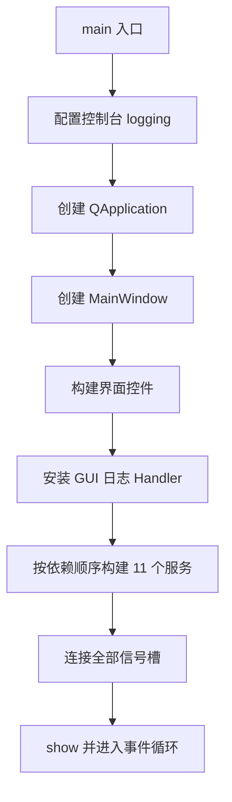
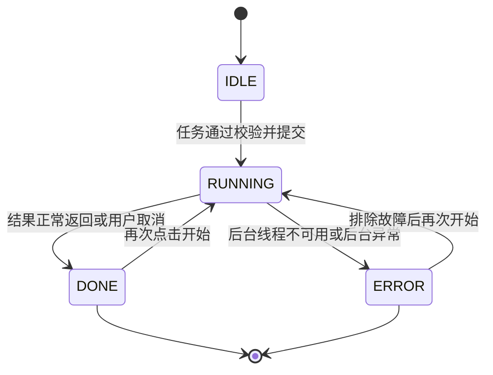
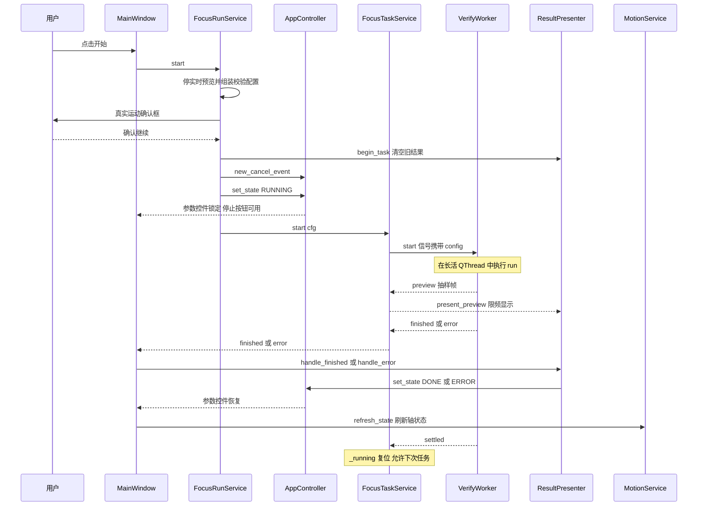

# 02-应用启动与GUI服务层

本章读完你会知道：

- 程序从 `app/gui/main.py` 到可交互主窗口的完整启动链，以及 MainWindow 构建了哪 11 个服务、按什么顺序构建；
- GUI 服务层如何分工：谁管状态、谁管配置、谁管任务、谁管运动、谁管关闭；
- AppController 的 IDLE/RUNNING/DONE/ERROR 状态机如何锁定参数控件、如何发放 cancel_event；
- FocusRunService 启动一次任务前做的七件事与全套校验清单；
- FocusTaskService 长活 QThread 模型、MotionService 的连接/命令双线程与后端认领协议；
- ApplicationShutdownService 的六步安全关闭顺序，以及为什么 HikCamera.shutdown() 必须放在最后。

本章只讲 GUI 层的组织方式。相机与运控的方法本身见《04-相机接口调用手册》《05-LCT运控接口调用手册》；线程与并发契约的完整推导见《06-线程模型与并发契约》。

---

## 2.1 启动链：从入口到可交互窗口

启动链一共四步，全部在 app/gui/main.py:18 main() 中：

| 步骤 | 代码 | 说明 |
| --- | --- | --- |
| 0. 路径与日志 | app/gui/main.py:10 sys.path 注入；app/gui/main.py:23 configure_console_logging() | 把项目根加入 sys.path，保证 `from gui...`、`from backend...` 可导入；入口统一配置 logging，业务模块只负责打日志 |
| 1. 创建 QApplication | app/gui/main.py:30 QApplication | 全进程唯一 Qt 实例 |
| 2. 创建主窗口 | app/gui/main.py:31 MainWindow | 构建界面与全部服务（见下文） |
| 3. 进入事件循环 | app/gui/main.py:33 app.exec_() | 窗口关闭后 sys.exit 退出 |

图 2-1 启动链流程

### MainWindow 的构建顺序

app/gui/main_window.py:52 __init__() 的构建顺序体现依赖关系：被依赖的服务先建。顺序为：

1. app/gui/main_window.py:57 _build_ui() —— 搭建参数面板、图像区、曲线面板、日志面板；
2. app/gui/main_window.py:59 install_qt_log_handler() —— 标准日志接入 GUI 日志窗口；
3. app/gui/main_window.py:68 AppController —— 状态机；
4. app/gui/main_window.py:76 CtLogger → app/gui/main_window.py:78 ResultPresenter —— 结果展示链；
5. app/gui/main_window.py:89 FocusTaskService —— 后台任务线程立即创建（长活 QThread）；
6. app/gui/main_window.py:91 DetectionModelService 并在 app/gui/main_window.py:94 调用 `load()` —— YOLO 启动即加载预热，避免任务开始时卡顿；
7. app/gui/main_window.py:96 LiveViewService → app/gui/main_window.py:103 ConfigService（并 `load()` 恢复 gui/config.json）→ app/gui/main_window.py:109 MotionService；
8. app/gui/main_window.py:123 FocusRunService —— 聚合上面所有服务；
9. app/gui/main_window.py:136 ApplicationShutdownService —— 关闭协调；
10. app/gui/main_window.py:145 _connect_signals() —— 最后统一接线。

【约定】服务之间的依赖全部通过构造参数注入（函数引用如 `motion_backend_fn`、`stroke_range_fn` 用 lambda 延迟求值），服务之间不互相 import，MainWindow 是唯一的装配点。新增服务时保持这一约定。

### 按钮接线一览

接线集中在 app/gui/main_window.py:154 _connect_signals()：

| 控件 | 目标 | 代码 |
| --- | --- | --- |
| 连接运动控制器按钮 | `_on_motion_connect`（构造运动配置后交给 MotionService.toggle） | app/gui/main_window.py:156 |
| 复位报警按钮 | `motion_service.clear_alarm()` | app/gui/main_window.py:159 |
| 伺服使能按钮 | `_on_motion_servo`（使能前二次确认） | app/gui/main_window.py:162 |
| 回原点按钮 | `_on_motion_home`（回零前二次确认） | app/gui/main_window.py:165 |
| 停止运动按钮 | `motion_service.stop_motion()` | app/gui/main_window.py:168 |
| 加载模板按钮 | `result_presenter.load_template()` | app/gui/main_window.py:171 |
| 开始按钮 | `focus_run_service.start()` | app/gui/main_window.py:174 |
| 实时预览按钮 | `_on_toggle_live_view` | app/gui/main_window.py:177 |
| 停止任务按钮 | `controller.request_cancel` | app/gui/main_window.py:178 |
| 任务 finished/error | `_on_focus_finished` / `_on_focus_error`（展示结果并刷新轴状态） | app/gui/main_window.py:180、app/gui/main_window.py:183 |
| 任务 preview | `result_presenter.present_preview` | app/gui/main_window.py:186 |
| 关闭重试信号 | `self.close`（QueuedConnection） | app/gui/main_window.py:189 |

三个二次确认对话框都在 MainWindow 侧：app/gui/main_window.py:213 _confirm_motion()（真实运动确认框，供 FocusRunService 注入复用）、app/gui/main_window.py:243 _on_motion_servo()（手动使能）、app/gui/main_window.py:263 _on_motion_home()（回零，展示当前位置与超时参数）。任务结束后的轴状态刷新见 app/gui/main_window.py:199 _on_focus_finished() 与 app/gui/main_window.py:206 _on_focus_error()：只要运控后端存在就调 `refresh_state()`。

---

## 2.2 服务清单总表

| 服务 | 文件 | 职责 | 关键信号或方法 |
| --- | --- | --- | --- |
| AppController | app/gui/app/services/controller.py | 应用状态机、参数控件锁定、cancel_event 发放 | `state`、`set_state()`、`new_cancel_event()` |
| ConfigService | app/gui/app/services/config_service.py | gui/config.json 双向读写、组装 FocusConfig 与 LctMotionConfig | `load()`、`save()`、`build_focus_config()`、`build_motion_config()` |
| FocusRunService | app/gui/app/services/focus_run_service.py | 任务启动编排：停预览、组装、校验、确认、注入资源、提交 | `start()` |
| FocusTaskService | app/gui/app/services/focus_task_service.py | 长活 QThread 与 VerifyWorker 生命周期、任务信号转发 | `preview`、`finished`、`error`、`settled` |
| VerifyWorker | app/gui/app/workers/verify_worker.py | 在后台线程执行 run_search / run_calibrate | `start`、`preview`、`finished`、`error`、`settled` |
| MotionService | app/gui/app/services/motion_service.py | 连接、复位、使能、回零、停止、状态刷新 | `settled`、`state_changed`、`backend` |
| LiveViewService | app/gui/app/services/live_view_service.py | 实时预览启停、限频显示 | `settled` |
| DetectionModelService | app/gui/app/services/detection_model_service.py | YOLO 模型加载与预热、持有模型对象 | `model`、`load()` |
| ResultPresenter | app/gui/app/services/result_presenter.py | 结果与过程预览转成日志、曲线、图像、状态栏 | `present_preview()`、`handle_finished()`、`handle_error()` |
| CtLogger | app/gui/app/services/ct_logger.py | CT 耗时字典分组格式化输出 | `log()` |
| QtLogHandler | app/gui/app/services/qt_log_handler.py | 标准 logging 转发到 GUI 日志面板 | `message`（内部信号） |
| ApplicationShutdownService | app/gui/app/services/application_shutdown_service.py | 按安全顺序关闭全部资源 | `retry_requested` |

四个 Worker（VerifyWorker、LiveViewWorker、MotionConnectWorker、MotionCommandWorker）都不含业务决策，只负责"在线程里跑一段代码 + 发信号"。线程归属与队列连接的完整规则见《06-线程模型与并发契约》。

---

## 2.3 AppController：应用状态机

app/gui/app/services/controller.py:11 AppController 是唯一的"应用在干什么"权威：

- 四个状态常量定义在 app/gui/app/services/controller.py:14～app/gui/app/services/controller.py:17：STATE_IDLE、STATE_RUNNING、STATE_DONE、STATE_ERROR；
- app/gui/app/services/controller.py:48 new_cancel_event() 为每个新任务创建独立的 `threading.Event`；任务启动时由 FocusRunService 调用，旧事件随之作废；
- app/gui/app/services/controller.py:54 request_cancel() 是停止按钮的槽：置位 cancel_event、禁用停止按钮防重复点击；
- app/gui/app/services/controller.py:64 cancel() 是静默版本，供关闭流程使用；
- app/gui/app/services/controller.py:70 set_state() 切换状态并同步控件可用性。

图 2-2 应用状态机

**参数锁定协议**（app/gui/app/services/controller.py:90～app/gui/app/services/controller.py:113）：

- 首次进入 RUNNING 时快照每个参数控件当时的启用状态存入 `_enabled_before_run`（例如搜索模式下"标定步距"本来就是禁用的）；
- RUNNING 期间全部参数控件强制禁用；
- 离开 RUNNING 时按快照逐个恢复，而不是一刀切全开——app/gui/app/services/controller.py:86 的注释说明了为什么重复 set_state(RUNNING) 不能覆盖快照；
- 三个总控按钮始终联动：开始按钮 = 非运行可用，停止按钮 = 仅运行可用，实时预览按钮 = 非运行可用（app/gui/app/services/controller.py:111～app/gui/app/services/controller.py:113）。

【约定】DONE 与 ERROR 之后状态机停在终态，不自动回 IDLE；下一次 set_state(RUNNING) 直接从终态迁移。UI 判断"是否在运行"一律读 `controller.state`，不要自行维护布尔标志。

cancel_event 在后端各阶段的检查点与安全退出语义见《06-线程模型与并发契约》。

---

## 2.4 FocusRunService：任务启动编排七件事

app/gui/app/services/focus_run_service.py:40 start() 是"开始"按钮的唯一入口。它在创建后台线程、连接相机和触发运动**之前**完成全部准备，任何一步失败都直接返回 False，不触碰状态机。七件事按序为：

| 序 | 动作 | 代码 |
| --- | --- | --- |
| 1 | 停实时预览；3 秒内未停完则拒绝启动 | app/gui/app/services/focus_run_service.py:43～app/gui/app/services/focus_run_service.py:47 |
| 2 | 从参数面板组装 FocusConfig | app/gui/app/services/focus_run_service.py:50，实现在 app/gui/app/services/config_service.py:120 build_focus_config() |
| 3 | 真实模式下注入 motion_backend（MotionService 拥有连接生命周期，任务只借用） | app/gui/app/services/focus_run_service.py:51～app/gui/app/services/focus_run_service.py:53 |
| 4 | 静态校验：errors 阻止启动，warnings 只提醒 | app/gui/app/services/focus_run_service.py:56，见 2.5 节 |
| 5 | 真实模式且未勾选跳过确认时弹真实运动确认框，拒绝则放弃 | app/gui/app/services/focus_run_service.py:68～app/gui/app/services/focus_run_service.py:87，确认框即 2.1 节的 `_confirm_motion` |
| 6 | 通过后清空上一轮展示（`result_presenter.begin_task`） | app/gui/app/services/focus_run_service.py:90 |
| 7 | 注入运行期资源并提交：`cfg.cancel_event = controller.new_cancel_event()`、`cfg.detect_model_obj = detection_model_service.model`、`set_state(RUNNING)`、`focus_task_service.start(cfg)`；提交失败则转 STATE_ERROR | app/gui/app/services/focus_run_service.py:107～app/gui/app/services/focus_run_service.py:117 |

两个设计意图值得注意：

- **校验先于确认框**：用户看到确认框时参数一定合法，不会出现"确认了才发现跨度非法"；
- **detect_model_obj 是预热后的现成对象**：YOLO 已在启动阶段由 DetectionModelService 加载并完成一次推理（见 2.8 节），任务线程拿到的模型不再付出首次加载与预热代价。

FocusConfig 的字段含义与字段→面板映射见《07-配置与数据契约》。

---

## 2.5 启动前校验清单

app/gui/app/services/focus_run_service.py:120 _validate_config() 返回 `(errors, warnings)`。校验按当前动作/策略先算出实际使用的起点、跨度、步距（app/gui/app/services/focus_run_service.py:135～app/gui/app/services/focus_run_service.py:164：标定用标定参数，NCC 搜索用搜索参数，AI 搜索无扫描段），再逐项检查：

| 校验项 | 规则 | 级别 | 代码 |
| --- | --- | --- | --- |
| 跨度 | 必须 > 0 | error | app/gui/app/services/focus_run_service.py:169 |
| 步距 | 扫描类任务必须 > 0 | error | app/gui/app/services/focus_run_service.py:175 |
| 帧数 | 跨度整除步距的商 ≥ 3 | error | app/gui/app/services/focus_run_service.py:183 |
| 整除 | 跨度能被步距整除 | error | app/gui/app/services/focus_run_service.py:190 |
| 运动状态机 | 真实模式必须：已连接、已回零、伺服使能、无报警、无急停、无硬限位、未掉线、ready_for_autofocus | error | app/gui/app/services/focus_run_service.py:203～app/gui/app/services/focus_run_service.py:230 |
| 行程软限位 | 起点与终点都在 MotionService 读到的行程范围内 | error | app/gui/app/services/focus_run_service.py:232～app/gui/app/services/focus_run_service.py:245 |
| 行程未知 | 尚未读到行程时无法提前校验范围 | warning | app/gui/app/services/focus_run_service.py:247 |
| 精扫步距 | 不应大于粗扫步距 | warning | app/gui/app/services/focus_run_service.py:258 |
| NCC 模板 | 已选择、文件存在、可读取、曲线点数 ≥ 3、峰值序号在曲线范围内 | error | app/gui/app/services/focus_run_service.py:341～app/gui/app/services/focus_run_service.py:378 |
| 模板峰值位置 | 峰值距模板边界过近（边界区取总点数 5% 且至少 3 点） | warning | app/gui/app/services/focus_run_service.py:380～app/gui/app/services/focus_run_service.py:394 |
| AI 策略参数 | 模型文件存在、拍摄位置在搜索范围内、最大预测偏移 > 0 | error/warning | app/gui/app/services/focus_run_service.py:285 _validate_dl_config() |

【约定】errors 与 warnings 的分界：errors 意味着任务必然失败或危险（会动错行程、必然崩）；warnings 只是提醒（可以跑，但结果可能不理想）。新增校验项时先想清楚归哪一类。

---

## 2.6 FocusTaskService 与 VerifyWorker：长活 QThread 模型

app/gui/app/services/focus_task_service.py:19 FocusTaskService 在 MainWindow 构造时就创建了一对**长期存活**的 QThread + VerifyWorker（app/gui/app/services/focus_task_service.py:64 _create_worker()）：

- app/gui/app/services/focus_task_service.py:70 moveToThread() 把 Worker 移入线程，app/gui/app/services/focus_task_service.py:101 thread.start() 启动线程事件循环——线程在程序整个生命周期内常驻，任务之间复用；
- Worker 的四个信号全部以 QueuedConnection 接回 Service（app/gui/app/services/focus_task_service.py:72～app/gui/app/services/focus_task_service.py:90）；线程退出时 `thread.finished` 触发 `worker.deleteLater`（app/gui/app/services/focus_task_service.py:93）；
- app/gui/app/services/focus_task_service.py:107 start(config) 做两道防线：`_running` 防重复提交（app/gui/app/services/focus_task_service.py:110），线程存活性检查（app/gui/app/services/focus_task_service.py:116）；随后 `self._worker.start.emit(config)` 把任务排进 Worker 线程的事件队列（app/gui/app/services/focus_task_service.py:130）；
- Service 把 Worker 信号原样转发给 GUI，且每个槽都先核对 `sender() is self._worker` 丢弃陈旧 Worker 的信号（app/gui/app/services/focus_task_service.py:168～app/gui/app/services/focus_task_service.py:209）。

四个转发信号的含义：

| 信号 | 载荷 | 时机 |
| --- | --- | --- |
| preview | image, phase, sequence, score | 扫描过程中的抽样帧 |
| finished | result 对象 | run_search / run_calibrate 正常返回 |
| error | 简短错误文字 | 后台未捕获异常 |
| settled | 无 | Worker 执行完 finally，本次任务彻底结束 |

settled 是关键信号：它到达前 `_running` 保持 True，`shutdown()` 也因此拒绝关线程（app/gui/app/services/focus_task_service.py:139）。

app/gui/app/workers/verify_worker.py:49 run() 在后台线程执行：

- app/gui/app/workers/verify_worker.py:64 把 `self.preview.emit` 作为普通回调注入 `config.preview_callback`——后端不 import PyQt 也能上报预览帧；finally 中置回 None（app/gui/app/workers/verify_worker.py:112）；
- app/gui/app/workers/verify_worker.py:69 `from verify_ncc_full import run_search, run_calibrate` 按动作分派。app/verify_ncc_full.py:1～app/verify_ncc_full.py:18 是**薄壳**，仅从 app/backend/ 各模块 re-export（run_search/run_calibrate 来自 backend/pipeline.py，另含 cli/config/result/collector/camera_utils/constants/ncc/detection）——GUI 到 pipeline 的边界就这一层，改流程实现不需要动 GUI。

七步流程内部（粗扫、NCC、精扫、单点飞拍等）见《03-搜索管线与策略》。为什么预览回调不会淹没 GUI 线程（丢帧契约）见《06-线程模型与并发契约》。

---

## 2.7 MotionService：连接/命令双线程与后端认领

app/gui/app/services/motion_service.py:17 MotionService 串行管理运控后端（LctMotionBackend）与全部维护命令，GUI 侧不直接触碰 SDK。

**两条 Python 线程**：

- 连接线程：app/gui/app/services/motion_service.py:102 connect() 创建 `MotionConnectWorker` 并跑在名为 `motion-connect` 的 `threading.Thread`（app/gui/app/services/motion_service.py:117～app/gui/app/services/motion_service.py:124）。Worker 在后台完成 LctMotionBackend 构造、connect、read_stroke_range、get_state（app/gui/app/workers/motion_connect_worker.py:33～app/gui/app/workers/motion_connect_worker.py:38），成功后 `connected.emit((backend, stroke, state))`（app/gui/app/workers/motion_connect_worker.py:48）。
- 命令线程：app/gui/app/services/motion_service.py:174 _start_command() 把任意命令包成 `MotionCommandWorker` 跑在 `motion-command` 线程（app/gui/app/services/motion_service.py:182～app/gui/app/services/motion_service.py:193）。六个命令入口中五个经它派发到 motion-command 线程：`clear_alarm`（:137）、`toggle_servo`（:141）、`home`（:152）、`refresh_state`（:170）、`disconnect`（:126）；`stop_motion`（:163）是唯一同步入口——置操作取消事件并直接调 `cancel_current_motion`，不经 _start_command。

**is_busy 互斥**：app/gui/app/services/motion_service.py:85 is_busy = 连接线程活着或命令线程活着。connect 与 _start_command 开头都检查，忙时直接拒绝并记日志，保证同一时刻最多一条链路在操作轴卡。按钮可用性也由它驱动（app/gui/app/services/motion_service.py:301 _update_button_states()）。

**后端认领协议（take_backend）**：连接成功到 Service 接管之间存在窗口期，take_backend 认领协议防止孤儿后端占用 EtherCAT 资源（→ 详见《06-线程模型与并发契约》6.6）。

【约定】后台任务只通过 `MotionService.backend` 属性借用连接（FocusRunService 注入的就是它），永远不自行 connect/disconnect。后端方法本身的调用手册见《05-LCT运控接口调用手册》。

app/gui/app/services/motion_service.py:328 shutdown()（默认 8 秒）：置关闭标记 → stop_motion → join 连接/命令两条线程 → 关闭未认领后端 → `backend.disconnect()` → 清空全部引用与界面状态。它在应用关闭序列中的位置见 2.9 节。

---

## 2.8 其余服务一览

**LiveViewService**（app/gui/app/services/live_view_service.py:16）：实时预览的启停与状态。`toggle()`（:54）按当前状态决定启停；`start()`（:62）创建 LiveViewWorker 与 `stop_event` 跑在 `live-view` Python 线程（:99）；`stop()`（:121）置事件并 join 3 秒，线程退出后**必须等 settled 信号在 GUI 线程处理完才能清 Worker 引用**（:149 注释）；`_on_frame`（:161）在 GUI 侧限频约 20 FPS（间隔 0.05 秒，:170～:177），防止图像转换与重绘占满主线程。相机取流本身见《04-相机接口调用手册》。

**DetectionModelService**（app/gui/app/services/detection_model_service.py:13）：启动阶段加载 YOLO 并预热。`load()`（:48）路径来自 FocusConfig 默认值（:21）；`torch.set_num_threads(4)`（:74）限制 PyTorch CPU 线程，避免与 Qt、相机回调、图像评价线程抢占全部核；随后用 640×640 空白图做一次 predict 预热（:98～:109），使首次真实推理不再承担初始化开销。加载失败返回 None，任务仍可提交（后端会按无模型处理）。

**ResultPresenter**（app/gui/app/services/result_presenter.py:12）：唯一的结果出口。`begin_task()`（:34）清空旧曲线与预览状态；`present_preview()`（:44）带 0.05 秒保护性限频（:56～:60），显示抽样帧并在状态栏报"第 N 帧、清晰度"；`handle_finished()`（:87）按 result.rc 区分取消（转 DONE）与失败（转 ERROR），成功则 `present()`（:122）分派到 `_present_search`（:167，粗扫/精扫曲线、峰值、ROI 标注单点飞拍（定拍）图、CT 日志）或 `_present_calibrate`（:229，从保存后的模板文件重画标定曲线）。`load_template()`（:132）服务模板加载按钮。

**ConfigService**（app/gui/app/services/config_service.py:63）：gui/config.json 与参数面板的双向映射。`load()`（:374）/`save()`（:354）负责持久化；`build_focus_config()`（:120）面板→FocusConfig；`build_motion_config()`（:232）面板配置+默认值→LctMotionConfig（默认值表 `DEFAULT_MOTION_CONFIG` 在 :13～:60，SDK 路径等本机参数不占界面控件）。motion 节字段含义见《05-LCT运控接口调用手册》，FocusConfig 全字段见《07-配置与数据契约》。

**CtLogger**（app/gui/app/services/ct_logger.py:15）：把结果里的 ct_ms 耗时字典格式化输出。搜索结果输出「五大块」markdown 表格（阶段/耗时/占比/内容，按耗时降序，口径同 `app/docs/对焦CT拆解报告.md` §1，可直接粘进文档；STAGES 定义 :19，`_log_search_table()` :186）；标定/模拟等其它口径退回按"CT 总览/标定"逐项一行（GROUPS :113、LABELS :75，`_log_flat()` :226）。各阶段耗时的测量口径见 `app/docs/CT时序分析.md`。

**QtLogHandler**（app/gui/app/services/qt_log_handler.py:55）：标准 logging 到 GUI 日志面板的桥。emit 里只发 `message` 信号，且以 QueuedConnection 接到 MainWindow._log（:79～:82），保证来自 VerifyWorker、相机 SDK 回调、预览线程的日志都在 GUI 主线程落盘显示；Handler 自身异常走 `handleError` 防递归（:106～:119）。GuiLogFormatter（:20）给除 INFO 外各级别（含 DEBUG）加中文前缀。安装/卸载用 `install_qt_log_handler` / `remove_qt_log_handler`（:122、:156），后者在 closeEvent 里调用（app/gui/main_window.py:336）。

---

## 2.9 ApplicationShutdownService：安全关闭顺序

用户点窗口叉 → app/gui/main_window.py:329 closeEvent() → `shutdown_service.try_shutdown()`。app/gui/app/services/application_shutdown_service.py:72 try_shutdown() 返回 True 才允许关窗，否则 `event.ignore()` 挂起关闭。

| 步 | 动作 | 代码 | 未完成时 |
| --- | --- | --- | --- |
| 0 | 仅首次关闭请求时保存配置 | :83～:84 | — |
| 1 | 停实时预览 | :87 | _defer 提示"预览结束后自动关闭" |
| 2 | RUNNING 时静默取消任务（controller.cancel） | :96～:104 | _defer 等任务安全结束 |
| 3 | 关闭空闲的 VerifyWorker QThread（3 秒超时） | :107 | _defer 等线程退出 |
| 4 | 关闭运动控制（停运动、join 线程、断开后端，8 秒超时） | :116 | _defer 等连接任务结束 |
| 5 | `HikCamera.shutdown()` 反初始化相机 SDK | :126～:128 | — |

【约定】HikCamera.shutdown() 必须最后执行：实时预览、后台任务都还在用相机时反初始化 SDK 会直接崩。步骤 1～4 保证走到步骤 5 时所有使用相机的线程都已退出。

**重试驱动**：三个异步服务（live_view、focus_task、motion）的 settled 信号都接到 `_on_dependency_settled`（:47～:58）。某项资源结束后，`_defer` 置位的 `_pending` 触发 `QTimer.singleShot(0)` → `retry_requested`（:154～:179）→ MainWindow 以 QueuedConnection 重新 `close()`（app/gui/main_window.py:189），自动再走一遍 try_shutdown，直到全部通过。用 singleShot(0) 而非在 settled 槽里直接关窗，是为了不在 settled 调用栈内销毁发出信号的 Worker。`_shutdown_complete` 防止重复执行（:79）。

---

## 2.10 GUI 层时序图：一次对焦任务

下图画的是 GUI 侧的信号流转（任务内部七步见《03-搜索管线与策略》；含后端的端到端总时序图见《01-系统总览与主链路》）。

图 2-3 一次对焦任务的 GUI 侧信号流转

注意 finished/error 与 settled 是两组独立信号：前者驱动界面状态切换，后者驱动"任务是否真正收尾"。取消任务时后端返回 rc 非 0 且错误文字含"取消"，ResultPresenter 据此转 DONE 而非 ERROR（app/gui/app/services/result_presenter.py:90～app/gui/app/services/result_presenter.py:115）。

---

## 2.11 遗留服务一句话表

以下文件存在于 GUI 目录但未被 MainWindow 引用，仅现行主链路入册（完整遗留清单见《01-系统总览与主链路》）：

| 文件 | 一句话说明 |
| --- | --- |
| app/gui/app/services/plc_service.py、app/gui/app/workers/plc_connect_worker.py | PLC 连接服务，LCT 运控路线不使用（遗留，不在主链路） |
| app/gui/app/services/dl_model_service.py、app/gui/app/services/dl_model_load_service.py、app/gui/app/workers/dl_model_load_worker.py | 独立的 AI 模型加载服务，MainWindow 未引用；DL 策略在主链路中仅为校验占位（遗留，不在主链路） |

---

## 本章小结

- 启动链四步：配日志 → QApplication → MainWindow（11 个服务按依赖序构建）→ 事件循环；装配只发生在 MainWindow。
- AppController 是唯一状态权威：RUNNING 锁参数、发放 cancel_event；终态为 DONE/ERROR。
- FocusRunService 在触碰任何硬件前完成"停预览、组装、校验、确认"四道闸，再注入 cancel_event 与预热模型提交任务。
- FocusTaskService 用一对常驻 QThread+VerifyWorker 跑任务，settled 信号是收尾的权威标记；MotionService 用双 Python 线程 + is_busy 互斥 + take_backend 认领协议管理运控后端。
- 关闭顺序固定：存配置 → 停预览 → 取消任务 → 关任务线程 → 关运动 → 最后 HikCamera.shutdown()。
