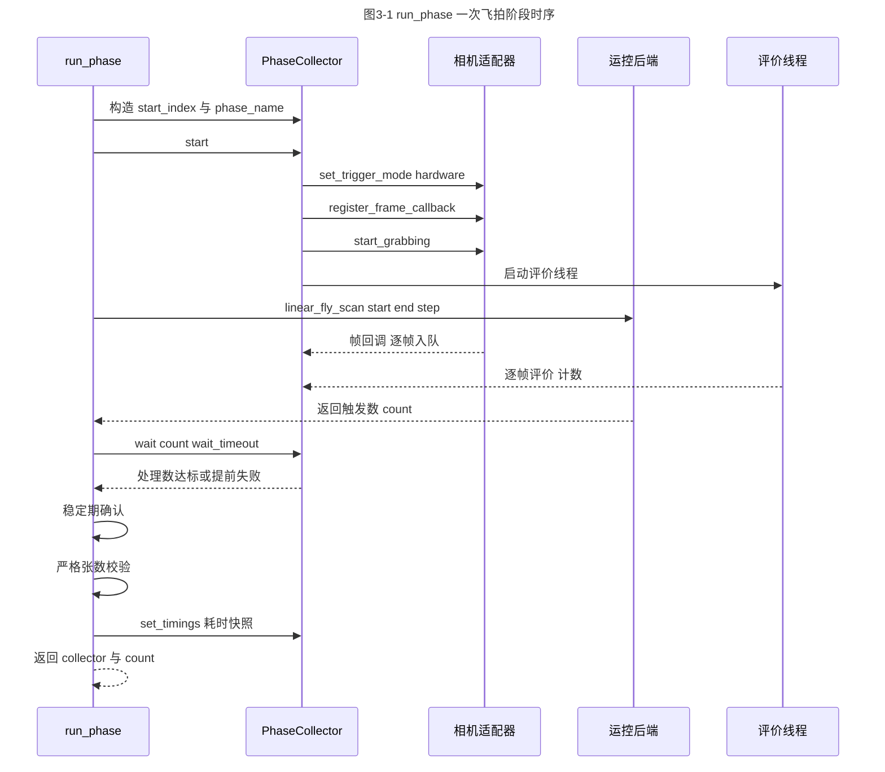
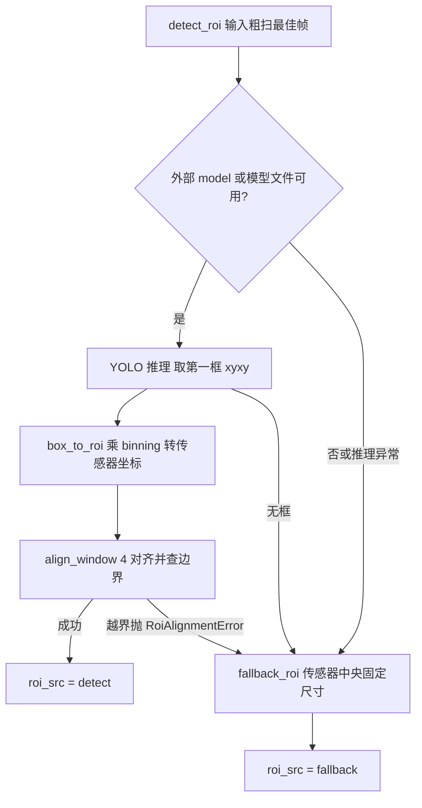

# 03-搜索管线与策略

本章读完你会知道：

- `app/backend/pipeline.py` 的三个入口 `run_search` / `run_phase` / `run_calibrate` 各自做什么、签名长什么样、失败时如何返回；
- `run_search` 七步流程中每一步的目的、输入输出、调用了哪些相机与运控接口、失败路径走向，以及 sim 与 real 两套硬件分支的差异；
- 一次飞拍阶段（`run_phase`）内部"启动采集器 → 飞扫 → 等待 → 稳定期 → 严格张数校验 → 写耗时"的完整时序，以及"丢一帧就整轮失败"这一设计的理由；
- 策略层（`FocusStrategy` / `PeakPrediction` / `STRATEGIES` 注册表 / `SearchContext` 能力接口）如何做到新增策略零侵入；
- `PhaseCollector` 的回调只入队、评价线程、预览限频、四项计数；
- 清晰度评价（Tenengrad）、NCC 峰值预测、YOLO ROI 检测三个算法调用点的位置（原理只引用现有文档，不展开公式）。

本章只覆盖"编排与策略"。相机方法（`set_roi` / `set_trigger_mode` 等）的内部机制 → 详见《04-相机接口调用手册》；运控方法（`linear_fly_scan` / `prepare_new_task` 等）的内部机制 → 详见《05-LCT运控接口调用手册》；线程、锁、丢帧契约的深层的讨论 → 详见《06-线程模型与并发契约》；`FocusConfig` 全部字段与结果对象字段 → 详见《07-配置与数据契约》。

---

## 3.1 三个入口

`app/backend/pipeline.py` 是后端编排层，对外只有三个入口函数和两个辅助函数：

| 函数 | 位置 | 职责 | 返回 |
|---|---|---|---|
| `run_phase` | app/backend/pipeline.py:74 run_phase() | 执行一次飞拍阶段并做严格张数校验 | `(collector, 触发数, 飞扫耗时)`，失败抛异常 |
| `run_search` | app/backend/pipeline.py:265 run_search() | 完整对焦搜索：模板 → 粗扫 → ROI → 精扫 → 单点飞拍 → 回位 | `SearchResult`（成功失败都不抛异常） |
| `run_calibrate` | app/backend/pipeline.py:754 run_calibrate() | 生成焦点响应曲线模板（sim / 离线图片 / 真机全扫三分支） | `CalibrateResult`（同上） |
| `compute_interval` | app/backend/pipeline.py:53 compute_interval() | 辅助：由粗扫分数求精扫区间（峰值 ±1 粗扫点，端点向内 2 个） | `(lo, hi, best_idx, peak_um)` |
| `build_sim_scores` | app/backend/pipeline.py:45 build_sim_scores() | 辅助：合成位置域抛物线清晰度曲线，sim 模式专用 | `list[float]` |

签名要点：

```python
run_search(cfg)        # cfg: FocusConfig，返回 SearchResult（类型注解 -> int 已过时，以实际返回为准）
run_calibrate(cfg)     # 同上，返回 CalibrateResult
run_phase(motion, cam, evaluator, start_um, end_um, step_um, expected_n,
          save_dir, start_index, flyscan_timeout, wait_timeout,
          save_all=False, cancel_event=None, keep_images=True,
          preview_callback=None, preview_interval_s=0.1, phase_name="")
```

【约定】`run_search` / `run_calibrate` 是"结果对象出口"：任何异常都在函数内部消化成 `rc=1` 的结果对象返回，绝不向 GUI 抛异常；而 `run_phase` 是"异常出口"：失败时先 `collector.stop()` 再把原始异常向上抛（app/backend/pipeline.py:254）。所以只有 `run_phase` 的调用方（`run_search` 精扫、`SearchContext.coarse_scan`、`run_calibrate`）需要写 try/except。

调用关系：GUI Worker（`VerifyWorker`）经 `verify_ncc_full` 转发调用 `backend.pipeline` 的 `run_search` / `run_calibrate`，`FocusConfig` 按任务注入；`run_search` 与 `run_calibrate` 内部调 `run_phase`；策略的 `coarse_scan` 也会延迟导入并调 `run_phase`（app/backend/strategies.py:44）。端到端总时序图 → 详见《01-系统总览与主链路》。

---

## 3.2 run_search 七步详解

先给总表，再逐步展开。行号以当前源码为准。

| 步 | 名称 | 位置 | 关键调用点 |
|---|---|---|---|
| ① | 加载模板与策略 | app/backend/pipeline.py:265-302 | `STRATEGIES.get`、`FocusTemplate.load` |
| ② | 硬件准备 | app/backend/pipeline.py:315-368 | `prepare_new_task`、`HikCamera`、`set_coarse_frame` |
| ③ | 策略预测（含粗扫） | app/backend/pipeline.py:370-407 | `strategy.predict_peak(ctx)` |
| ④ | ROI 检测 | app/backend/pipeline.py:409-450 | `detect_roi` / `fallback_roi` |
| ⑤ | 精扫 | app/backend/pipeline.py:451-554 | `set_full_frame`、`set_roi`、`run_phase` |
| ⑥ | 单点飞拍 + 回位 | app/backend/pipeline.py:556-647 | `capture_at_position`、`move_to_position` |
| ⑦ | 结果装配 | app/backend/pipeline.py:670-683 | 构造 `SearchResult` |

### ① 加载模板与策略（:265-302）

- 目的：确定策略类并加载焦点响应模板。
- 输入：`cfg.strategy`（`"ncc"` 或 `"dl"`）、`cfg.template`（模板 JSON 路径）。
- 失败路径：策略名不在注册表 → 返回 `rc=1, error="未知搜索策略"`（app/backend/pipeline.py:268-283）；模板文件不存在 → 返回 `rc=1`，提示"请先执行标定生成模板"（app/backend/pipeline.py:286-301）。这两条是**最早的快速失败**，不碰任何硬件。
- 此步无硬件调用。

### ② 硬件准备（:315-368）

- 目的：按 `cfg.mode` 装配运控后端、相机、评价器三件套。
- real 分支（app/backend/pipeline.py:333-352）：

| 调用点 | 行号 | 说明 |
|---|---|---|
| `motion.is_connected()` | :335 | 未连接直接抛异常"请先在GUI中连接M60 + E4O4" |
| `motion.prepare_new_task()` | :340 | 任务前安全复位 → 详见《05-LCT运控接口调用手册》 |
| `HikCamera(cfg.camera_index)` + `cam.open()` | :341/:344 | 每次搜索新建并打开相机 → 详见《04-相机接口调用手册》 |
| `cam.set_exposure` / `cam.set_gain` | :345-346 | 粗扫曝光取 `coarse_exposure_us`，缺省回落 `exposure_us` |
| `set_coarse_frame(cam, ...)` | :347 | 设置粗扫降采样（binning 或 decimation），返回传感器尺寸 |

- sim 分支（app/backend/pipeline.py:320-327）：不碰硬件，用 `autofocus_sim` 的 `FakeMotionBackend` / `SimCamera` / `ScoreMapEvaluator` 替换三件套，清晰度曲线由 `build_sim_scores` 合成，峰默认放在粗扫中点。
- real 分支还有一道 CLI 人工确认（app/backend/pipeline.py:353-368）：`cfg.yes` 为假时要求终端输入 yes，否则返回"用户取消"。GUI 模式下 `skip_confirm` 会置 `yes`，不会阻塞。
- 失败路径：连接未就绪、相机打开失败 → 抛异常，被 :684 的统一 except 捕获 → `rc=1`。

### ③ 策略预测（:370-407）

- 目的：把"采图能力"交给策略，换回一个峰位置预测。
- 输入输出：构造 `SearchContext`（app/backend/pipeline.py:371-377）→ `pred = strategy.predict_peak(ctx)`（:379）→ 展开 `PeakPrediction` 得到 `predicted_peak_um` / `ncc_max` / `quality` / `roi_frame` / `coarse_points`（:387-397）。
- NCC 策略在此步骤内部完成**整个粗扫飞拍**（见 3.6.4）；DL 策略只做一次 DL 单帧拍摄。
- 耗时：`ct["predict_ms"]` 外层计时，策略内部又把粗扫各阶段耗时塞进 `pred.extra["ct_ms"]` 合并（:381-386）。
- 失败路径：粗扫缺帧、评价失败等异常从 `run_phase` 一路上抛 → 统一 except。

### ④ ROI 检测（:409-450）

- 目的：为精扫确定清晰度评价窗口（传感器坐标）。
- real：取粗扫最佳帧 `pred.roi_frame`，调 `detect_roi`（app/backend/pipeline.py:423-431），参数含检测模型、置信度、粗扫 binning、兜底尺寸；耗时记 `ct["yolo_ms"]`。策略未给帧则直接抛异常（:418-421）。
- sim：跳过 YOLO，直接 `fallback_roi` 居中降级（:410-416），`roi_src="fallback(sim)"`。
- 检测后有一次取消检查（:438-450），用户已取消则返回 `rc=1, error="用户取消"`。
- 详见 3.9 的降级链。

### ⑤ 精扫（:451-554）

- 目的：在预测峰附近做小步距飞拍，锁定最终位置。
- **DL 策略跳过精扫**（app/backend/pipeline.py:456-467）：直接 `final_position_um = int(round(predicted_peak_um))`，只做相机切换（`set_full_frame(cam, 1)` + `set_roi` + 曝光）。
- NCC 策略分两种情况定精扫区间：
  - `quality` 为 `mismatch` 或 `boundary`：NCC 预测不可信，**降级**为粗扫峰 ±2×粗扫步距（app/backend/pipeline.py:469-486，内部用 `compute_interval`）；
  - 其他：预测峰 ± `fine_half_steps × fine_step`，并裁剪到搜索区间内（:488-489）。
- 区间确定后：
  - sim：换一套精扫专用假组件（:493-498）；
  - real：`set_full_frame(cam, cfg.fine_binning)` → `cam.set_roi(*roi)` → `cam.set_exposure(cfg.exposure_us)`（:499-504），即"停流状态下开窗换档"。
- 飞拍：`run_phase(motion, cam, evaluator, lo, lo+n_fine*fine_step, fine_step, n_fine, start_index=100, phase_name="fine")`（app/backend/pipeline.py:507-519）。`start_index=100` 让精扫存图文件名从 `img_0100.jpg` 起，与粗扫 `img_0000.jpg` 区分。
- 后处理：取分数表（:534-535），任一序号缺分数抛"精扫缺帧"（:536-537）；`best_f` 为最高分帧（:538）；**若最佳帧落在精扫区间首帧或末帧，只记警告不失败**（:539-544）——这是"结果可疑但流程合法"的典型例子，与丢帧的硬失败形成对比。
- 输出：`final_position_um = fine_positions[best_f]`（:554）。

### ⑥ 单点飞拍 + 回位（:556-647）

- 目的：在最终位置单点飞拍（定拍）一张作为存证，并让 Z 轴回到该位置保持伺服。
- 顺序（real）：
  1. 停精扫采集器 `col_f.stop()`（:559-564）；
  2. `set_full_frame(cam, 1)` 恢复全幅 1×1（:565-570）；
  3. 新建单点采集器 `PhaseCollector(cam, evaluator, save_dir=cfg.save_dir, start_index=200)` 并 `start()`（:572-574）；
  4. `motion.capture_at_position(final_position_um, ...)` 触发一张（:581-585）；**返回触发数必须等于 1**，否则抛异常（:589-593）；
  5. 轮询等 `final_col.processed >= 1`，上限 `cfg.final_frame_timeout`（:594-604）；拿到帧后存 `final.jpg` 与可选 `final_<位置>um.jpg`（:606-612）；
  6. `final_col.stop()`（:614-619）；
  7. `motion.move_to_position(final_position_um, ...)` 无比较器回到最终位置并保持伺服（:628-645）。
- 为什么单点也要飞拍触发：`capture_at_position` 沿用 E4O4 的位置比较触发，运动越过目标位置才能曝光，因此拍完后必须再走一次 `move_to_position` 回位（源码注释 ：626-627）。
- sim：跳过相机步骤，只打日志（:620-624），运控调用仍执行。

### ⑦ 结果装配（:670-683）

- 组装 `SearchResult`：`rc=0`、预测峰、NCC 值、quality、精扫最佳序号、最终位置、精扫最佳帧、最终帧、粗扫/精扫点列、ROI 三元组、耗时表 `ct_ms`。字段表见 3.10。

### sim 与 real 分支差异汇总

| 维度 | sim（`cfg.mode=="sim"`） | real |
|---|---|---|
| 运控后端 | `FakeMotionBackend`（app/autofocus_sim.py:12） | `cfg.motion_backend`（GUI 的 MotionService 持有） |
| 相机 | `SimCamera`（app/autofocus_sim.py:171） | `HikCamera`，每次搜索新建 |
| 评价器 | `ScoreMapEvaluator`（查合成曲线） | `OpenCVSharpnessEvaluator`（Tenengrad） |
| 精扫阶段 | **重新换一套**假组件（:493-498） | 复用同一相机，仅改开窗与曝光 |
| ROI | 直接 `fallback_roi`，不跑 YOLO | YOLO 检测，失败降级 |
| 单点飞拍 | 只调 `capture_at_position` 计数 | 完整采集 + final.jpg + 回位 |
| 人工确认 | 无 | CLI 模式需输入 yes |

---

## 3.3 run_phase：一次飞拍阶段的解剖

`run_phase` 是粗扫、精扫、标定全扫共用的"一次飞拍"单元。内部时序：



分步说明：

| 步 | 位置 | 动作 |
|---|---|---|
| 1 | app/backend/pipeline.py:95-106 | 构造 `PhaseCollector`（透传 save_dir / preview / cancel 等） |
| 2 | :110 | `collector.start()`：相机切硬件触发、注册帧回调、开始取流、起评价线程（见 3.7） |
| 3 | :117-124 | `motion.linear_fly_scan(start_um, end_um, step_um, timeout_s, cancel_event, phase_name)`：M60 走运动、E4O4 按位置触发相机，**同步阻塞**到飞扫结束并返回实际触发数（内部机制 → 详见《05-LCT运控接口调用手册》） |
| 4 | :129-130 | 运动返回后立即查 `cancel_event`，用户已取消则抛"用户取消" |
| 5 | :134 | `collector.wait(count, wait_timeout)`：等评价线程处理满 `count` 帧，20ms 轮询；取消、评价异常、`dropped>0`、超时都会提前返回 False（app/backend/collector.py:171） |
| 6 | :139-167 | wait 失败后的原因分派：取消 → 抛"用户取消"；`collector.error` → 抛评价错误；`dropped>0` → 抛"图像处理队列溢出"；否则抛"帧处理超时"。四类异常都带 `触发/收到/入队/丢弃/处理` 五个数字 |
| 7 | :173-207 | 稳定期（见 3.4） |
| 8 | :217-227 | 严格张数校验（见 3.4） |
| 9 | :231-236 | `count != expected_n`（E4O4 触发数与理论帧数不一致）只警告不失败 |
| 10 | :238-246 | `collector.set_timings(...)` 写入本阶段耗时快照（collector_start / motion / frame_wait / stabilize / phase_total） |
| 11 | :252 | 成功才把 collector 交给调用方；**正常路径由调用方负责 `collector.stop()`** |
| 12 | :254-263 | 任何异常：`collector.stop()` 停流停线程，原样上抛 |

【约定】"谁拿到 collector 谁负责 stop"：`run_phase` 成功时不停采集器（调用方还要读分数和图像），失败时必须自己停（调用方拿不到引用）。三条成功路径的 stop 位置：粗扫在 `SearchContext.coarse_scan`（app/backend/strategies.py:80）、精扫在 run_search 步骤⑥（app/backend/pipeline.py:561）、标定在 app/backend/pipeline.py:941。

---

## 3.4 稳定期与张数校验的哲学

**为什么丢一帧就整轮失败？**

粗扫/精扫的每一帧都对应一个确定的 Z 位置（第 k 帧位置 = `start + (k+1) × step`，见 app/backend/camera_utils.py:280 frame_positions）。帧序号是位置的**唯一**载体：丢掉中间任何一帧，后续所有帧的序号仍然连续，但"序号 → 位置"的映射会出现一个看不见的错位——曲线整体平移，NCC 会自信地匹配到一个错误的峰，精扫随之跑偏。**错误的对焦结果比失败更危险**：失败可以被重试，错误结果会直接进产线。

因此校验分三层：

1. **队列层**：相机回调只做 `put_nowait`，队列满（max_queue=32）即丢弃并计 `dropped`。`wait()` 一旦发现 `dropped>0` 立即提前返回失败，不浪费剩余等待时间（app/backend/collector.py:203）。
2. **稳定期**（app/backend/pipeline.py:173-207）：`linear_fly_scan` 返回 ≠ 所有帧评完。先做 3 次 20ms 快检：若 `processed == count` 且队列为空，直接通过（不进入 2 秒慢路径的快路径，仅 3×20ms 轮询）；否则进入慢路径——最多再等 2 秒，直到 `processed` 连续 0.2 秒不变。这一段兜的是"最后几帧还在评价队列里"的时序差。
3. **严格张数校验**（app/backend/pipeline.py:217-227）：稳定期后必须 `collector.processed == count`（E4O4 返回的触发数）。少了 = 丢帧；多了 = 混入额外触发。两者都抛"帧数不符"，异常信息携带 `触发/收到/入队/丢弃/处理` 五个计数用于定位。

对比一条软校验：E4O4 触发数 `count` 与理论帧数 `expected_n` 不一致时只记警告（:231-236），因为触发数是真实发生的事实，后续以 `count` 为准恢复分数即可，不影响序号-位置映射的正确性。**硬失败的标准是"数据正确性受损"，而非"参数不完全符合预期"**。

丢帧契约的线程视角（锁、队列、回调线程归属）→ 详见《06-线程模型与并发契约》。

---

## 3.5 run_calibrate：标定三分支

标定的产物是一个 `FocusTemplate` JSON（焦点响应曲线 + FWHM + 元信息）。三个分支按优先级依次判定：

| 分支 | 判定条件 | 位置 | 数据来源 |
|---|---|---|---|
| sim 合成 | `cfg.mode == "sim"` | app/backend/pipeline.py:761-786 | `build_sim_scores` 抛物线，峰放粗扫中点 |
| 离线图片目录 | `cfg.calibrate_images` 非空 | :788-866 | 目录下按名排序的 bmp → png → jpg |
| 真机全扫 | 其余情况 | :867-1024 | `run_phase` 全扫飞拍 |

公共前置（:756-760）：`cal_start` / `cal_span` 缺省回落到 search 同名参数，`n_cal = cal_span // cal_step`。

- **sim 分支**：合成分数直接 `FocusTemplate.from_fullscan`，写 `meta["start_um"]` / `meta["step_um"]` 后保存。这两个 meta 字段是后续 NCC 位置域匹配的坐标系基准，缺了搜索必挂。
- **离线图片分支**：逐张 `cv2.imdecode` 读入 → `OpenCVSharpnessEvaluator.evaluate_image` 评价（:812-816）；张数与理论网格不符只警告（:798-804）；同样走 `from_fullscan` → 写 meta → 计算 `peak_um = cal_start + (peak_position + 1) × cal_step`（:824-828）→ 保存。适合没有运控的桌面复算。
- **真机全扫分支**：流程与 run_search 步骤②几乎一致（`is_connected` :874、`prepare_new_task` :879、开相机 :880-890、CLI 确认 :892-907，降采样可用 `calibrate_downsample` / `calibrate_factor` 覆盖粗扫默认值），然后 `run_phase(motion, cam, evaluator, cal_start, cal_start + n_cal×cal_step, cal_step, n_cal, start_index=0, phase_name="calibrate")`（:911-924）。飞拍成功后取分数（缺帧抛"标定全扫缺帧" :948-951），`FocusTemplate.from_fullscan`（app/focus_template.py:21，内部含 min-max 归一化与 FWHM 半高线性插值交点）→ 写 meta → `template.save(cfg.template)`（app/focus_template.py:97）→ 返回 `CalibrateResult`。

峰位置 µm 换算公式 `cal_start + (peak_position + 1) × cal_step` 中的 +1 来自飞拍"含终点、不含起点"约定（第 k 帧位置 = start + (k+1)×step），与 `frame_positions` 一致；NCC 端用同一约定把粗扫位置映射回模板下标（app/backend/ncc.py:57）。

---

## 3.6 策略层

### 3.6.1 FocusStrategy 与 PeakPrediction

- 基类 `FocusStrategy`（app/backend/strategies.py:140）：唯一抽象方法 `predict_peak(ctx) -> PeakPrediction`，类属性 `name` 作为注册键。
- 结果对象 `PeakPrediction`（app/backend/strategies.py:13）：

| 字段 | 类型 | 含义 | 消费方 |
|---|---|---|---|
| `peak_um` | float | 预测峰位置 | run_search 步骤⑤定精扫区间 |
| `quality` | str | `ok` / `partial` / `mismatch` / `boundary` / `low_contrast` / `dl_placeholder` | 步骤⑤决定是否降级 |
| `ncc_max` | float | NCC 峰值相关系数 | 结果展示 |
| `roi_frame` | object | 供 ROI 检测的帧（NCC=粗扫最佳帧，DL=单帧） | 步骤④ |
| `coarse_points` | list | `[(位置µm, 分数)]` 曲线数据 | 步骤⑤降级 + 结果 |
| `extra` | dict | 自由扩展（NCC 塞耗时 `ct_ms`） | 耗时统计 |

### 3.6.2 STRATEGIES 注册表与 @register

- `STRATEGIES: Dict[str, Type[FocusStrategy]]`（app/backend/strategies.py:150）+ 装饰器 `register`（:153-156）。
- `run_search` 只认注册表：`STRATEGIES.get(cfg.strategy)`（app/backend/pipeline.py:268）。**新增策略不需要改 pipeline 一行代码**，import 即注册。
- 策略选择：后端默认 `cfg.strategy`（`"ncc"`）；GUI 由参数面板的策略选项卡决定——`ai_tab_index` 命中返回 `"dl"`，否则 `"ncc"`（app/gui/app/services/config_service.py:77 _current_strategy）。

### 3.6.3 SearchContext：能力接口

`SearchContext`（app/backend/strategies.py:25）是策略眼中的世界：**只暴露采图能力，不暴露硬件细节**。构造参数 `(cam, motion, evaluator, cfg, template)`（:28），策略拿不到裸运控对象（`self._motion` 私有），只能通过下面两个能力方法间接驱动：

| 能力 | 位置 | 行为 |
|---|---|---|
| `coarse_scan(start_um, end_um, step_um)` | app/backend/strategies.py:36 coarse_scan | 延迟导入 run_phase（避免循环导入，:39-44）→ 飞拍粗扫 → `col.stop()` → 按序号恢复分数（缺帧抛"粗扫缺帧" :98-99）→ 换算位置 → 可选存 `coarse_0000_14900um.jpg` → 返回 `(positions, scores, best_frame)` |
| `capture_frame()` | :130 | 软件触发 DL 单帧拍摄（timeout 1000ms），供 DL 策略使用 |

`coarse_scan` 粗扫结束立即停流的理由写在 :76-77：后续 ROI/YOLO 不应与相机回调并发。`last_coarse_ct_ms`（:84）暂存粗扫耗时供策略组装 extra。

### 3.6.4 NCCStrategy 流程

`NCCStrategy`（app/backend/strategies.py:160，name="ncc"）的 `predict_peak`（:165）：

1. `ctx.coarse_scan(search_start, search_start+search_span, coarse_step)` 完成粗扫飞拍（:169-173）；
2. 调 `ncc_predict_peak(positions, scores, template, search_start, search_end, min_score=cfg.ncc_min_score)` 得 `(peak_um, ncc_max, quality)`（:179-184）；
3. 组装 `PeakPrediction`，`extra["ct_ms"]` 携带粗扫各阶段与 NCC 计算耗时（:190-231）。

NCC 本体在 app/backend/ncc.py:5 ncc_predict_peak：**位置域**模板匹配——用模板 meta 的 `start_um`/`step_um` 网格把粗扫位置映射到模板下标（app/backend/ncc.py:57），对每个候选偏移 Δ 算 Pearson 相关取最大，预测峰 = 模板峰 µm + 最优 Δ×cal_step（:77）。算法推导与示例 → 详见 app/docs/NCC模板匹配对焦搜索v1实现方案.md 与 app/docs/NCC搜索流程图.md。

### 3.6.5 DLStrategy（占位）

`DLStrategy`（app/backend/strategies.py:236，name="dl"）当前是**接口占位**：`capture_frame` 拍一张，`deltaZ = 0.0`（TODO 注释 ：243 待接 DLDistanceModel），峰 = 拍摄位 + Δz 并裁剪到搜索区间，quality 固定 `dl_placeholder`。run_search 对 dl 策略跳过精扫（见 3.2 步骤⑤），直接单点飞拍验证落位。DL 验证计划 → 详见 app/docs/深度学习单帧对焦验证计划.md。

### 3.6.6 新增一个策略的步骤

1. 在 app/backend/strategies.py（或被其 import 的模块）定义子类，设 `name`，实现 `predict_peak`；
2. 加 `@register` 装饰器；
3. 返回的 `PeakPrediction` 必须填 `roi_frame`（否则 run_search 步骤④直接抛异常，app/backend/pipeline.py:418-421）；
4. 若新策略不需要精扫，在 run_search 步骤⑤补一个 `cfg.strategy == "<name>"` 分支（目前仅 dl 有此特判）。

---

## 3.7 PhaseCollector

`PhaseCollector`（app/backend/collector.py:32）为一次飞拍阶段服务：管理相机回调、后台评价线程、分数/图像缓存。线程归属与并发细节 → 详见《06-线程模型与并发契约》，这里只讲结构。

### 3.7.1 构造参数（app/backend/collector.py:33）

| 参数 | 默认 | 用途 |
|---|---|---|
| `camera` / `evaluator` | 必填 | 三件套之二 |
| `save_dir` | None | save_all 模式即时存图目录 |
| `start_index` | 0 | 文件名起始编号（粗扫 0 / 精扫 100 / 单点 200） |
| `max_queue` | 32 | 评价队列容量，满即丢帧 |
| `save_all` | False | 评价一帧立即存 `img_XXXX.jpg` |
| `cancel_event` | None | 用户取消信号 |
| `keep_images` | True | 是否缓存图像（供 ROI 检测、final.jpg、存图复用） |
| `preview_callback` | None | GUI 预览信号（`VerifyWorker.preview.emit`） |
| `preview_interval_s` | 0.1 | 预览最小间隔 |
| `phase_name` | "" | calibrate / coarse / fine，随预览上报 |
| `evaluation_roi` | None | 固定评价 ROI（当前主链路未用） |

### 3.7.2 start 四步（app/backend/collector.py:95）

`set_trigger_mode("hardware")` → `register_frame_callback(self._on_frame)` → `start_grabbing()` → 启动评价线程 `_worker`。三个相机方法的内部行为 → 详见《04-相机接口调用手册》。

### 3.7.3 回调只入队（app/backend/collector.py:225 _on_frame）

相机 SDK 回调线程里只做三件事：stop 标记检查、锁内分配连续 `seq` 并计 `received`（:236-238）、`put_nowait` 非阻塞入队（:243）。队列满抛 `queue.Full` → `dropped += 1`（:245-251，故意不打日志防高频打印阻塞回调）；成功则 `enqueued += 1`（:253-257）。**回调内禁止任何阻塞操作**，评价、存图、预览全部留给 worker。

### 3.7.4 评价线程 _worker（app/backend/collector.py:310）

循环取队列 → `evaluator.evaluate_image(img, roi)`（:320）→ 锁内写 `scores[seq]`、可选 `images[seq]`、`processed += 1`（:324-328）→ 锁外 `_emit_preview`（:333）→ save_all 模式存图（:338-342）。任何一帧评价异常：记 `error="第 N 帧评价失败"` 并置 stop（:343-346），`wait()` 随即提前返回失败。

### 3.7.5 预览限频（app/backend/collector.py:259 _emit_preview）

无回调直接返回；`preview_interval_s > 0` 且距上次发送不足间隔则丢弃本帧预览（首帧立即发）。先更新时间戳再调回调，防止回调异常导致下一帧立即重试；回调异常只记警告，绝不影响采集（:300-308）。

### 3.7.6 stats 四计数（app/backend/collector.py:145）

`received`（回调收到）/ `enqueued`（入队成功）/ `dropped`（队列满丢弃）/ `processed`（评价完成）。`run_phase` 的所有帧数校验与错误信息都围绕这四个数加 E4O4 触发数展开。恒等式：`received = enqueued + dropped`，`processed <= enqueued`。

---

## 3.8 评价与预测调用点

| 能力 | 入口 | 位置 | 说明 |
|---|---|---|---|
| 清晰度评价 | `OpenCVSharpnessEvaluator.evaluate_image` | app/adapters/evaluator_opencv.py:53 | Tenengrad：ROI 裁剪 → 灰度 → Sobel 梯度幅值均值；公式与离线 `evaluate` 版本 → 详见 app/docs/黄金分割算法说明.md、app/docs/自动对焦软件开发文档.md |
| NCC 峰值预测 | `ncc_predict_peak` | app/backend/ncc.py:5 | 位置域 Pearson 相关；唯一调用方 NCCStrategy（app/backend/strategies.py:179） |
| 模板峰 µm | `t_peak_um = cal_start + (peak_position+1)×cal_step` | app/backend/ncc.py:47 | 与标定端换算（app/backend/pipeline.py:960）互逆 |

【约定】评价器接口刻意模仿 SDK 的 `scImageSharpness`（类注释 app/adapters/evaluator_opencv.py:8-14），将来换 SDK 评价器只换类不动管线。

---

## 3.9 YOLO ROI 调用点：一条降级链

调用链固定为 `detect_roi → box_to_roi → fallback_roi`，任何一环失败都**降级而不是失败**：



- `detect_roi`（app/backend/detection.py:27）：优先用外部传入的已加载模型（`cfg.detect_model_obj`），否则按路径加载（进程级单例缓存 ：16-26）；有框取 `boxes.xyxy[0]` **第一个框**（:44-45），成功返回 `(roi, "detect", 原始框)`；无模型、无框、推理异常统统落到 `fallback_roi` 返回 `(居中ROI, "fallback", None)`（:89-96）。
- `box_to_roi`（app/backend/camera_utils.py:223）：把降采样图像坐标系的框乘 `binning` 还原成传感器坐标（:239-244），再交 `align_window`（app/backend/camera_utils.py:62）做 4 像素向下对齐与越界检查。
- `fallback_roi`（app/backend/camera_utils.py:252）：传感器中央 `roi_fallback_size` 见方，同样过 `align_window`。
- YOLO 模型与训练细节 → 详见 app/docs/自动对焦软件开发文档.md；sim 模式直接从 `fallback_roi` 进入（app/backend/pipeline.py:410）。

---

## 3.10 产出契约

`SearchResult`（app/backend/result.py:9）关键字段：

| 字段 | 含义 | 来源步骤 |
|---|---|---|
| `rc` / `error` | 0 成功；1 失败并附错误串 | 全流程 |
| `predicted_peak_um` / `ncc_max` / `quality` | 策略预测三元组 | 步骤③ |
| `fine_best` / `final_position_um` | 精扫最佳序号与最终定位 | 步骤⑤ |
| `fine_best_image` / `final_image` | 精扫最佳帧与单点飞拍（定拍）帧 | 步骤⑤⑥ |
| `coarse_points` / `fine_points` | 两阶段 `[(位置µm, 分数)]` 曲线 | 步骤③⑤ |
| `roi` / `roi_src` / `detect_box` | ROI 三元组 | 步骤④ |
| `ct_ms` | 分阶段耗时表（predict / yolo / fine / final / total…） | 各步 |

`CalibrateResult`（app/backend/result.py:29）：`peak_position`（index）、`peak_width`（FWHM，单位：帧）、`peak_um`（换算后的 µm 峰）、`ct_ms`。

字段与 FocusConfig 的完整对照、GUI 侧如何消费这些对象 → 详见《07-配置与数据契约》。

---

## 3.11 异常与取消路径

以 `run_search` 的统一处理为例（app/backend/pipeline.py:684-752，`run_calibrate` 同构 ：985-1024）：

1. **异常归一**：任何异常取 `str(e)` 为错误消息，空则用异常类名（:685-691）。
2. **取消识别**：消息含"取消"二字即视为用户取消——只 `logger.info`，不记 ERROR、不打调用栈（:695-698）；其余异常 `logger.exception` 带完整栈（:705-710）。取消点遍布各阶段：飞扫返回后（:129）、wait 失败后（:144）、ROI 检测后（:438）、稳定期循环内（:176/:195）、标定 stop 后（:945）。
3. **运动安全清理**：`motion.cancel_current_motion()`（app/backend/pipeline.py:714，标定分支 ：1006），失败再记异常，不影响错误消息返回。
4. **finally 清理**（:723-752）：依次 `final_col.stop()`（:724）→ `col_f.stop()`（:733）→ `cam.close()`（:744）。**运控后端永不断开**（:752 注释：由 GUI MotionService 持有，不在单次任务后断开）——相机是任务级资源（每次搜索新建），运控是会话级资源（GUI 连接时创建）。
5. 正常路径中每一步都可能因取消/异常跳入该 except，因此 finally 里的三个引用都以"可能为 None"防御。

线程取消信号（`cancel_event`）的创建与传播、`linear_fly_scan` 内部对它的响应 → 详见《06-线程模型与并发契约》。

---

## 3.12 相关遗留与实验代码

`app/backend/direct_fine.py:41 DirectFineCollector` 是"单程精扫 + 首帧局部 ROI"的实验采集器，仅被 tools/test_direct_fine_ct.py 与测试使用（实验，未接入主流程）。其余遗留清单 → 详见《01-系统总览与主链路》。
