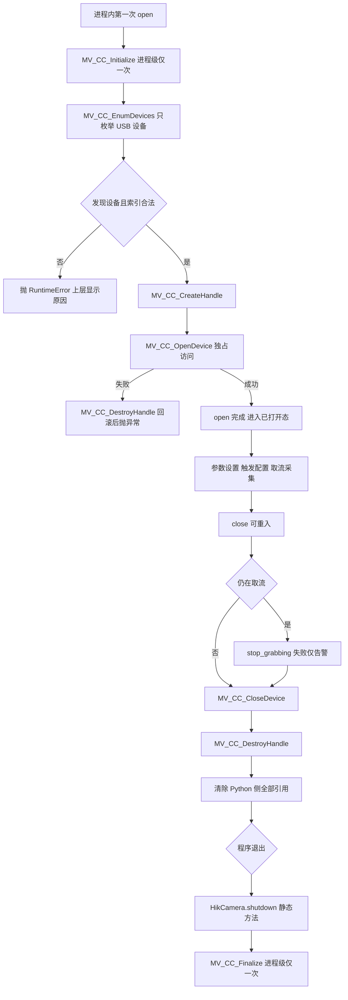
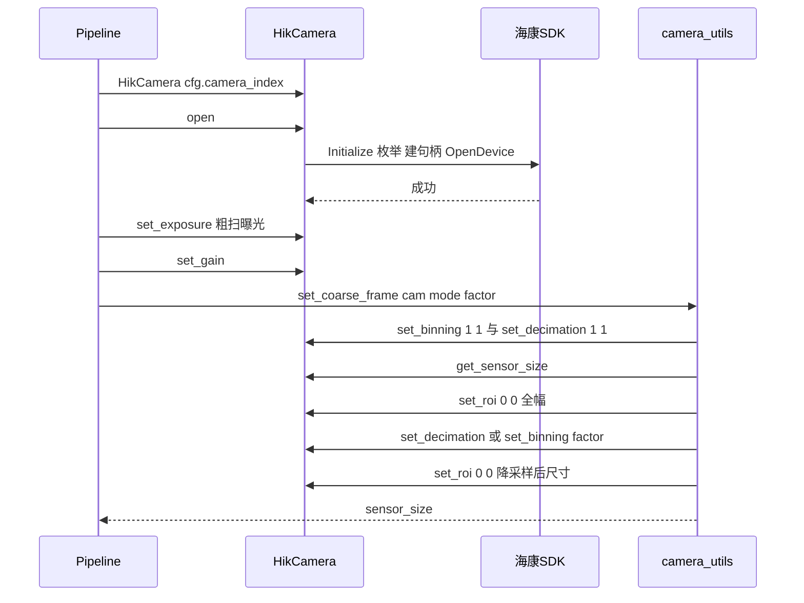
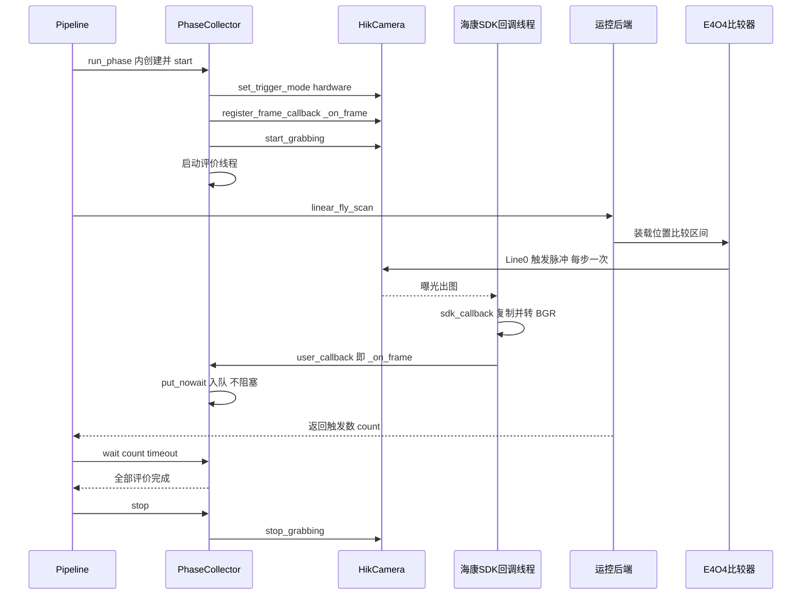
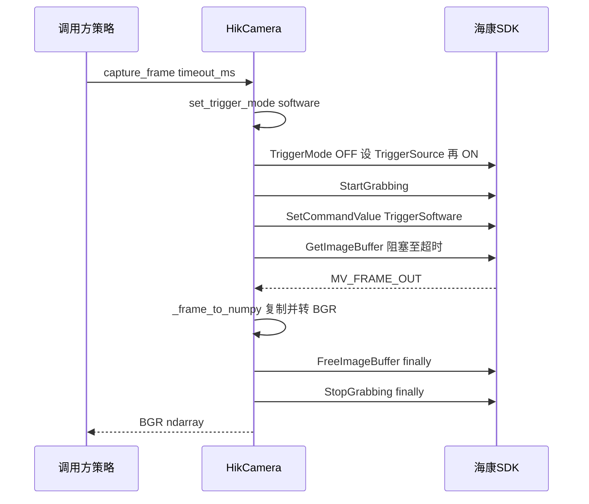

# 04-相机接口调用手册

本章是相机层的唯一权威参考，覆盖 `HikCamera` 全部对外方法、每个方法对应的海康 SDK 调用点、取图线程模型、像素格式转换，以及 `camera_utils` 的开窗编排。所有行号均已对照当前源码核实；若后续代码演进导致行号漂移，请按"相对路径 + 符号名"grep 定位。

**本章读完你会知道：**

- 相机相关五个文件各自负责什么、依赖方向如何；
- SDK 为什么是进程级单例，DLL 搜索路径 hack 解决什么问题；
- 从 `MV_CC_Initialize` 到 `MV_CC_Finalize` 的完整句柄生命周期，以及每一步失败时如何回滚；
- 每个方法封装了哪个 `MV_CC_*` 函数、被谁调用、有什么前置条件；
- 同步取帧（GetImageBuffer）与回调取帧（RegisterImageCallBackEx）两条路径的差异与各自的像素转换实现；
- `camera_utils` 如何把"传感器尺寸 → 粗扫降采样 → 检测框 → 精扫 ROI"串起来。

## 4.1 模块地图

| 文件 | 职责（一句话） | 关键符号 |
| --- | --- | --- |
| app/camera/camera_adapter.py | 海康相机适配器：封装 SDK 句柄生命周期、参数、触发与取图 | `HikCamera`:42 |
| app/camera/frame_converter.py | 同步路径像素转换：`MV_FRAME_OUT` 结构体 → BGR `ndarray` | `_frame_to_numpy`:5 |
| app/camera/frame_worker.py | 早期通用"回调入队 + 工作线程处理"封装（遗留，不在主链路，全项目未使用） | `FrameWorker`:9 |
| app/backend/camera_utils.py | 相机编排层：尺寸解析、对齐、全幅/粗扫开窗、ROI 换算、帧位置公式 | `resolve_sensor_size`:16 等 |
| app/backend/constants.py | 传感器默认兜底尺寸 `SENSOR_W=5472`、`SENSOR_H=3648` | 模块级常量 |

依赖方向：`pipeline.py` 与 `live_view_worker.py` 同时使用 `camera_adapter`（开相机、设参数）与 `camera_utils`（决定开多大的窗）；`camera_utils` 只调用 `HikCamera` 的参数类方法，不触碰触发与取流。SDK 底层封装位于 app/MvImport/MvCameraControl_class.py（`MvCamera`:98），项目不直接使用该模块，只经由 `HikCamera` 间接调用。

## 4.2 SDK 预加载与进程级生命周期

### 4.2.1 DLL 搜索路径 hack

app/camera/camera_adapter.py:12-23 在模块导入时（早于 `from MvImport.MvCameraControl_class import *`）把海康 MVS 运行时目录插入 DLL 搜索路径：

- 候选目录依次为 `C:\Program Files (x86)\Common Files\MVS\Runtime\Win64_x64` 与 `C:\Program Files\Common Files\MVS\Runtime\Win64_x64`；
- 对第一个存在的目录同时执行 `os.add_dll_directory()` 与追加 `PATH`，然后 `break`。

目的：避免 Python 进程加载到机器上其他软件（如 LBAS 运行时）自带的旧版 `MvCameraControl.dll`。真正的加载动作发生在 app/MvImport/MvCameraControl_class.py:77 `check_sys_and_update_dll()`（Windows 下 `WinDLL("MvCameraControl.dll")`，见该文件 44-48 行）。

【约定】任何新的相机相关模块都应从 `camera.camera_adapter`（或 `camera` 包）导入，不要先于它导入 `MvImport`，否则 DLL hack 失效。

### 4.2.2 进程级单例状态

海康 SDK 的初始化属于整个 Python 进程，不属于某个 `HikCamera` 对象：

- app/camera/camera_adapter.py:34 `_sdk_initialized`：进程内是否有且只有一次 `MV_CC_Initialize()`；
- app/camera/camera_adapter.py:40 `_sdk_lifecycle_lock`：保护 Initialize 与 Finalize 不被并发调用（GUI 预览线程与后台任务线程可能几乎同时打开相机）。

由此推出三条使用规则：

1. 第二个 `HikCamera.open()` 不会重复初始化 SDK，只是走枚举与打开流程；
2. `HikCamera.shutdown()`（app/camera/camera_adapter.py:265 静态方法）反初始化的是整个 SDK，只应在**所有相机对象已 close、所有相机工作线程已退出**后调用——GUI 主链路唯一调用点是 app/gui/app/services/application_shutdown_service.py:126-128 的程序退出清理链第四步之后；
3. shutdown 失败（`MV_CC_Finalize` 异常或返回非 0）时保留 `_sdk_initialized=True` 并返回 `False`，不假装关闭成功；未初始化时直接返回 `True`，可安全重复调用。

## 4.3 句柄生命周期总览

下图给出从进程首次打开相机到程序退出的完整 SDK 调用链，包含两条失败路径（半初始化回滚、close 容错清理）：

图 4-1 相机句柄生命周期与两条失败路径

要点：`open()` 中间任何一步失败都会抛 `RuntimeError`，对象回到"未打开"状态；`close()` 是最终清理路径，任何一步失败只记 warning 不中断后续清理。

### 对象状态字段与不变量

`HikCamera.__init__`（app/camera/camera_adapter.py:43-51）维护八个软件侧字段，全部遵循"SDK 确认成功后才提交"：

| 字段 | 含义 | 取值约束 |
| --- | --- | --- |
| `_cam` | `MvCamera` 实例，句柄持有者 | `None` 表示未打开；非 None 才允许调用设备类方法 |
| `_index` | 构造时传入的设备索引 | open 时校验 `0 <= index < 枚举数` |
| `_trigger_mode` | 最近一次确认成功的触发模式 | off / software / hardware / unknown（初始与失败态均为 unknown） |
| `_device_info` | 枚举得到的设备信息结构体 | 仅 open 全部成功后写入 |
| `_stream_count` | 回调路径累计帧数（sdk_callback 自增，:1285） | 仅统计用，不参与控制 |
| `_user_callback` | 当前生效的上层回调 | 回调路径每帧动态读取，支持热切换 |
| `_cb_func_holder` | C 回调函数对象引用 | **必须持有**，否则 CFUNCTYPE 对象被回收后 SDK 调用悬空指针崩溃 |
| `_is_grabbing` | 软件侧取流状态 | 只在 StartGrabbing/StopGrabbing 返回 0 后修改 |

## 4.4 方法总表·生命周期组

| 方法 | 位置 | SDK 调用 | 主要调用方 | 注意项 |
| --- | --- | --- | --- | --- |
| `open()` | app/camera/camera_adapter.py:54 open() | `MV_CC_Initialize`:74 → `MV_CC_EnumDevices(MV_USB_DEVICE)`:91 → `MV_CC_CreateHandle`:136 → `MV_CC_OpenDevice(MV_ACCESS_Exclusive, 0)`:146 | pipeline.run_search:344、pipeline.run_calibrate:884、live_view_worker:125 | 同一对象重复 open 抛错（:68）；枚举数为 0 或索引越界抛错（:104、:111）；OpenDevice 失败时回滚销毁句柄（:159-176）；独占访问意味着 GUI 预览与后台任务**不能同时**打开相机 |
| `close()` | app/camera/camera_adapter.py:190 close() | 必要时 `stop_grabbing` → `MV_CC_CloseDevice`:222 → `MV_CC_DestroyHandle`:238 | pipeline 两处 finally（:744、:1018）、live_view_worker:181 | 幂等可重入；停流/关设备/销毁句柄任一步失败仅告警继续；最后无条件清空 `self._cam` 等全部引用 |
| `shutdown()` 静态 | app/camera/camera_adapter.py:265 shutdown() | `MV_CC_Finalize`:292 | application_shutdown_service.py:128（唯一 GUI 调用点） | 与 Initialize 共用 `_sdk_lifecycle_lock`；失败返回 `False` 且保持 `_sdk_initialized=True`；未初始化时直接返回 `True` |

辅助方法：`_model_name()`（app/camera/camera_adapter.py:323 `_model_name()`）从 USB 设备信息解码 GBK 型号名，仅用于 open 成功后的日志。

## 4.5 方法总表·参数组

参数组的共同风格是**写后读回校验**：SDK 返回成功只代表命令被接受，必须再读节点当前值确认与请求一致，否则抛 `RuntimeError`。

| 方法 | 位置 | SDK 调用 | 上层调用方 | 注意项 |
| --- | --- | --- | --- | --- |
| `set_exposure(value_us)` | app/camera/camera_adapter.py:328 set_exposure() | `MV_CC_SetFloatValue("ExposureTime")`:340 | pipeline:345/:462/:503/:885、live_view_worker:128 | 单位微秒；不做读回校验（浮点节点）；无取流检查——SDK 允许取流中改曝光 |
| `set_gain(value_db)` | app/camera/camera_adapter.py:358 set_gain() | `MV_CC_SetFloatValue("Gain")`:370 | pipeline:346/:886、live_view_worker:132 | 单位 dB；其余同上 |
| `get_sensor_size()` | app/camera/camera_adapter.py:388 get_sensor_size() | `MV_CC_GetIntValue("WidthMax"/"HeightMax")`:401/:406 | camera_utils.resolve_sensor_size:35 | 无 WidthMax 节点的机型回退读 Width/Height 节点的 `nMax`（:415-438）；返回值随当前 Binning/Decimation 变化，因此 camera_utils 总是先重置 1×1 再读 |
| `set_roi(x, y, w, h)` | app/camera/camera_adapter.py:453 set_roi() | `MV_CC_SetIntValue` × 6（:509）与 `MV_CC_GetIntValue` × 4（:538） | camera_utils:154/:170/:192/:213 | **取流中禁止修改**（:463）；写入顺序固定为 OffsetXY 归零 → Width/Height → OffsetXY（:499-506），保证既能从小窗恢复全幅也能从全幅缩小；读回四节点逐一比对（:527-575），不一致即抛错 |
| `set_binning(h, v)` | app/camera/camera_adapter.py:751 set_binning() | `MV_CC_SetIntValue/GetIntValue`（经 `_set_sampling_axis`） | camera_utils:146/:162/:187/:205 | **取流中禁止修改**（`_set_sampling_pair`:691）；优先厂商节点 `BinningHorizontal_Val`，失败回退标准节点（:617-620），两侧都失败时报出两次状态码 |
| `set_decimation(h, v)` | app/camera/camera_adapter.py:761 set_decimation() | 同上 | camera_utils:147/:188/:200、live_view_worker 间接经 set_coarse_frame | 机制与 set_binning 完全一致，仅节点名不同 |

两个内部支撑方法：

- `_set_sampling_axis()`（app/camera/camera_adapter.py:587）：单方向设置 + 读回，返回实际成功的节点名，供日志区分厂商节点与标准节点；
- `_set_sampling_pair()`（app/camera/camera_adapter.py:677）：合成水平/垂直两方向，前置完成"未打开 / 取流中 / 倍率非正"三项检查。

**"取流中禁止修改"完整清单**（未列入的方法即允许取流中调用）：

| 方法 | 检查位置 | 抛错文案要点 |
| --- | --- | --- |
| `set_roi` | camera_adapter.py:463 | 必须先停止取流才能修改 ROI |
| `set_binning` / `set_decimation`（经 `_set_sampling_pair`） | :691 | 必须先停止取流才能修改采样 |
| `set_trigger_mode` | :843 | 必须先停止取流才能修改触发模式 |
| `register_frame_callback`（含热切换） | :1175 | 必须先停止取流才能注册或更新回调 |
| `set_exposure` / `set_gain` | 无此检查 | SDK 允许取流中改曝光/增益，pipeline 也依赖这一点在精扫切换时改曝光 |

主链路的实际顺序印证了这张表：每次精扫切换前必先 `collector.stop()`（内部 stop_grabbing），再执行 `set_full_frame` + `set_roi` + `set_exposure`（app/backend/pipeline.py:501-503，粗扫采集器停止见 app/backend/strategies.py:80）。

## 4.6 方法总表·触发与采集组

| 方法 | 位置 | SDK 调用 | 上层调用方 | 注意项 |
| --- | --- | --- | --- | --- |
| `set_trigger_mode(mode)` | app/camera/camera_adapter.py:829 set_trigger_mode() | `MV_CC_SetEnumValue/GetEnumValue`（经 `_set_and_verify_enum`:772/:789/:805） | collector.start:96、live_view_worker:146、capture_frame 内部:1002 | 三种模式：`off` 自由运行、`software` 软触发、`hardware` = Line0 硬触发（`MV_TRIGGER_SOURCE_LINE0`，:893）；**取流中禁止修改**（:843）；顺序固定：先关 TriggerMode → 设 TriggerSource → 再开 TriggerMode（:871-908）；任一步失败置 `_trigger_mode="unknown"` 并抛错（:917）。`off` 时保留 TriggerSource 旧值——TriggerMode 关闭后触发源不参与曝光 |
| `trigger_software()` | app/camera/camera_adapter.py:930 trigger_software() | `MV_CC_SetCommandValue("TriggerSoftware")`:956 | 仅 capture_frame:1011 | 前置双检查：必须处于 software 模式（:941）且已开始取流（:950），否则抛错；命令发送失败立即抛错，不空等图像 |
| `capture_frame(timeout_ms=500)` | app/camera/camera_adapter.py:972 capture_frame() | 编排下方四方法 | strategies.py:135（DL 单帧拍摄，timeout_ms=1000） | 一次完整软触发采图：`set_trigger_mode("software")`:1002 → `start_grabbing`:1003 → `trigger_software`:1011 → `get_frame`:1013 → `finally stop_grabbing`:1031；超时未得图抛错（:1017-1024） |
| `start_grabbing()` | app/camera/camera_adapter.py:1033 start_grabbing() | `MV_CC_StartGrabbing`:1063 | collector.start:98、live_view_worker:161、capture_frame | 幂等：已取流直接返回 `True`（:1060）；未打开抛错；SDK 失败时 `_is_grabbing` 保持 `False` |
| `stop_grabbing()` | app/camera/camera_adapter.py:1082 stop_grabbing() | `MV_CC_StopGrabbing`:1099 | collector.stop:106、close:209、capture_frame finally | 幂等：未打开或未取流都直接返回 `True`；SDK 失败时保留 `_is_grabbing=True`（不假装已停止）并抛错 |
| `get_frame(timeout_ms=200)` | app/camera/camera_adapter.py:1114 get_frame() | `MV_CC_GetImageBuffer`:1129、`MV_CC_FreeImageBuffer`:1145 | 仅 capture_frame:1013 | 超时或无图返回 `None`（:1131-1134）；成功后 `finally` 必归还 SDK 缓冲区（:1140-1151）；转换失败也归还 |
| `register_frame_callback(callback)` | app/camera/camera_adapter.py:1154 register_frame_callback() | 首次经 `_register_callback`:1195 → `CFUNCTYPE`:1303 → `MV_CC_RegisterImageCallBackEx`:1317 | collector.start:97、live_view_worker:150 | **取流中禁止注册或更换**（:1175）；C 回调已注册时只热切换 `self._user_callback`（:1188-1190），粗扫转精扫无需重新注册 |

`capture_frame` 的失败模式速查：

| 失败点 | 表现 | 含义 |
| --- | --- | --- |
| set_trigger_mode / start_grabbing 抛错 | 在 try 块之前抛出 | 配置类失败，相机状态未进入取流 |
| trigger_software 抛错 | 立即抛，不等待 | 触发命令被 SDK 拒绝（如模式校验不过） |
| get_frame 返回 None | 抛"软件触发已发送但未收到图像" | 命令已接受但超时无图，检查曝光/光源 |
| finally stop_grabbing 抛错 | 覆盖原图像异常路径 | 极少见；此时图像可能已取到但取流未停 |

### SDK 回调线程契约（要点，详述 → 详见《06-线程模型与并发契约》）

`callback(img_bgr)` 运行在**海康 SDK 自己的回调线程**里，不是任何 Python 线程。适配器内部契约：

1. 回调里先 `string_at` 复制图像（:1226-1229），因为回调返回后 SDK 缓冲区可能立即被复用；
2. 复制 + `cvtColor` 在回调线程内完成，然后调用 `user_callback`；
3. 两层 `try`（:1273、:1293）分别兜住转换异常与上层回调异常，只记 warning——ctypes 回调中的异常穿透 C 边界只会得到难以定位的 "Exception ignored on calling ctypes callback"；
4. 因此**上层回调必须只入队**：`PhaseCollector._on_frame`（app/backend/collector.py:225 `_on_frame()`）只做 `put_nowait`（:243），队列满则计丢帧；live_view_worker 的 `_on_camera_frame`（app/gui/app/workers/live_view_worker.py:183）只发 Qt 信号。

## 4.7 海康SDK调用点对照表

项目实际用到的 `MV_CC_*` 函数（封装层 app/MvImport/MvCameraControl_class.py 中 `MvCamera` 类的行号一并给出）：

| 海康 SDK 函数 | 封装类行号 | HikCamera 封装方法 | 上层调用方 |
| --- | --- | --- | --- |
| `MV_CC_Initialize` | MvCameraControl_class.py:125 | open:74 | pipeline:344/:884、live_view_worker:125 |
| `MV_CC_Finalize` | :140 | shutdown:292 | application_shutdown_service.py:128 |
| `MV_CC_EnumDevices` | :191 | open:91（仅 `MV_USB_DEVICE`） | 同 open |
| `MV_CC_CreateHandle` | :303 | open:136 | 同 open |
| `MV_CC_OpenDevice` | :351 | open:146（`MV_ACCESS_Exclusive`） | 同 open |
| `MV_CC_CloseDevice` | :368 | close:222 | pipeline finally、live_view finally |
| `MV_CC_DestroyHandle` | :320 | open 回滚:161 / close:238 | 同 open/close |
| `MV_CC_SetFloatValue` | :1174 | set_exposure:340、set_gain:370 | 见 4.5 表 |
| `MV_CC_SetIntValue` | :3548 | set_roi:509、`_set_sampling_axis`:629 | camera_utils、pipeline |
| `MV_CC_GetIntValue` | :3541 | get_sensor_size:401/:406/:420/:425、set_roi 读回:538、`_set_sampling_axis` 读回:643 | 同上 |
| `MV_CC_SetEnumValue` | :1089 | `_set_and_verify_enum`:789（TriggerMode/TriggerSource） | set_trigger_mode |
| `MV_CC_GetEnumValue` | :1045 | `_set_and_verify_enum`:805 | 同上 |
| `MV_CC_SetCommandValue` | :1277 | trigger_software:956 | capture_frame |
| `MV_CC_StartGrabbing` | :479 | start_grabbing:1063 | collector.start:98 等 |
| `MV_CC_StopGrabbing` | :497 | stop_grabbing:1099 | collector.stop:106 等 |
| `MV_CC_GetImageBuffer` | :527 | get_frame:1129 | capture_frame |
| `MV_CC_FreeImageBuffer` | :550 | get_frame:1145 | capture_frame |
| `MV_CC_RegisterImageCallBackEx` | :412 | `_register_callback`:1317 | register_frame_callback |

**未使用能力清单**（封装类里存在、项目未调用，改动相机层前先确认不要重复造轮子）：

| 能力族 | 代表函数 | 不用的原因 |
| --- | --- | --- |
| SDK 像素转换与存图 | `MV_CC_ConvertPixelTypeEx`、`MV_CC_SaveImageEx3`、`MV_CC_SaveImageToFileEx` | 像素转换用 OpenCV 自实现（见 4.8），存图用项目自己的 `save_jpg` |
| 备选取帧接口 | `MV_CC_GetOneFrameTimeout`、`MV_CC_ClearImageBuffer`、`MV_CC_GetValidImageNum` | 统一走 GetImageBuffer/FreeImageBuffer 配对 |
| SDK 渲染显示 | `MV_CC_DisplayOneFrameEx` 系列 | 显示由 Qt + OpenCV 负责 |
| 取流策略与缓冲 | `MV_CC_SetGrabStrategy`、`MV_CC_SetImageNodeNum`、`MV_CC_SetOutputQueueSize` | 使用 SDK 默认策略，帧处理节奏由 Collector 队列控制 |
| 异常/事件回调 | `MV_CC_RegisterExceptionCallBack`、`MV_CC_RegisterStreamExceptionCallBack`、`MV_CC_RegisterAllEventCallBack` | 掉线等异常不做自动重连，任务直接失败（见 4.13） |
| 参数组文件 | `MV_CC_FeatureSave/FeatureLoad` | 参数来源是 FocusConfig 与 config.json（见 4.12） |
| GenTL / 液态镜头 / 串口 / 图像处理 | `MV_CC_EnumDevicesByGenTL`、`MV_CC_LiquidLens_*`、`MV_CC_SerialPort_*` 等 | 与本硬件方案无关 |

## 4.8 像素格式转换

转换目标统一为 **BGR 三通道 `ndarray`**（OpenCV 约定）。项目**不使用** SDK 的 `ConvertPixelType`，而是用 OpenCV 自己转，且同步与回调两条路径各有一份实现（逻辑相同、复制手段不同）。

### 4.8.1 同步路径（GetImageBuffer）

app/camera/frame_converter.py:5 `_frame_to_numpy(stFrame)`：

1. `(c_ubyte * length)()` 建缓冲并 `memmove` 复制 `pBufAddr`（:10-11），`np.frombuffer` 得到一维 uint8 数组；
2. 像素格式分支（:14-23）：
   - `PixelType_Gvsp_Mono8`：reshape 成 h×w 灰度，再 `cv2.COLOR_GRAY2BGR`；
   - `PixelType_Gvsp_BGR8_Packed`：直接 reshape 成 h×w×3；
   - 其他格式：按 h×w 单字节灰度兜底 reshape 后转 BGR。

### 4.8.2 回调路径（RegisterImageCallBackEx）

app/camera/camera_adapter.py:1205 `sdk_callback` 内嵌函数，逐帧执行：

1. `string_at(pData, frame_info.nFrameLen)` 把 SDK 内存复制成 Python `bytes`（:1226-1229）——回调返回后 `pData` 指向的缓冲可能立即被 SDK 复用，必须先复制；
2. 像素格式分支与同步路径完全同构：Mono8 → reshape + GRAY2BGR（:1236-1248）；BGR8_Packed → 直接 reshape 三通道（:1250-1258）；其他 → h×w 灰度兜底（:1260-1271）。

### 4.8.3 兜底限制（重要）

| 像素格式 | 两处实现的处理 | 结果 |
| --- | --- | --- |
| `PixelType_Gvsp_Mono8` | reshape h×w 后 `COLOR_GRAY2BGR` | 正确，灰度复制到三通道 |
| `PixelType_Gvsp_BGR8_Packed` | 直接 reshape h×w×3 | 正确，零拷贝语义的直读 |
| 其他一切格式 | 按 h×w 单字节灰度兜底 | 见下，多数情况错误 |

非 Mono8 / BGR8_Packed 格式（例如 Bayer 格式或 16 位深度）落入兜底分支时，`nFrameLen` 通常不等于 h×w，`reshape` 会抛异常或得到错乱的图像。回调路径里该异常被 4.6 所述的 try 捕获只记 warning，表现为"预览/采集收不到图但程序不报错"。**换用其他像素格式的相机前必须先在 frame_converter.py 与 sdk_callback 两处同步扩展格式分支。**

当前相机实际输出 Mono8，兜底分支是历史兼容逻辑（camera_adapter.py:1260-1262 注释原文"保留当前项目原有兼容逻辑"）。

## 4.9 取图双路径与三张时序图

两条取图路径的分工：

| 维度 | 同步路径 | 回调路径 |
| --- | --- | --- |
| 入口 | `capture_frame` → `get_frame` | `register_frame_callback` + `start_grabbing` |
| SDK 机制 | 主动 `GetImageBuffer` 阻塞取一帧 | SDK 回调线程逐帧推送 |
| 触发方式 | 固定 software | 通常 hardware（飞拍）或 off（预览） |
| 使用场景 | DL 策略单帧拍摄 | 粗扫/精扫/标定飞拍、GUI 实时预览 |
| 生命周期 | 自包含：内部起停取流 | 由 Collector 或预览 worker 管理起停 |

### 场景一：打开并配置相机（以 pipeline.run_search 为例）

图 4-2 打开与粗扫配置时序

### 场景二：硬触发飞拍回调链（粗扫/精扫/标定共用）

图 4-3 硬触发飞拍回调链时序（linear_fly_scan 内部机制 → 详见《05-LCT运控接口调用手册》）

### 场景三：软触发单帧 capture_frame 内部序列

图 4-4 软触发单帧采集时序（GetImageBuffer 超时返回 None 时上层抛"未收到图像"）

## 4.10 camera_utils 编排函数表

app/backend/camera_utils.py 提供介于 pipeline 与 HikCamera 之间的开窗编排，全部为无状态纯函数（`cam` 之外无隐藏状态）：

| 函数 | 位置 | 职责 | 调用方 |
| --- | --- | --- | --- |
| `RoiAlignmentError` | app/backend/camera_utils.py:13 | ROI 对齐/越界校验失败专用异常（`ValueError` 子类） | align_window 抛出 |
| `resolve_sensor_size(cam)` | :16 | 优先 `cam.get_sensor_size()`；对象无该方法（仿真相机）或读取失败/非法时回退 `SENSOR_W×SENSOR_H` 默认值并记日志 | set_full_frame:150、set_coarse_frame:190 |
| `align_window(roi, sensor_size, inc=4)` | :62 | 四个分量向下对齐到 4 的倍数（对齐时记 warning），再检查越界（宽高小于 inc、坐标为负、超出传感器即抛 `RoiAlignmentError`） | box_to_roi、fallback_roi 及外部直接调用 |
| `set_full_frame(cam, binning)` | :138 | 重置 1×1 → 读原始尺寸 → 全幅 ROI → 应用 Binning → 再裁到 `(sensor//binning)//4*4`；返回原始传感器尺寸 | pipeline:460/:501/:567（精扫切换与单点飞拍前） |
| `set_coarse_frame(cam, mode, factor)` | :180 | 重置 1×1 → 读尺寸 → 全幅 → 按 mode 施加 decimation 或 binning → 裁到 4 对齐尺寸；返回原始尺寸 | pipeline:347/:887、live_view_worker:138 |
| `box_to_roi(x1, y1, x2, y2, binning, sensor_size)` | :223 | 把降采样图上的检测框按 binning 倍率放大换算成传感器 ROI，再经 align_window 对齐校验 | detection.py:47/:73 |
| `fallback_roi(size, sensor_size)` | :252 | 传感器中央的固定尺寸方形 ROI（YOLO 未检出时的兜底） | detection.py:90、pipeline:411 |
| `frame_positions(n, start_um, step_um)` | :280 | 返回 n 帧位置列表，**第 k 帧 = start + (k+1) × step**（:287-290，含尾不含首：飞拍需越过目标位置才触发） | pipeline:545/:975、strategies.py:102 |

注意 `set_full_frame` 与 `set_coarse_frame` 之所以开头都重置 1×1，是因为相机可能记住上次运行的采样设置，直接读尺寸会拿到缩小后的值（注释见 :144-147）。

**数值示例**（默认 20M 相机，`SENSOR_W×SENSOR_H = 5472×3648`）：

- 粗扫 `set_coarse_frame(mode="decimation", factor=4)`：重置 1×1 → 读得 5472×3648 → 全幅 ROI → decimation 4×4 → 目标宽 `(5472//4)//4*4 = 1368`、高 `(3648//4)//4*4 = 912` → 最终 ROI 为 (0,0,1368,912)；
- 检测框换算 `box_to_roi`：粗扫图上检出框 (342, 228, 684, 456)，binning=4 时换算 ROI=(1368, 912, 1368, 912)，再 4 对齐并检查不超出 5472×3648；
- 帧位置 `frame_positions(n=5, start_um=9600, step_um=100)` 返回 [9700, 9800, 9900, 10000, 10100]——不含起点 9600，因单点飞拍需越过目标位置才触发（→ 详见《05-LCT运控接口调用手册》）。

## 4.11 主链路中的相机调用点汇总

主链路真机模式下相机只有三个创建点（sim 模式使用 `SimCamera`，不在本章范围）：

| 创建点 | 位置 | 生命周期序列 |
| --- | --- | --- |
| run_search 粗扫 | app/backend/pipeline.py:341 `HikCamera(cfg.camera_index)` | open:344 → set_exposure:345 → set_gain:346 → set_coarse_frame:347 → 粗扫 run_phase（collector.start 硬触发回调 → linear_fly_scan → collector.wait → collector.stop:80 停流）→ set_full_frame:460 或 :501 + set_roi:461/:502 + set_exposure:462/:503 精扫切换 → 精扫 run_phase → col_f.stop:561 → set_full_frame(cam,1):567 → 单点飞拍 collector:573-574 → final_col.stop:615 → finally cam.close:744 |
| run_calibrate 标定 | app/backend/pipeline.py:880 | open:884 → set_exposure:885 → set_gain:886 → set_coarse_frame:887 → run_phase 全扫 → col.stop:941 → finally cam.close:1018 |
| GUI 实时预览 | app/gui/app/workers/live_view_worker.py:117 `HikCamera(0)` | open:125 → set_exposure:128 → set_gain:132 → set_coarse_frame:138（decimation，factor 来自 GUI）→ set_trigger_mode("off"):146 → register_frame_callback:150 → start_grabbing:161 → 循环等待停止 → finally cam.close:181 |

此外两处**不含创建**的相机使用：`PhaseCollector.start/stop`（app/backend/collector.py:95-133，set_trigger_mode("hardware"):96 → register_frame_callback:97 → start_grabbing:98；stop 先 stop_grabbing:106）；DL 策略单帧拍摄 `strategies.py:135 capture_frame(timeout_ms=1000)`。`open()` 使用独占访问模式，因此预览与搜索/标定任务在时间上必须互斥——预览停止（`cam.close`）完成后任务才能 `open` 相机，该调度归 GUI 服务层管（→ 详见《02-应用启动与GUI服务层》）。

与相机调用点配套的耗时观测键（写入 `ct_ms`，随结果返回）：`camera_setup_ms`（open 到 set_coarse_frame 完成，pipeline:352/:890）、`fine_switch_ms`（精扫开窗切换，:463/:504）、`final_switch_ms`（单点飞拍前 set_full_frame，:568）。排查相机配置耗时先看这三个键。七步流程中相机的调用时机 → 详见《03-搜索管线与策略》3.2。

## 4.12 配置来源

相机参数有两个来源：GUI 持久化与 FocusConfig，经 ConfigService.build_focus_config() 汇合后进入主链路（FocusConfig 字段契约全表 → 详见《07-配置与数据契约》7.2.4）。

GUI 持久化 app/gui/config.json 中相机相关字段为 `exposure_us`（当前 800）、`gain_db`、`decimation`（如 "4x4"，供预览降采样）；`motion` 节属运控配置（→ 详见《05-LCT运控接口调用手册》）。GUI 值经服务层写入 FocusConfig 后进入主链路；实时预览的曝光/增益则直接取自 GUI 传入的 `camera_params` 字典（live_view_worker.py:128-136，缺省曝光 3000µs、增益 0dB、降采样 1）。

## 4.13 错误处理风格清单

改动相机层时保持以下七条既定风格：

1. **半初始化回滚**：open 中 CreateHandle 成功而 OpenDevice 失败时，销毁已建句柄再抛原异常（camera_adapter.py:156-176）；`self._cam` 只在全部成功后赋值（:178-183）。
2. **finally 归还缓冲**：GetImageBuffer 成功后无论转换是否异常都 FreeImageBuffer（:1140-1151）。
3. **回调异常不穿透 C 边界**：sdk_callback 双层 try，转换异常与上层回调异常均只记 warning（:1273-1301）。
4. **写后读回校验**：ROI 四节点、TriggerMode/TriggerSource、Binning/Decimation 均读回比对，不一致抛错；曝光/增益（浮点）是唯一例外。
5. **状态后置提交**：`_is_grabbing`、`_trigger_mode`、`_user_callback`、`_cb_func_holder` 全部在 SDK 确认成功后才修改；失败路径会把 `_trigger_mode` 置回 "unknown"。
6. **幂等可重入**：close、start_grabbing、stop_grabbing、shutdown 均可安全重复调用；close 属最终清理路径，任一步失败不阻断后续清理。
7. **无自动重连、丢帧即失败**：不注册 SDK 异常回调，不在适配器内做重连；飞拍缺帧由 pipeline 直接判失败（"粗扫缺帧，请检查" strategies.py:99、"精扫缺帧" pipeline.py:537、run_phase 的队列溢出/超时诊断 pipeline.py:150-167）。丢帧统计与等待契约 → 详见《06-线程模型与并发契约》。

## 4.14 已知注意事项清单

按现状如实列出，改相机层前先评估是否要顺手修复：

| 事项 | 现状 | 位置 |
| --- | --- | --- |
| 像素格式兜底限制 | 非 Mono8/BGR8 格式按 h×w 单字节兜底，Bayer/16 位会异常或图像错乱；两份实现需同步扩展 | frame_converter.py:20-23、camera_adapter.py:1260-1271 |
| 转换逻辑双份维护 | 同步与回调路径各一份格式分支，修改时必须两处同改 | frame_converter.py:14-23、camera_adapter.py:1236-1271 |
| 预览相机索引硬编码 | live_view_worker 固定 `HikCamera(0)`，不读 FocusConfig.camera_index | live_view_worker.py:117 |
| 预览默认曝光 | 预览 `camera_params` 缺省曝光 3000µs，与任务曝光体系独立 | live_view_worker.py:129 |
| 预览参数键名 | 预览字典用 `"dec"` 键，与 config.json 的 `decimation` 命名不一致 | live_view_worker.py:136 |
| 独占访问互斥 | OpenDevice 独占模式，预览与任务并发打开第二台会失败 | camera_adapter.py:147 |
| frame_worker.py 未使用 | 早期通用回调封装（遗留，不在主链路），但仍被 app/camera/__init__.py:2 导出，新代码不要引用 | app/camera/frame_worker.py:9 |
| 旧文档接口名过期 | app/相机处理流程图.md 与 app/docs/相机适配器开发计划.md 中的 `capture`/`start_stream`/`stop_stream` 是旧版接口名，与现行 `capture_frame`/`start_grabbing`/`stop_grabbing` 不一致，以本章为准 | 两份历史文档 |
| TriggerSource 残留 | 切回 off 模式不重置 TriggerSource（设计上无害，但排障时需知道） | camera_adapter.py:871-879 |

——本章覆盖相机层全部现行主链路代码；取流回调与评价线程的并发细节、丢帧统计契约继续阅读《06-线程模型与并发契约》。
