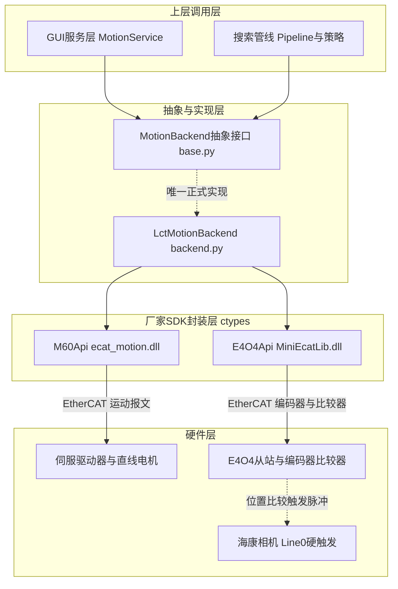
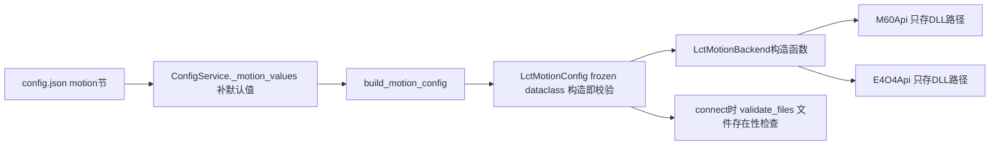
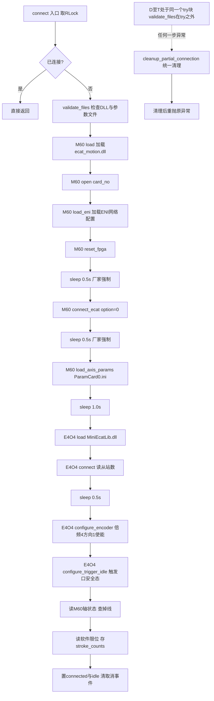
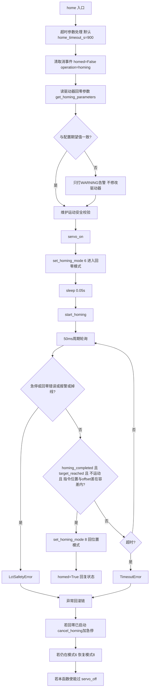
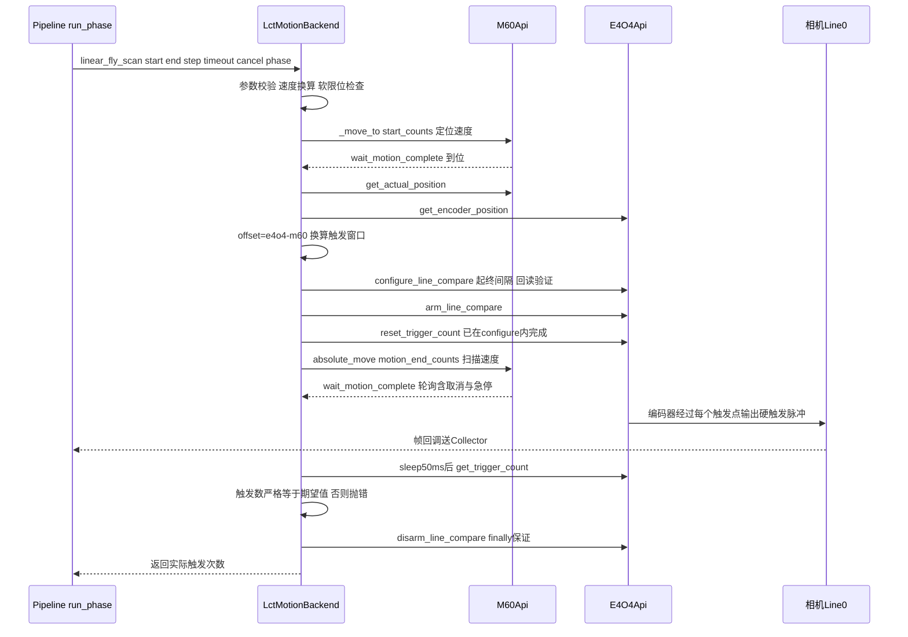
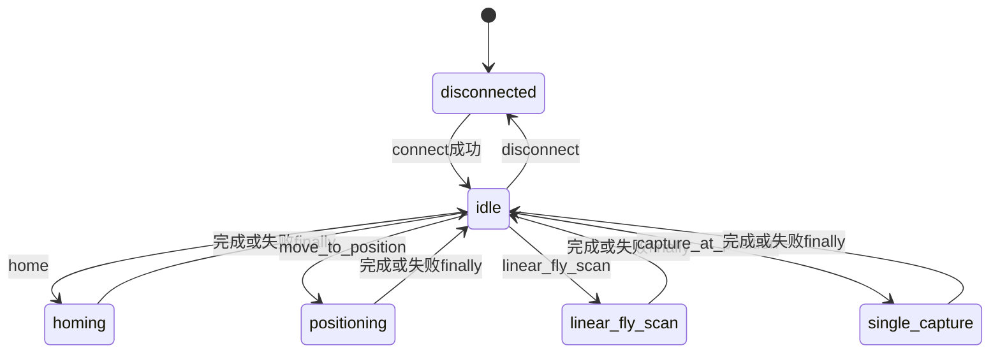

# 05-LCT运控接口调用手册

本章面向需要修改运控层的开发者，完整拆解自动对焦系统的运动控制栈：凌臣 M60 运动控制卡与 E4O4 飞拍触发模块组成的双卡架构、`MotionBackend` 抽象接口、`LctMotionConfig` 配置体系、`LctMotionBackend` 全部业务方法，以及 `linear_fly_scan` 飞拍的逐行解剖。

**本章读完你会知道：**

- 为什么运动和相机触发分属 M60、E4O4 两块卡，两套总线坐标系如何对齐；
- 从 `app/motion/base.py` 的抽象动作到 `ecat_motion.dll`、`MiniEcatLib.dll` 的 ctypes 调用，每一层的方法清单、前置条件与错误类型；
- `connect()`、`home()`、`linear_fly_scan()`、`capture_at_position()` 四条核心流程的完整时序与失败清理路径；
- "含终点不含起点"的飞拍约定如何贯穿触发窗口配置、帧位置还原与 NCC 模板峰值换算；
- 运控层的串行锁、操作状态机与安全校验机制各挡在哪一步。

---

## 5.1 双卡架构：M60 运动 + E4O4 触发

### 5.1.1 两块卡各干什么

| 维度 | M60（PCIe-M60） | E4O4（MINI-BUS） |
| --- | --- | --- |
| 角色 | EtherCAT 运动主站 | 编码器位置比较触发模块 |
| 厂家动态库 | `ecat_motion.dll` | `MiniEcatLib.dll` |
| Python 封装 | `app/motion/lct/m60_api.py:132` M60Api | `app/motion/lct/e4o4_api.py:91` E4O4Api |
| 职责 | 伺服使能/去使能、绝对运动、回零、状态与位置读取、软限位 | 订阅丝杆编码器、线性/预设定位置比较器、输出相机硬件触发脉冲、触发计数 |
| 坐标系 | 驱动器反馈计数（回零后为工件坐标） | 自身编码器计数（上电零点，与 M60 差一个固定 offset） |
| 误差特征 | 闭环控制位置 | 比较器实时比较，触发位置不受软件轮询延迟影响 |

`LctMotionBackend` 在构造时同时实例化两套 API（app/motion/lct/backend.py:25-26），类注释一句话概括分工（app/motion/lct/backend.py:21）：**"用 M60 完成运动、用 E4O4 按位置输出相机触发"**。

【约定】两套总线、两套坐标系，读的是**同一根丝杆**。M60 计数与 E4O4 计数之间存在固定偏移量 `offset = e4o4 − m60`，任何一次配置比较器之前都必须重新采样该偏移（详见 5.7.3）。E4O4 触发位置全部用 E4O4 自己的坐标系表达，M60 运动目标全部用 M60 坐标系表达，二者只在采样点做一次换算。

### 5.1.2 三层架构图


**图 5-1 运控三层架构：MotionBackend 抽象 → LctMotionBackend → M60/E4O4 双卡**

分层要点：

| 层 | 文件 | 对上层暴露的内容 |
| --- | --- | --- |
| 抽象接口 / 状态快照 | app/motion/base.py:8 MotionBackend、app/motion/state.py:8 MotionState | 业务动作签名与 GUI 可渲染快照，不涉及硬件 |
| 组合实现 | app/motion/lct/backend.py:20 LctMotionBackend | 全部动作的正式实现，内部串行化 |
| 厂家 SDK 封装 | app/motion/lct/m60_api.py:132 M60Api、app/motion/lct/e4o4_api.py:91 E4O4Api | ctypes 直调，状态解码，配置回读验证，错误码翻译 |
| 异常 | app/motion/lct/errors.py | LctError 异常层次 |

`base.py` 的抽象设计意图写在类注释里：上层 Pipeline 只表达"需要完成的运动和拍照动作"，不关心底层是真实 LCT 轴卡还是仿真后端（app/motion/base.py:9-13）。仿真模式由 `FakeMotionBackend` 提供（app/autofocus_sim.py:12；→ 详见《01-系统总览与主链路》第 8 节与《03-搜索管线与策略》）。

### 5.1.3 原生 API 对照来源

厂家 C# Demo 是所有 ctypes 声明的对照基准，位于 `参考资料/PCIe-M60 C Sharp Demo/`：

- `ecat_motion.cs` 的 `DllImport` 声明全部使用 `CallingConvention.Cdecl`，因此 Python 侧用 `ctypes.CDLL` 而非 `WinDLL`（app/motion/lct/m60_api.py:223-227）；
- `mainForm.cs:183-234` 的官方连接序列（LoadEni → ResetFpga → 等 500ms → ConnectECAT → 等 500ms → LoadParamFromFile）被 `backend.py:63-73` 逐句复刻；
- `MiniEcatLib.cs` 声明了 `Mb_E4O4*` 系列函数，`e4o4_api.py:820` 的 `_bind_functions` 与之一一对应。

---

## 5.2 抽象接口 MotionBackend 与状态快照 MotionState

### 5.2.1 八个业务动作 + 生命周期与读数接口

`MotionBackend` 是纯 ABC（app/motion/base.py:8），共 16 个抽象成员，按用途分三组：

**生命周期（4 个）**：`connect()`（app/motion/base.py:20，连接并完成不产生运动的静态初始化）、`disconnect()`（:24）、`is_connected()`（:28）、`backend_name`（:15，lct 后端返回 `"lct"`）。

**业务动作（8 个）**

| 方法 | 位置 | 语义要点 |
| --- | --- | --- |
| `linear_fly_scan(...)` | app/motion/base.py:48 | 等间距飞拍，返回 E4O4 实际触发次数 |
| `capture_at_position(...)` | app/motion/base.py:89 | 单点飞拍，返回触发数，正常为 1 |
| `move_to_position(...)` | app/motion/base.py:113 | 不配置比较器的定位保持 |
| `home(...)` | app/motion/base.py:142 | 可取消回零，返回新状态 |
| `servo_on()` / `servo_off()` | app/motion/base.py:134 / :138 | 手动使能/去使能 |
| `clear_alarm()` | app/motion/base.py:130 | 复位轴报警 |
| `cancel_current_motion()` | app/motion/base.py:146 | 取消当前运动并进入安全停止 |

**任务准备与读数（4 个）**：`prepare_new_task()`（app/motion/base.py:32，只清上一轮取消状态，不得使能/运动/改变回零状态）、`read_stroke_range()`（:40，返回 `(min_um, max_um)`）、`get_state()`（:122，返回 MotionState 快照）、`is_ready_for_autofocus()`（:126）。

### 5.2.2 两条必须遵守的实现约定

抽象层用 docstring 固定了两条跨实现契约，改任何后端都必须保持：

1. **飞拍"含终点不含起点"**（app/motion/base.py:84-87）：第一个拍照位置为 `start_um + step_um`，最后一个拍照位置为 `end_um`。详见 5.8。
2. **单点飞拍运动路径**（app/motion/base.py:108-111）：M60 先移动到目标位置前的准备位置，然后以设定速度经过 `position_um`；E4O4 使用单点预设定比较器触发相机。不允许"停下再拍"。

### 5.2.3 MotionState 快照

`MotionState` 是 frozen dataclass（app/motion/state.py:8），未连接时各字段取默认值。GUI 标签、按钮使能逻辑全部消费这份快照：

| 字段 | 类型 | 含义 |
| --- | --- | --- |
| `connected` / `servo_enabled` / `homed` | bool | 连接、使能、回零三要素 |
| `position_um` | float 或 None | 当前实际位置（counts_to_um 换算） |
| `stroke_min_um` / `stroke_max_um` | int 或 None | 软件行程（读软限位后取整） |
| `alarm` / `emergency_stop` | bool | 驱动器报警 / 板卡急停 |
| `positive_limit` / `negative_limit` | bool | 正/负硬限位 |
| `moving` / `offline` | bool | 运动中 / 轴掉线 |
| `ready_for_autofocus` | bool | 自动对焦就绪总判据（见 5.4） |
| `operation` | str | 后端操作状态机当前值（见 5.13.2） |
| `message` | str | 人读状态消息，由 `_state_message` 生成（app/motion/lct/backend.py:993） |

---

## 5.3 运控配置体系

### 5.3.1 配置链路：GUI → config.json → LctMotionConfig

运控参数不写死在代码里，全部由工控机本地 `app/gui/config.json` 的 `motion` 节提供，因此笔记本上没有厂家 SDK 也能导入、测试和编辑程序（`validate_files` 的设计说明见 app/motion/lct/config.py:233-238）。


**图 5-2 运控配置链路：配置在 connect 阶段才触达硬件**

链路关键代码：

| 步骤 | 位置 | 说明 |
| --- | --- | --- |
| 保存/加载 motion 节 | app/gui/app/services/config_service.py:102 | 序列化时取 `_motion_values()` |
| 默认值表 | app/gui/app/services/config_service.py:13 DEFAULT_MOTION_CONFIG | 本机无 motion 节时的兜底 |
| 合并存储值 | app/gui/app/services/config_service.py:244-251 `_motion_values` | 默认值 dict + 存储值覆盖 |
| 构造配置对象 | app/gui/app/services/config_service.py:232-242 `build_motion_config` | `LctMotionConfig(**values)`，字段名校验由 dataclass 承担 |
| GUI 入口 | app/gui/main_window.py:226-241 `_on_motion_connect` | 构造失败弹窗，成功交给 `motion_service.toggle(config)` |

### 5.3.2 config.json motion 节字段映射表

| config.json 字段 | LctMotionConfig 字段 | 现场值 | 用途 |
| --- | --- | --- | --- |
| `m60_dll_path` | m60_dll_path | `...ecat_motion.dll` | M60 厂家库 |
| `e4o4_dll_path` | e4o4_dll_path | `...MiniEcatLib.dll` | E4O4 厂家库 |
| `eni_path` | eni_path | `eni_expertmode_Card0.xml` | EtherCAT 网络配置 |
| `axis_param_path` | axis_param_path | `ParamCard0.ini` | M60 轴参数（软限位来源） |
| `card_no` / `axis_no` | card_no / axis_no | 0 / 1 | M60 卡号与轴号 |
| `e4o4_slave_no` | e4o4_slave_no | 1 | E4O4 从站号（从 1 起） |
| `encoder_no` / `trigger_out_no` | 同名 | 0 / 0 | E4O4 编码器通道 / 触发输出口 |
| `line_compare_no` / `precompare_no` | 同名 | 0 / 0 | 线性 / 预设定比较器编号 |
| `counts_per_um` | counts_per_um | 100 | 1 µm = 100 count 换算比例 |
| `encoder_multiplier` / `encoder_direction` | 同名 | 4 / 1 | E4O4 编码器倍频与方向 |
| `trigger_pulse_width_10ns` / `trigger_polarity` | 同名 | 2000 / 0 | 触发脉宽 20µs 与极性 |
| `positioning_velocity_um_s` | 同名 | 10000.0 | 非飞拍定位速度 |
| `scan_velocity_um_s` | 同名 | 500.0 | 默认/单点飞拍速度 |
| `calibrate_scan_velocity_um_s` | 同名 | 150.0 | 标定飞拍速度 |
| `coarse_scan_velocity_um_s` | 同名 | 1000.0 | 粗扫飞拍速度 |
| `fine_scan_velocity_um_s` | 同名 | 100.0 | 精扫飞拍速度 |
| `line_scan_overrun_um` | 同名 | 20.0 | 线性飞拍末端越程 |
| `single_capture_approach_um` / `single_capture_exit_um` | 同名 | 50 / 50 | 单点飞拍准备/越过距离 |
| `position_tolerance_um` | 同名 | 1.0 | 到位判定居差 |
| `home_method` 等 9 个回零字段 | 同名 | 见 5.3.5 | 回零参数，仅比对告警 |
| （无对应 json 键） | e4o4_net_card | None | 可选网卡名，传入 `Mb_SelectNetCard` |

### 5.3.3 构造即校验：`__post_init__`

`LctMotionConfig` 是 frozen dataclass（app/motion/lct/config.py:22），`__post_init__`（app/motion/lct/config.py:78-198）在构造瞬间完成全部静态校验，非法值抛 `LctConfigurationError`：

| 校验组 | 规则 |
| --- | --- |
| 通道号 | card_no ≥ 0；axis_no > 0；e4o4_slave_no ≥ 1；encoder_no / trigger_out_no ≥ 0 |
| 换算 | counts_per_um > 0 |
| 编码器 | multiplier ∈ {1,2,4}；direction ∈ {0,1} |
| 触发口 | pulse_width_10ns > 0；polarity ∈ {0,1} |
| 速度 | 五档速度全部 > 0 |
| 飞拍几何 | overrun / approach / exit / tolerance 全部 > 0 |
| 回零 | method ≥ 0；speed1、speed2、acceleration > 0；tolerance ≥ 0；timeout > 0；poll_interval > 0 |

### 5.3.4 counts_per_um 换算与速度派生

所有上层坐标是微米整数，所有 SDK 坐标是 count，换算只此一处：

| API | 位置 | 公式 |
| --- | --- | --- |
| `um_to_counts(x)` | app/motion/lct/config.py:206 | `round(x × counts_per_um)` |
| `counts_to_um(c)` | app/motion/lct/config.py:213 | `c ÷ counts_per_um` |
| `positioning_velocity_counts_s` | app/motion/lct/config.py:221 | 定位速度 × counts_per_um |
| `scan_velocity_counts_s` | app/motion/lct/config.py:225 | 飞拍速度 × counts_per_um |
| `position_tolerance_counts` | app/motion/lct/config.py:229 | `max(1, round(tolerance_um × counts_per_um))` |
| `trigger_pulse_width_us` | app/motion/lct/config.py:200 | 10ns 单位 ÷ 100 |

【约定】counts_per_um = 100 意味着 1 count = 10 nm，速度 1000 µm/s = 100000 count/s。改机械结构或编码器分辨率时只需改这一个比例，但飞拍几何参数（µm）与软限位（count，来自 ParamCard0.ini）会同时受影响，必须重新标定。

**五档速度与用途：**

| 速度字段 | 现场值 µm/s | 使用场合 |
| --- | --- | --- |
| positioning_velocity | 10000 | 一切非飞拍定位：起点定位、准备点、最终保持 |
| scan_velocity | 500 | 无 phase 匹配的默认飞拍 + 单点飞拍越程运动 |
| calibrate_scan_velocity | 150 | `phase_name="calibrate"` 标定全扫 |
| coarse_scan_velocity | 1000 | `phase_name="coarse"` 粗扫 |
| fine_scan_velocity | 100 | `phase_name="fine"` 精扫 |

### 5.3.5 飞拍几何与回零参数

飞拍几何字段（app/motion/lct/config.py:59-62）只影响运动轮廓，不影响触发窗口逻辑本身：`line_scan_overrun_um=20` 保证最后触发点之后仍有恒速段；`single_capture_approach/exit_um=50` 定义单点飞拍的准备点与停止点。

回零参数（app/motion/lct/config.py:64-72，method=33、speed1=10000、speed2=2000 等）**只用于与驱动器当前保存值比对，不一致时仅打告警日志，程序不修改驱动器**（见 5.6 步骤 1）。GUI 回零确认框据此向用户明示"使用驱动器当前保存值"（app/gui/main_window.py:275-282）。

---

## 5.4 LctMotionBackend 方法总表

`LctMotionBackend` 是 `MotionBackend` 的唯一正式实现（app/motion/lct/backend.py:20）。所有公开方法都在 `threading.RLock`（app/motion/lct/backend.py:28）保护下串行执行；`_operation` 状态机（app/motion/lct/backend.py:31）标记当前动作。

| 方法 | 位置 | 前置条件 | 上层调用方 | 主要错误 |
| --- | --- | --- | --- | --- |
| `backend_name` | :34 | — | 日志/诊断 | — |
| `is_connected` | :38 | — | pipeline 前置检查 | — |
| `prepare_new_task` | :41 | 已连接且 operation=idle | pipeline 两处任务开头 | LctStateError（忙碌） |
| `connect` | :54 | 配置文件齐全（validate_files） | MotionService.connect | LctLibraryLoadError / LctSdkCallError / LctStateError |
| `disconnect` | :117 | — | MotionService.disconnect | — |
| `read_stroke_range` | :129 | 已连接 | MotionConnectWorker 连接线程内（backend.connect 之后、交接前） | LctStateError |
| `get_state` | :140 | 已连接（未连接返回默认快照） | MotionService.refresh_state 等 | LctSdkCallError |
| `is_ready_for_autofocus` | :194 | — | GUI 就绪判断 | 同上 |
| `get_homing_parameters` | :197 | 已连接 | home 内部比对 | LctSdkCallError |
| `clear_alarm` | :203 | 已连接、不在运动 | 复位报警按钮 | LctSafetyError |
| `servo_on` | :222 | 已连接、维护安全校验通过 | 伺服使能按钮 | LctSafetyError / LctStateError |
| `servo_off` | :229 | 已连接（运动中先安全停止） | 伺服去使能按钮 | — |
| `move_to_position` | :240 | autofocus-ready、目标在软限位内 | 最终保持定位 | LctSafetyError / TimeoutError |
| `cancel_current_motion` | :279 | —（未连接直接返回） | 停止按钮、pipeline 失败清理 | 内部吞掉并记日志 |
| `home` | :297 | 已连接、维护安全校验通过 | 回原点按钮 | LctSafetyError / TimeoutError |
| `linear_fly_scan` | :429 | autofocus-ready、正方向、整除 | 三相飞拍 | ValueError / LctStateError / LctSafetyError |
| `capture_at_position` | :668 | autofocus-ready、三点在软限位内 | 单点飞拍 | LctStateError / TimeoutError |

**`is_ready_for_autofocus` 判据**（app/motion/lct/backend.py:158-170，全部同时成立）：

```
已回零(self._homed) ∧ 伺服使能 ∧ 无急停 ∧ 无报警 ∧ 无正/负硬限位
∧ 轴未掉线 ∧ 轴静止 ∧ 软限位下限 ≤ 当前实际位置counts ≤ 软限位上限
```

`_require_autofocus_ready`（app/motion/lct/backend.py:818）在此之上叠加"静止安全检查 + 伺服使能检查"，是所有飞拍/定位动作的第一道门禁；未回零直接抛 `LctSafetyError("本次连接尚未完成回零")`。

---

## 5.5 connect() 初始化全流程

`connect()`（app/motion/lct/backend.py:54-115）完成一次**不产生任何运动**的静态初始化，任何一步失败都统一走 `_cleanup_partial_connection` 清理后重抛异常。


**图 5-3 connect 初始化序列（步骤 D 至 T 处于同一个 try 块；validate_files 在 try 之外，此时尚未加载任何硬件资源，失败无需清理）**

| 步骤 | 代码位置 | 说明 |
| --- | --- | --- |
| 文件检查 / M60 装载 | backend.py:60-64 | 四类必查文件；load + open，DLL 依赖目录注入见 5.10.1 |
| ENI 与 FPGA | backend.py:65-67 | reset_fpga 后**必须**等 ≥500ms（M60Api 文档注释 app/motion/lct/m60_api.py:298-304） |
| 总线与轴参数 | backend.py:68-73 | connect_ecat 后等 500ms，load_axis_params 后等 1.0s，参数来自 ParamCard0.ini |
| E4O4 装载 | backend.py:75-80 | connect 返回从站数，为 0 视为失败（e4o4_api.py:174-179） |
| 编码器配置 | backend.py:81-87 | 只设倍频/方向/使能，**不设当前位置**，不动零点（e4o4_api.py:297-308） |
| 触发口安全态 | backend.py:88-95 | 解除两个比较器绑定 + 脉冲输出模式 + 脉宽，保证连接后触发口不会乱发脉冲 |
| 掉线检查与软限位 | backend.py:97-104 | 轴掉线抛 LctStateError；软限位 (负,正) 存入 `_stroke_counts` |
| 收尾 | backend.py:105-112 | `_connected=True`、`_homed=False`、`_operation="idle"` |

`_cleanup_partial_connection`（app/motion/lct/backend.py:1014-1028）的清理顺序：E4O4 已连接则先关两个比较器再 close；M60 总线已连接则查运动中先急停、去使能；最后 `M60 close`。`disconnect()`（app/motion/lct/backend.py:117-127）复用同一清理函数，再重置全部内存状态并置取消事件。

---

## 5.6 home() 回零流程

`home()`（app/motion/lct/backend.py:297-427）使用**驱动器当前保存的回零参数**执行一次可取消回零。核心原则：程序不写驱动器参数，只读出来比对；不一致仅告警。


**图 5-4 home 流程：比对只告警、轮询有四类异常出口、回滚按使能链逆序**

| 阶段 | 位置 | 要点 |
| --- | --- | --- |
| 参数比对 | backend.py:323-347 | 六元组 (method, offset, speed1, speed2, acceleration, probe_function) 与配置期望比对，不一致只告警并继续 |
| 进入回零 | backend.py:349-361 | 维护安全校验 → servo_on → `set_homing_mode(axis, 6)` → 等 50ms → `start_homing` |
| 轮询循环 | backend.py:363-409 | 周期 `home_poll_interval_s`=0.05s；每圈检查用户取消、板卡急停、homing_error、alarm、offline |
| 完成判据 | backend.py:383-392 | `homing_completed ∧ target_reached ∧ ¬moving ∧ |command_position − 驱动器offset| ≤ home_position_tolerance_counts(50)` |
| 收尾 | backend.py:393-405 | `set_homing_mode(axis, 8)` 恢复位置模式，`_homed=True` |
| 异常回滚 | backend.py:415-424 | 按 `homing_started → homing_mode_active → servo_engaged` 三个标志逆序回滚（cancel_homing+急停 → 恢复模式8 → servo_off），回滚函数全部 `_safe_*` 吞异常 |
| finally | backend.py:425-427 | 无论成败 `operation` 复位 idle、清除取消事件 |

注意：`_homed` 是**每次连接的会话状态**，connect 时强制置 False（backend.py:106），回零成功才置 True；断电重连后必须重新回零才能启动自动对焦。

---

## 5.7 linear_fly_scan 深度解剖

`linear_fly_scan()`（app/motion/lct/backend.py:429-666）是运控层最复杂的方法：一次调用完成"定位 → 坐标对齐 → 武装比较器 → 恒速扫描 → 严格校验 → 收尾"六段，每段都有 CT 耗时埋点。

### 5.7.1 参数与校验

| 参数 | 约束 | 校验位置 |
| --- | --- | --- |
| `start_um` / `end_um` | 必须 `end > start`（**只允许正方向飞拍**） | backend.py:444-448 |
| `step_um` | > 0，且 `span = end − start` 必须被 step 整除 | backend.py:449-456 |
| `timeout_s` | > 0，作为整段动作的总 deadline | backend.py:457-458 |
| `phase_name` | calibrate / coarse / fine 三选一，其余按默认速度 | backend.py:459-480 |
| `velocity_um_s` | 可选覆盖值，>0，主要用于速度验证实验 | backend.py:481-487 |
| `cancel_event` | 任一时刻置位即抛"用户取消" | 贯穿全程 |

速度换算与目标计算（backend.py:489-502）：

```
velocity_counts_s = velocity_um_s × counts_per_um
start_counts      = um_to_counts(start_um)
logical_end_counts= um_to_counts(end_um)              ← 逻辑终点=最后触发点
motion_end_counts = logical_end_counts + um_to_counts(line_scan_overrun_um)  ← 物理终点
```

三个目标（起点、逻辑终点、物理终点）都要先过 `_validate_target` 软限位检查（backend.py:500-502）。

### 5.7.2 六段流程


**图 5-5 linear_fly_scan 时序：M60 恒速运动与 E4O4 位置比较并行，相机帧独立回流**

### 5.7.3 坐标对齐：`_sample_coordinate_pair`

起点定位完成后、武装比较器之前，静止状态下同时读两套坐标（app/motion/lct/backend.py:899-913）：

```
m60_position  = M60.get_actual_position(axis_no)      ← M60坐标系
e4o4_position = E4O4.get_encoder_position(slave, enc) ← E4O4坐标系
offset = e4o4_position − m60_position                 ← 本根丝杆两坐标系的固定差
```

采样点在起点（M60 坐标 `start_counts`），因此 E4O4 坐标系下同一点是 `start_counts + offset`。触发窗口换算（backend.py:530-532）：

```
trigger_start = start_counts + offset + step_counts    ← 第一个触发点在起点之后一个步距
trigger_end   = logical_end_counts + offset            ← 最后触发点在逻辑终点
```

【约定】offset 每次飞拍重新采样，不缓存。E4O4 编码器计数在上电与倍频配置后确定，两次连接之间不可比；M60 坐标在回零后确定。同一连接内 offset 理论恒定，但采样成本极低（µs 级），现场默认每次重采，日志打印 `LCT坐标采样: m60=%d, e4o4=%d, offset=%d`。

### 5.7.4 触发窗口与越程：数轴图

```
 E4O4坐标系    trigger_start                                trigger_end
                ↓ 第1帧触发                                   ↓ 最后1帧触发
 ──────────┬────────┬────────┬─────···─────┬────────┬─────────────┬────────→ 位置
          start   start+d   start+2d      start+kd  start+nd      +overrun
           ↑M60停在起点                                            ↑motion_end
           │起点不触发！                                            M60实际停止点
 M60坐标系  |←————— 触发窗口 distance = n·d 必须被 d 整除 ——————→|
           |←空一步→|                                              |←越程不触发→|
```
**图 5-6 触发窗口数轴：起点空一个步距，终点必触发，越程段只跑不拍**

- `n = distance / step`（distance = trigger_end − trigger_start），**期望触发数 = n + 1**（含两端，e4o4_api.py:508）；
- 越程 `line_scan_overrun_um = 20 µm`（2000 count）保证最后一个触发点发生后伺服仍有恒速段，比较器不会在减速抖动区补触发；
- M60 的运动目标是 `motion_end_counts` 而不是逻辑终点，`wait_motion_complete` 判到位用 `position_tolerance_counts`（backend.py:587-593）。

### 5.7.5 武装、恒速运动与严格校验

| 段 | 位置 | 要点 |
| --- | --- | --- |
| 配置比较器 | backend.py:557-566 | `configure_line_compare` 绑定编码器、设起/终/间隔，内部先 disarm + 清零触发计数再写入，最后**回读全部参数逐项验证**（见 5.11.2） |
| 武装 | backend.py:571-578 | `arm_line_compare` 打开比较器使能位，此后编码器一进入窗口即发脉冲 |
| 恒速运动 | backend.py:580-597 | `absolute_move(motion_end, velocity_counts_s)` 逐次传速度；`wait_motion_complete` 轮询周期 0.02s，每圈检查取消事件与急停 |
| 校验 | backend.py:599-624 | 等 50ms 让末脉冲落账 → 读 E4O4 编码器与触发计数 → **`actual_count != expected_trigger_count` 立即抛 LctStateError**，错误消息带 logical_end、motion_end、trigger_end、m60_final、e4o4_final、越过量六个诊断字段 |
| 收尾 | backend.py:643-666 | finally 中 `_safe_disarm_line`（吞异常）+ 若运动未完成则急停 + operation 复位 idle；随后输出 CT 分段日志 |

CT 分段日志格式（backend.py:652-666）：`LCT CT[phase] | 起点定位 | 坐标采样 | 比较器配置 | 比较器使能 | 扫描运动 | 触发校验 | 比较器清理 | 总计`，单位 ms。CT 分析方法论见 `app/docs/CT时序分析.md`。触发数校验是**防丢帧的第一道闸门**：帧序号契约与丢帧补偿属 06 章主题，→ 详见《06-线程模型与并发契约》。

---

## 5.8 "含终点不含起点"约定与帧位置还原

【约定】E4O4 线性飞拍的触发点序列为 `start+step, start+2·step, …, end`——**含终点、不含起点**。抽象接口（app/motion/base.py:84-87）、策略层注释（app/backend/strategies.py:46-48）、帧位置还原函数（app/backend/camera_utils.py:280-290 `frame_positions`，第 k 帧为 `start + (k+1)·step`）三处一致。

因果链条——为什么必须"+1"：

1. 飞拍起点定位时轴**停**在 start，伺服建立稳定后才开始扫描；若起点也触发，第一帧将在起步加速区拍摄，清晰度评价失真。故触发起点整体后移一个步距（backend.py:531）。
2. 于是第 k 帧（k 从 0 计）的位置 = `start + (k+1)·step`，帧数 = `span / step`（strategies.py:48）。
3. NCC 标定模板用**帧序号**存峰位置（`FocusTemplate.peak_position` 是 index，app/focus_template.py:27）。标定完成时把 index 还原成微米（app/backend/pipeline.py:960-964）：

```python
peak_um = cal_start + (template.peak_position + 1) * cal_step
```

4. 同一 "+1" 还出现在粗扫位置表（app/backend/camera_utils.py:288 `start_um + step_um * (index + 1)`）。**改触发起点约定而不改这两处，NCC 峰位将系统性偏移一个步距**——这是运控层与算法层之间最脆弱的耦合点。NCC 匹配原理与模板字段 → 详见《07-配置与数据契约》。

---

## 5.9 capture_at_position 单点飞拍

`capture_at_position()`（app/motion/lct/backend.py:668-816）用于搜索收敛后的最终成像：从目标前方准备点正向越过目标，用**预设定比较器**只触发一次。

| 阶段 | 位置 | 动作 |
| --- | --- | --- |
| 目标换算 | backend.py:682-693 | `prepare = target − approach(50µm)`、`finish = target + exit(50µm)`；三点（prepare/target/finish）全部过软限位检查 |
| 门禁 | backend.py:698-699 | `_require_autofocus_ready`，operation 置 `single_capture` |
| 准备点定位 | backend.py:702-707 | `_move_to(prepare, positioning_velocity)` |
| 坐标对齐 | backend.py:713 | 采样 `m60_prepare, e4o4_prepare`，换算 `trigger_position = e4o4_prepare + target_counts − m60_prepare`（backend.py:721-723），即"目标点在 E4O4 坐标系的读数" |
| 单点预设定 | backend.py:727-735 | `configure_pre_compare(positions=[trigger_position], direction=0正向)`，回读验证位置数组、点数、两个掩码与极性（方向只写入不回读） |
| 武装与越程 | backend.py:741-762 | `arm_pre_compare` → `absolute_move(finish, scan_velocity_counts_s)` → `wait_motion_complete` |
| 校验 | backend.py:768-781 | 等 50ms 读触发计数，**必须 == 1**，否则 `LctStateError("E4O4单点飞拍触发数不符")` |
| 收尾 | backend.py:794-816 | finally 中 `_safe_disarm_pre` + CT 分段日志（`LCT CT[single]`） |

单点飞拍结束后轴停在 `finish`（越过目标 50 µm 处），所以 pipeline 随后调用 `move_to_position` 无比较器地回到最终清晰位置保持伺服（app/backend/pipeline.py:626-637）。`move_to_position`（backend.py:240-277）复用 `_move_to`：目标已在容差内则不发运动（backend.py:861-863），异常时 `_safe_servo_off`，finally 复位 idle。

---

## 5.10 M60Api 方法表

### 5.10.1 DLL 加载与调用约定

`M60Api`（app/motion/lct/m60_api.py:132）构造时**只保存 DLL 路径**，不加载不打开（类注释 app/motion/lct/m60_api.py:133-143 给出标准调用顺序 load→open→…→close）。`load()`（app/motion/lct/m60_api.py:198）三个关键细节：

| 细节 | 位置 | 说明 |
| --- | --- | --- |
| DLL 搜索目录 | m60_api.py:210-221 | Python 3.8+ 不再搜索 DLL 同目录依赖，须 `os.add_dll_directory` 注入并保存句柄 |
| 调用约定 | m60_api.py:223-227 | C# Demo 声明为 Cdecl，故用 `ctypes.CDLL`（`WinDLL` 的 stdcall 会崩） |
| 路径编码 | m60_api.py:1262-1288 `_encode_sdk_path` | 厂家接口按 ANSI 接收，Windows 用 **mbcs**（系统代码页）编码，SDK 目录必须无特殊字符 |
| 函数绑定 | m60_api.py:1014-1241 `_bind_functions` | 显式声明 25 个函数的 argtypes/restype |

### 5.10.2 方法总表

| 分类 | 方法 | 位置 | SDK 函数 | 说明 |
| --- | --- | --- | --- | --- |
| 装载 | `load` | :198 | — | CDLL 加载 + 绑定 |
| 装载 | `open` | :901 | M_Open | 只开卡，不动总线 |
| 装载 | `close` | :942 | M_Close | 先自动 disconnect_ecat |
| 初始化 | `load_eni` | :250 | M_LoadEni | 总线未连接时才允许 |
| 初始化 | `reset_fpga` | :298 | M_ResetFpga | 成功后**必须等 ≥500ms** |
| 初始化 | `connect_ecat` | :326 | M_ConnectECAT | option 固定 0 |
| 初始化 | `disconnect_ecat` | :371 | M_DisconnectECAT | — |
| 初始化 | `load_axis_params` | :396 | M_LoadParamFromFile | 装载 ParamCard0.ini，软限位生效前提 |
| 资源 | `get_slave_resource` | :433 | M_GetSlaveResource | 从站/轴/IO 数量 |
| 位置 | `get_encoder_position` | :494 | M_GetEncPos | M60 侧编码器计数（float） |
| 位置 | `get_actual_position` | :564 | M_ReadActualPosition | 驱动器反馈实际位置（int，飞拍坐标采样用） |
| 位置 | `get_command_position` | :683 | M_GetCmd | 板卡规划位置（回零判据用） |
| 状态 | `get_axis_status` | :535 | M_GetSts | 位解码见 5.10.3 |
| 状态 | `get_drive_status_word` | :550 | M_EcatStatusWord | CiA402 状态字 |
| 状态 | `get_emergency_stop` | :523 | M_GetEmg | 板卡急停 |
| 状态 | `get_soft_limits` | :579 | M_GetSoftLimit | 返回 (负,正)，要求轴参数已加载 |
| 状态 | `clear_axis_status` | :599 | M_ClrSts | 清报警与可清位 |
| 伺服 | `servo_on` | :698 | M_Servo_On | 先安全检查；发令后 20ms 轮询确认使能位，超时 2s |
| 伺服 | `servo_off` | :734 | M_Servo_Off | — |
| 运动 | `absolute_move` | :746 | M_AbsMove | **单轴绝对运动，速度逐次传参**；前置：轴参数已加载(:755)、无报警/限位/掉线(:765)、伺服使能(:767)、目标在软限位内(:772-778) |
| 运动 | `wait_motion_complete` | :794 | M_GetSts + M_ReadActualPosition | 轮询 0.02s；到位 = `¬moving ∧ |actual−target| ≤ tolerance`(:834-837)；每圈查取消(:821)、急停(:824)、不安全状态(:830)；超时抛 TimeoutError(:850) |
| 运动 | `stop` | :856 | M_StopSingleAxis | `emergency=True` 用急停减速度（`_safe_stop_axis` 固定用 True） |
| 回零 | `get_homing_parameters` | :612 | M_GetHomingPrm | **只读**，六元组 |
| 回零 | `set_homing_mode` | :646 | M_SetHomingMode | 6=回零模式，8=位置模式 |
| 回零 | `start_homing` | :659 | M_HomingStart | — |
| 回零 | `cancel_homing` | :671 | M_HomeCancelSingleAxis | — |
| 其它 | `get_version` | :973 | M_GetVersion | 版本串，utf-8/gbk 双解码 |

### 5.10.3 状态位解码：`M60AxisStatus.from_raw`

`M_GetSts` 返回 int 位域，解码表（app/motion/lct/m60_api.py:101-118）：

| 位 | 字段 | 含义 |
| --- | --- | --- |
| 0x02 | alarm | 驱动器报警 |
| 0x20 / 0x40 | positive_limit / negative_limit | 正/负硬限位 |
| 0x80 | smooth_stop | 平滑停止中 |
| 0x200 | servo_enabled | 伺服使能 |
| 0x400 | moving | 轴运动中 |
| 0x800 | in_position | 到位信号 |
| 0x10000 | homing_error | 回零错误 |
| 0x20000 | homing_completed | 回零完成 |
| 0x40000 | target_reached | 目标到达 |
| 0x100000 | origin | 原点信号 |
| 0x1000000 | offline | 轴掉线 |

`_raise_if_unsafe_for_motion`（app/motion/lct/m60_api.py:873-892）把报警/正负限位/掉线四类位汇总成 `LctSafetyError`，是 absolute_move、servo_on、wait_motion_complete 共用的运动前置检查。

### 5.10.4 错误码表

`_check_result`（app/motion/lct/m60_api.py:1290-1312）：**返回 0 = 成功**，非 0 抛 `LctSdkCallError(device="M60", operation, error_code, detail)`。`M60_ERROR_MESSAGES`（app/motion/lct/m60_api.py:25-50）常用码：

| 码 | 含义 | 码 | 含义 |
| --- | --- | --- | --- |
| 0 | 执行成功 | 13 | 尚未加载 ENI 文件 |
| 1 | 执行错误 | 19 | **伺服未使能** |
| 3 | 接口参数错误 | 21 | ENI 中找不到对应从站 |
| 4 | 设备未打开 | 22 | **看门狗超时** |
| 5 | EtherCAT 从站未连接 | 23 | **急停信号已触发** |
| 6 | 设备掉线 | 30 | EtherCAT 网络拓扑变化 |
| 10/11 | 文件打开/操作失败 | — | 其余见源码全表 |

### 5.10.5 能力边界（如实说明）

`M60Api` **没有**封装以下能力，属有意为之的窄接口：无 JOG 点动、无相对运动封装（只有 `absolute_move`）、无通用 IO 读写——IO 触发相机完全由 E4O4 承担，M60 只管运动。需要点动调试时用厂家 Motion Assistant 工具，不要为此扩展主链路接口。

---

## 5.11 E4O4Api 方法表

`E4O4Api`（app/motion/lct/e4o4_api.py:91）封装 `MiniEcatLib.dll` 的 `Mb_*` 系列函数。加载方式与 M60 相同（add_dll_directory + CDLL，e4o4_api.py:121-147）。

| 分类 | 方法 | 位置 | 说明 |
| --- | --- | --- | --- |
| 总线 | `load` / `connect` / `close` | :121 / :149 / :190 | connect 调 `Mb_InitEcat` 返回从站数，0 从站即失败；可选 `Mb_SelectNetCard` |
| 总线 | `get_connect_status` / `get_slave_name` / `get_version` / `get_slave_resource` | :200 / :212 / :224 / :238 | 诊断类只读 |
| 编码器 | `get_encoder_position` | :251 | `Mb_E4O4Encoder_GetEncoderData`，**坐标采样的 E4O4 侧数据源** |
| 编码器 | `get_encoder_config` / `configure_encoder` | :264 / :297 | 设倍频/方向/使能后回读；不设当前位置、不动零点 |
| 触发口 | `configure_trigger_idle` | :330 | 连接后的安全空闲态：解除绑定 + 输出模式 + 触发模式 + 脉宽 |
| 触发口 | `get_trigger_config` / `get_trigger_count` / `reset_trigger_count` | :385 / :456 / :469 | 计数器读/清，触发数校验的数据源 |
| 线比较 | `configure_line_compare` | :479 | 见下 |
| 线比较 | `arm_line_compare` / `disarm_line_compare` | :599 / :615 | 使能 / 关闭并解绑触发口 |
| 预设定 | `configure_pre_compare` | :646 | 单点(或多点)位置表 + 方向(0正/1负/2双向) |
| 预设定 | `arm_pre_compare` / `disarm_pre_compare` | :773 / :789 | 同上 |

**配置与回读验证（两套比较器一致的防呆设计）：**

- `configure_line_compare`（e4o4_api.py:479-597）：先 disarm + 清触发计数（:510-516）→ 绑定编码器（`Mb_E4O4LineCmp_BingdingEncoder`，注意厂家拼写就是 Bingding）→ 写起/终/间隔 → 绑定触发口掩码 → **回读编码器号、起点、终点、间隔、两个掩码、极性七元组逐项比对**（:544-587），不一致抛 `LctStateError`。区间必须被间隔整除，**期望触发数 = distance/interval + 1**（:502-508），随 `E4O4LineCompareConfig`（:64）返回给调用方做严格校验。
- `configure_pre_compare`（e4o4_api.py:646-771）：重置位置表 → 绑定编码器 → 设方向 → 写位置数组 → 绑定掩码 → 清计数 → 回读验证位置数组与点数（:720-763）。期望触发数 = 位置点数（`E4O4PreCompareConfig.expected_trigger_count`，:86-88）。

【约定】**负数 = 错误**：MiniEcatLib 的返回值约定与 M60 相反，`_check_result`（e4o4_api.py:1066-1076）只在 `result < 0` 时抛 `LctSdkCallError(device="E4O4", ...)`，0 及正数均为正常返回（如 connect 返回从站数）。排查跨卡问题时先看异常里的 device 字段再对错误码表。

---

## 5.12 上层调用点汇总

运控后端只有两类消费者：Pipeline/策略（业务动作）与 MotionService（维护命令）。

**Pipeline 侧（app/backend/pipeline.py 与 strategies.py）：**

| 调用点 | 位置 | 动作 | 时机 |
| --- | --- | --- | --- |
| 搜索前置检查 | pipeline.py:335-340 | `is_connected` + `prepare_new_task` | run_search 真机分支开头 |
| 粗扫飞拍 | strategies.py:53-74（run_phase 封装） | `linear_fly_scan(phase_name="coarse")` | 策略 predict_peak 内 |
| 精扫飞拍 | pipeline.py:507-519 | `linear_fly_scan(phase_name="fine")` | 峰值邻域精扫 |
| 单点飞拍 | pipeline.py:581-585 | `capture_at_position`，返回值必须为 1 | 收敛后最终成像 |
| 最终保持定位 | pipeline.py:633-637 | `move_to_position` | 单点飞拍后回到焦点位置 |
| 搜索失败清理 | pipeline.py:712-716 | `cancel_current_motion` | 异常路径兜底 |
| 标定前置 | pipeline.py:874-879 | `is_connected` + `prepare_new_task` | run_calibrate 真机分支开头 |
| 标定全扫 | pipeline.py:911-924 | `linear_fly_scan(phase_name="calibrate")` | 全扫生成模板 |
| 标定失败清理 | pipeline.py:1005-1008 | `cancel_current_motion` | 异常路径兜底 |

`run_phase`（app/backend/pipeline.py:74）是三个飞拍相位的公共包装：先启动相机 Collector 再调 `linear_fly_scan`（pipeline.py:107-124），再用触发数等帧——流程细节 → 详见《03-搜索管线与策略》。

**GUI 侧（MotionService 命令入口，app/gui/app/services/motion_service.py）：**

| 入口 | 位置 | 转发的后端方法 |
| --- | --- | --- |
| `toggle` / `connect` / `disconnect` | :96 / :102 / :126 | `connect`（后台线程执行）/ `disconnect` |
| `clear_alarm` | :137-139 | `clear_alarm` |
| `toggle_servo` | :141-150 | 按当前状态选 `servo_on` / `servo_off` |
| `home` | :152-161 | `home(cancel_event=操作取消事件)` |
| `stop_motion` | :163-168 | 置取消事件 + `cancel_current_motion`（同步直调，不走命令线程） |
| `refresh_state` | :170-172 | `get_state` |

按钮接线与入口细节 → 详见《02-应用启动与GUI服务层》2.1/2.7；搜索/标定任务结束或异常后 GUI 侧主动 `refresh_state` 刷新轴状态。

另有一组 CT 验证工具直连后端：`app/tools/test_lct_backend.py`、`app/tools/test_direct_fine_ct.py`、`app/tools/test_lct_line_fly.py` 等（工具，非 GUI 主链路），修改运控层后建议先跑工具再上 GUI。

---

## 5.13 错误体系与安全机制

### 5.13.1 异常层次

```
LctError (RuntimeError)                     errors.py:5  所有LCT异常的基类
 ├── LctConfigurationError                  errors.py:9  路径、通道或硬件参数配置错误
 ├── LctLibraryLoadError                    errors.py:13 M60或E4O4动态库加载失败
 ├── LctSdkCallError                        errors.py:17 厂家SDK返回失败码
 │     └── 携带 device / operation / error_code / detail 四个属性
 ├── LctStateError                          errors.py:44 设备状态不满足操作要求（未连接、触发数不符、配置回读不一致）
 └── LctSafetyError                         errors.py:48 运动参数或当前位置不满足安全要求（急停、限位、未回零、目标越界）
```

区分 `LctStateError` 与 `LctSafetyError` 的实际意义：前者表示"时序/契约不对，重试或检查流程"；后者表示"继续动有物理风险，必须人工介入"。GUI 对两类错误的统一处理是弹状态消息并 `refresh_state`，维护按钮按 MotionState 重新使能。

### 5.13.2 串行锁与操作状态机

`LctMotionBackend` 用两件东西保证时序安全：

1. **`threading.RLock`**（backend.py:28）：所有公开方法在锁内执行，同一时刻只有一个线程触达 SDK；RLock 允许锁内互相调用（`get_state` 内调 `read_stroke_range`）。Pipeline 线程与 GUI 命令线程因此天然串行——但代价是**急停也不能立即插队**，`cancel_current_motion` 依赖 `wait_motion_complete` 的 0.02s 轮询间隙（m60_api.py:821）响应取消，最坏等一个轮询周期。
2. **`_operation` 状态机**（backend.py:31）：标记后端当前动作，`prepare_new_task` 检查它必须为 idle 才放行新任务（backend.py:46-50）。


**图 5-7 `_operation` 状态机：所有非 idle 状态在 finally 中复位，异常不悬挂状态**

### 5.13.3 急停、限位与维护运动安全校验

| 校验 | 位置 | 拦截对象 |
| --- | --- | --- |
| `_validate_maintenance_motion_safety` | backend.py:828-851 | 手动使能与回零前：急停、报警、正/负硬限位、掉线、运动中五类问题，汇总成一条 LctSafetyError |
| `_validate_stationary_safety` | backend.py:915-922 | 飞拍/定位前的静止安全检查（急停 + `_raise_if_unsafe_for_motion`） |
| `_require_autofocus_ready` | backend.py:818-826 | 已回零 + 静止安全 + 伺服使能 |
| `_validate_target` | backend.py:924-931 | 目标 counts 必须在软限位区间内 |
| `absolute_move` 内部复查 | m60_api.py:765-778 | SDK 封装层最后一道：状态、使能、软限位 |
| `wait_motion_complete` 每圈复查 | m60_api.py:821-830 | 取消事件、急停、不安全状态，运动中持续生效 |

### 5.13.4 servo_off 时机与 `_safe_*` 家族

去使能是本后端的"默认安全落点"——**任何运动类方法异常退出都会去使能**，用户需重新手动使能：

| 场景 | 位置 | 动作 |
| --- | --- | --- |
| `_move_to` 异常 | backend.py:877-880 | 急停 + servo_off |
| `move_to_position` 异常 | backend.py:272-274 | `_safe_servo_off` |
| `linear_fly_scan` 前段异常 | backend.py:526-529 | `_safe_servo_off` |
| `linear_fly_scan` 后段异常 | backend.py:637-642 | 运动中先急停再 servo_off |
| `capture_at_position` 异常 | backend.py:788-793 | 同上 |
| `cancel_current_motion` | backend.py:279-295 | 置取消事件 → 运动中急停 → servo_off，异常只记日志不上抛 |
| `home` 异常回滚末步 | backend.py:422-423 | 本函数使能过才 servo_off |

`_safe_*` 家族（backend.py:944-991）：`_safe_disarm_line` / `_safe_disarm_pre` / `_safe_stop_axis`(固定 emergency=True) / `_safe_cancel_homing` / `_safe_restore_position_mode`(恢复模式8) / `_safe_servo_off`——全部吞异常打 `logger.exception`，用于清理路径，保证"清理失败不掩盖原始异常"。

---

## 5.14 GUI 侧线程模型概览

运控在 GUI 侧运行在两条专职线程上：`motion-connect`（MotionService.connect，motion_service.py:113-124）与 `motion-command`（`_start_command`，motion_service.py:174-193），命令结果经 Qt 队列信号回 GUI 线程刷新 MotionState。连接完成时的后端所有权交接使用"认领协议"（`take_backend` / `close_unclaimed_backend`，app/gui/app/workers/motion_connect_worker.py:63-76），防止关窗竞态泄漏硬件句柄；关停流程统一走 `MotionService.shutdown`（motion_service.py:328-350）。双线程细节、认领协议与 cancel_event 的全部语义 → 详见《06-线程模型与并发契约》。

---

## 5.15 延伸阅读

- CT 分段耗时分析方法：`app/docs/CT时序分析.md`；
- 厂家原生 API 对照：`参考资料/PCIe-M60 C Sharp Demo/ecat_motion.cs`、`MiniEcatLib.cs`，官方连接序列见 `mainForm.cs:183-234`；
- 相机侧硬触发接收 → 详见《04-相机接口调用手册》；飞拍调用与帧数校验（管线视角）→ 详见《03-搜索管线与策略》；线程与取消契约 → 详见《06-线程模型与并发契约》。
