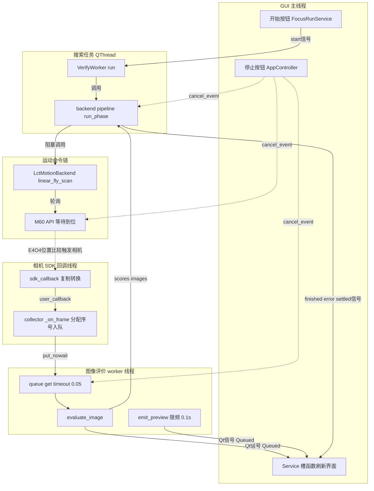
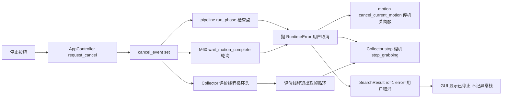

# 06-线程模型与并发契约

本章读完你会知道：系统运行时到底有哪些线程、一次对焦任务中它们如何协作；以及三条必须遵守的并发契约——丢帧即失败、cancel_event 全链路贯通、生命周期归属明确。凡涉及"这个操作能不能在那个线程里做"的问题，答案都在本章。

本项目是典型的"Qt 前端 + 无 GUI 后端 + 两套硬件 SDK"结构：Qt 控件只能在 GUI 主线程操作，而相机帧回调、运动控制等待都是阻塞或高频动作，必须移出主线程。全部并发问题由六类线程加三条契约覆盖，没有线程池、没有 asyncio。

## 6.1 六类线程清单总表

| # | 线程 | 创建点 | 承载工作 | 通信方式 | 退出协议 |
|---|------|--------|----------|----------|----------|
| 1 | GUI 主线程 | app/gui/main.py 启动 QApplication 事件循环 | 全部 Service 槽函数、控件刷新、日志落窗 | Qt 事件循环 + QueuedConnection 信号 | 应用关闭流程见 6.7 |
| 2 | 搜索任务 QThread | app/gui/app/services/focus_task_service.py:64 _create_worker()，长活线程，应用启动即创建 | app/gui/app/workers/verify_worker.py:49 run()：注入 preview_callback 后调 run_search 或 run_calibrate 进入 pipeline | start 信号入队触发；preview、finished、error、settled 信号经 focus_task_service.py:72-90 QueuedConnection 转发回主线程 | 任务结束线程不退；shutdown 先 quit 再 wait 超时（focus_task_service.py:134-166） |
| 3 | 实时预览线程 | app/gui/app/services/live_view_service.py:99-103 threading.Thread，name 为 live-view，每次预览新建 | app/gui/app/workers/live_view_worker.py:23 start()：sim 源轮播本地图片；real 源打开相机自由运行，帧由 SDK 回调送回 | stop_event（threading.Event）下发停止；frame、state、error、settled 信号 QueuedConnection 回主线程 | stop 置 stop_event → join 超时 → is_alive 检查（live_view_service.py:121-154） |
| 4a | 运动连接线程 | app/gui/app/services/motion_service.py:117-124，name 为 motion-connect，每次连接新建 | app/gui/app/workers/motion_connect_worker.py:27 run()：建 LctMotionBackend、connect、读行程与状态 | connected、failed、settled 信号 QueuedConnection；后端经 take_backend 交接（见 6.6） | run 结束线程自然退出；settled 槽清引用（motion_service.py:223-232） |
| 4b | 运动命令线程 | app/gui/app/services/motion_service.py:182-193，name 为 motion-command，一次命令一个线程 | app/gui/app/workers/motion_command_worker.py:22 run()：执行一条维护命令（回零、使能、断开、刷新等） | succeeded、failed、settled 信号 QueuedConnection 回主线程 | 同上；is_busy 拒绝并发命令（motion_service.py:85-90） |
| 5 | 相机 SDK 回调线程 | 海康 SDK 内部创建，进入点 app/camera/camera_adapter.py:1205 sdk_callback() | 逐帧：复制裸缓冲、像素转换，然后调上层 `user_callback`（即 collector 的 `_on_frame`） | 单向函数调用，只做"复制 + 入队" | 随 stop_grabbing 与相机关闭消失，代码不直接管理 |
| 6 | 图像评价 worker 线程 | app/backend/collector.py:99-100 threading.Thread(daemon=True)，每个 PhaseCollector 一条 | app/backend/collector.py:310 _worker() 循环：取帧 → evaluate_image → 写 scores、images → 发过程预览 | 从 queue.Queue(32) 取帧；预览经注入的 Qt 信号 emit | stop 置停止位 → join 超时 → is_alive 检查（collector.py:102-133） |

补充两点。第一，线程 4a 与 4b 合称"运动双线程"，二者由 `is_busy` 互斥，同一时刻至多存在一条连接线程或一条命令线程。第二，除搜索任务 QThread 是长活外，其余后台线程都是"一次任务一条"，用完即弃；搜索任务线程之所以长活，是为了避免每次对焦都付出 QThread 创建销毁成本。另注：sim 模式下没有真实 SDK 回调线程，第 5 类由 `SimCamera.start_grabbing`（app/autofocus_sim.py:207-218）另建的一条 daemon 模拟帧线程顶替，回调槽位与 real 模式相同。

## 6.2 一次对焦任务的线程协作图

下图是一次 real 模式搜索任务的完整协作：实线箭头是帧数据流，虚线箭头是控制流。

图 6-1 对焦任务线程协作图

要点：pipeline（搜索任务线程）是任务的"指挥部"，它阻塞等待运动完成，再阻塞等待 `collector.wait` 返回；相机回调线程和评价线程是纯生产者-消费者流水线，与指挥部之间只通过队列和统计计数交互；GUI 主线程自按下开始按钮后不再参与任何阻塞等待，只被动接收信号。

## 6.3 帧数据流详述

帧从硬件到界面的完整路径如下表，每一行都标注了执行线程。

| 步骤 | 位置 | 执行线程 | 说明 |
|------|------|----------|------|
| 1 SDK 回调进入 | app/camera/camera_adapter.py:1205 sdk_callback() | SDK 回调线程 | SDK 每交付一帧调用一次 |
| 2 复制裸缓冲 | app/camera/camera_adapter.py:1226 string_at() | SDK 回调线程 | 必须 `string_at` 拷成 Python bytes；回调返回后 pData 指向的 SDK 缓冲可能立即被复用 |
| 3 像素转换 | app/camera/camera_adapter.py:1231 np.frombuffer() 及随后 reshape、cvtColor | SDK 回调线程 | Mono8 或 BGR8 转成统一 BGR 数组，细节见《04-相机接口调用手册》 |
| 4 双层异常兜底 | app/camera/camera_adapter.py:1273 与 app/camera/camera_adapter.py:1293 | SDK 回调线程 | 转换失败与上层回调失败分别 try 住，绝不让 Python 异常穿透 ctypes 回调进入 C 边界 |
| 5 上层回调 | app/camera/camera_adapter.py:1294 user_callback(image) | SDK 回调线程 | 先把 `self._user_callback` 读入局部变量再调用，避免与回调更换操作竞态 |
| 6 分配帧序号 | app/backend/collector.py:236-238 | SDK 回调线程 | SDK 可能从不同线程调用回调（collector.py:233-235 注释），故必须在锁内分配连续 seq 并累加 received；帧序号契约详见《07-配置与数据契约》 |
| 7 非阻塞入队 | app/backend/collector.py:243 put_nowait() | SDK 回调线程 | 队列容量 32（collector.py:38 max_queue）；满则走 queue.Full 分支只累加 dropped（collector.py:245-251） |
| 8 取帧评价 | app/backend/collector.py:316 get(timeout=0.05) → app/backend/collector.py:320 evaluate_image() | 评价 worker 线程 | 短超时取帧保证能及时检查停止位与取消位 |
| 9 写结果 | app/backend/collector.py:324-328 | 评价 worker 线程 | 锁内写 `scores[seq]`、可选存 `images[seq]`、累加 processed |
| 10 过程预览 | app/backend/collector.py:259-308 _emit_preview()，默认限频 0.1s | 评价 worker 线程 | 只 emit Qt 信号，不碰任何控件 |
| 11 落盘 | app/backend/collector.py:338-342 save_jpg() | 评价 worker 线程 | 仅 save_all 开启时 |

**为什么回调里只入队、不做评价？** 相机回调线程属于 SDK：在它里面做毫秒级以上的活（清晰度评价、存图、GUI 操作）会直接拖慢 SDK 交付下一帧，最坏情况是 SDK 内部缓冲堆积然后丢帧。所以回调的全部职责被压缩为"复制 → 入队"两步，总耗时微秒级；评价和落盘全部甩给评价 worker 线程。这正是丢帧契约（6.4）能成立的前提：回调不阻塞，队列满才意味着评价侧真正过载。

## 6.4 【契约】丢帧即失败

**契约内容：飞拍阶段只要评价队列丢弃过哪怕一帧，本次任务即判定失败，不重拍、不补拍。**

链路上三个位置协同实现：

1. **队列满即丢**：app/backend/collector.py:243 put_nowait() 抛 queue.Full 时，collector.py:245-251 只在锁内累加 `_dropped`，连日志都不打（高帧率下打日志本身就会阻塞回调）。
2. **wait 提前返回**：app/backend/collector.py:203 检查到 `_dropped > 0` 时，`wait()` 立即返回 False，不再等满 wait_timeout。理由写在源码注释里：丢过帧就不可能得到一组完整、连续的扫描结果，继续等没有意义。
3. **pipeline 报明确错误**：app/backend/pipeline.py:150-158 抛出"图像处理队列溢出"，错误信息含期望触发数与 stats 四元组——received（收到）、enqueued（入队）、dropped（丢弃）、processed（处理），四者来自同一次锁内快照（app/backend/collector.py:145-154 stats），保证数字自洽。等待超时路径（pipeline.py:160-167）同样附上四元组。

**为什么不重拍？** 三个原因，按权重排列：

- **位置不可回退**：飞拍时 Z 轴按设定速度单向扫过区间，触发点由 E4O4 位置比较器硬件决定（见《05-LCT运控接口调用手册》）。发现丢帧时轴已经越过扫描区间，重拍意味着再次整段运动，成本等同重跑任务。
- **曲线已经不连续**：丢帧后 scores 序号出现空洞，位置-分数曲线缺失采样点，NCC 匹配与峰值预测的输入不再可信——算法原理 → 详见 `app/docs/NCC模板匹配对焦搜索v1实现方案.md`。
- **丢帧意味着系统性过载**：队列 32 帧深度仍溢出，说明评价耗时与帧率不匹配（降采样未生效、ROI 过大、磁盘写满等），不解决根因的重拍必然再丢。

因此丢帧是"配置或环境错误"的信号：正确的响应是检查粗扫降采样参数、评价 ROI 与磁盘写入速度，然后重新发起任务。

## 6.5 【契约】cancel_event 全链路

**契约内容：用户取消是正常控制流，不是错误。取消必须从 GUI 停止按钮一路贯通到相机停采，任何长等待点都必须能在秒级内响应取消。**

cancel 链路逐环如下：

| 环节 | 位置 | 动作 |
|------|------|------|
| 1 事件创建 | app/gui/app/services/controller.py:48 new_cancel_event()，由 app/gui/app/services/focus_run_service.py:107 注入 `cfg.cancel_event` | 每次任务一个全新 threading.Event，避免上一轮残留 |
| 2 用户触发 | app/gui/app/services/controller.py:54 request_cancel() | 置位事件并禁用停止按钮防重复点击；窗口关闭走 controller.py:64 cancel() 静默置位 |
| 3 pipeline 检查点 | app/backend/pipeline.py:129-130（飞拍返回后）、:144-145（wait 失败后） | 置位即抛 `RuntimeError("用户取消")` |
| 3b pipeline 检查点（返回式） | app/backend/pipeline.py:438-450（ROI 检测后） | 不抛异常，直接 `return SearchResult(rc=1, action="search", error="用户取消")`，不经过图 6-2 的 EX→RESULT 异常路径 |
| 4 运动层轮询点 | app/motion/lct/m60_api.py:821 wait_motion_complete() 每 0.02s 检查；app/motion/lct/backend.py:889 _raise_if_cancelled() 统一抛出；app/motion/lct/backend.py:364 回零轮询 | 长等待全部可打断 |
| 5 评价线程 | app/backend/collector.py:312-314 | 循环头检查 cancel_event，置位即跳出取帧循环 |
| 6 安全清理 | app/backend/pipeline.py:712-716 调 `motion.cancel_current_motion`（backend.py:279：停轴、关伺服）；collector.py:106 停相机取流 | 兜底停止硬件 |
| 7 结果归位 | app/backend/pipeline.py:695 用 `"取消" in error_message` 识别 | 只记 INFO 不记异常栈，界面按"已停止"而非"出错"呈现 |

图 6-2 cancel_event 全链路

两个容易忽视的细节：其一，`_raise_if_cancelled`（backend.py:889-894）同时检查外部 cancel_event 与后端自己的 `_operation_cancel_event`，所以 GUI 的 stop_motion 按钮（motion_service.py:163-168）即使不经任务链路也能叫停运动；其二，pipeline 靠错误文案中的"取消"二字区分取消与故障——因此业务代码抛取消异常时**必须**带上"取消"字样，自定义异常文案若写成别的词就会被当成故障记录完整异常栈。

## 6.6 Qt 跨线程约定

【约定】跨线程通信只有一种合法形式：工作对象 emit `pyqtSignal`，接收端以 `Qt.QueuedConnection` 连接，槽函数最终在 GUI 主线程执行。禁止后台线程直接调用控件方法，禁止用 `QMetaObject.invokeMethod` 之外的裸调用穿越线程边界。

全项目共四类系统性使用：

| 使用点 | 信号定义 | 连接处 | 说明 |
|--------|----------|--------|------|
| 实时预览帧 | app/gui/app/workers/live_view_worker.py:10 frame = pyqtSignal(object) | app/gui/app/services/live_view_service.py:82-85 QueuedConnection | SDK 回调线程 → Worker `_on_camera_frame`（live_view_worker.py:183）只 emit 信号，绝不碰界面 |
| 后台任务状态 | verify_worker.py:20-39 的 preview、finished、error、settled | focus_task_service.py:72-90 QueuedConnection 转发 | 转发槽用 `self.sender() is not self._worker` 过滤过期 Worker 信号（focus_task_service.py:177） |
| 运动 Worker 信号 | motion_connect_worker.py:16-18 的 connected、failed、settled；motion_command_worker.py:13-15 的 succeeded、failed、settled | motion_service.py:114-116、:179-181 QueuedConnection | 运动 worker 线程状态回主线程；下文的 Worker → Service 认领协议即建立在 connected 信号上 |
| 日志落窗 | app/gui/app/services/qt_log_handler.py:17 message = pyqtSignal(str) | qt_log_handler.py:79-82 QueuedConnection | 任意线程的 logging 记录都安全送到主线程（qt_log_handler.py:92-104 emit()） |

**Worker → Service 认领协议**（防关闭竞态，以运动连接为例）：连接成功时后端对象还在 Worker 手里，而 GUI 可能已经开始关闭程序——直接把后端塞给 Service 会在关闭路径上泄漏设备。协议分四步：

1. Worker 连接成功后，锁内暂存后端（app/gui/app/workers/motion_connect_worker.py:45-48），随 connected 信号发出元组。
2. Service 在 GUI 线程槽里先做身份校验：若信号的 sender 已不是当前 Worker，或程序已请求关闭，立即调 `close_unclaimed_backend` 释放（app/gui/app/services/motion_service.py:198-203）。
3. 校验通过才 `take_backend(expected=...)` 认领（motion_service.py:204），认领即所有权从 Worker 移交 Service。
4. take_backend（motion_connect_worker.py:63-71）在锁内比对 expected 防止错拿，settled 槽再兜底调一次 `close_unclaimed_backend`（motion_service.py:223-228），确保任何路径下未认领的后端最终都被关闭。

## 6.7 【契约】生命周期归属

**契约内容：每类硬件资源有且只有一个拥有者，拥有者之外的使用者只借不还。**

| 资源 | 拥有者 | 生命周期 | 关键代码 |
|------|--------|----------|----------|
| LctMotionBackend | GUI 的 MotionService | 应用级：GUI 连接创建，直到用户断开或程序关闭 | app/gui/app/services/focus_run_service.py:52-53 注释明示"MotionService 拥有连接的生命周期，后台任务只借用它" |
| 搜索任务 QThread | FocusTaskService | 应用级：启动即建，空闲时才允许 shutdown | focus_task_service.py:134-143：任务运行中拒绝关闭，须先取消并等 settled |
| HikCamera 相机对象 | 单次任务的 pipeline | 任务级：每任务 open、close | app/backend/pipeline.py:344 cam.open()，:742-750 finally 中 cam.close() |
| 相机 SDK 全局句柄 | 应用进程 | 全局唯一：仅在应用关闭最后一布 Finalize | app/gui/app/services/application_shutdown_service.py:124-128，前置四步（停预览、取消任务、关任务线程、关运动）全部完成后才调 `HikCamera.shutdown()`（camera_adapter.py:266） |

"借用"语义最关键的一条：**任务结束不断开运控**。pipeline.py:752 的注释写明运控后端由 GUI MotionService 持有，单次任务后不断开。若任务里顺手 disconnect，GUI 的连接状态、行程缓存、回零标记全部失效，下一次对焦会被"运动控制器未连接"校验拦下。同理，pipeline 每任务开头调 `prepare_new_task`（pipeline.py:340）清的是后端内部的遗留取消标记，不动连接本身。

相机走相反的极端——每任务开关——是因为相机参数（曝光、降采样、ROI）随阶段剧烈变化，重开一次换来全新确定的初始状态；而运动连接是重资源（加载 DLL、EtherCAT 组态、加载轴参数要数秒），必须复用。SDK 全局 Finalize 只能放在所有使用线程退出之后，否则取流中的回调会访问已释放的 SDK 内存。

## 6.8 互斥与串行

**运控后端整锁串行**：app/motion/lct/backend.py:28 定义 `threading.RLock`，connect、home、linear_fly_scan、cancel_current_motion、get_state 等全部公开方法都在 `with self._lock` 内执行（如 backend.py:441、:304）。选 RLock 是因为加锁的公开方法内部会调用同样加锁的 get_state（如 backend.py:304 home → :405 调 :143 的 get_state，:206 clear_alarm → :217）；_move_to（backend.py:853）本身不加锁，依赖外层调用者持锁（linear_fly_scan 于 :441 持锁后在 :511 调它）。代价是查询类调用也会被长动作阻塞，所以 GUI 刷新状态走独立命令线程而非直接在按钮槽里同步调用。

**_operation 状态机**：backend.py:31 维护 `_operation`（disconnected、idle、homing、linear_fly_scan、single_capture 等），`prepare_new_task`（backend.py:41-52）要求必须 idle 才能开始新任务，动作结束在 finally 归位 idle（backend.py:276）。这是锁之外的第二道防线：锁保证物理串行，状态机保证语义串行（不把回零和飞拍交错提交）。

**相机取流参数守卫**：取流期间修改 ROI/采样/触发模式/回调四个入口统一被 `_is_grabbing` 拒绝（完整清单 → 详见《04-相机接口调用手册》4.5）。phase 之间的参数切换因此必须先 `collector.stop()` 再改——pipeline 精扫转单点时的 set_full_frame 正是这个顺序（pipeline.py:561-567）。

**GUI 侧命令串行**：MotionService 用 `is_busy`（motion_service.py:85-90，连接线程或命令线程存活即忙）在提交前拒绝并发命令；对焦任务期间 GUI 按钮已被 AppController 整体锁死，任务线程独占后端。

## 6.9 并发陷阱清单

| # | 陷阱 | 后果 | 现行防护 |
|---|------|------|----------|
| 1 | SDK 回调内做耗时活或直接调 GUI | 拖慢帧交付、跨线程操作控件崩溃 | 回调只复制+入队（camera_adapter.py:1226-1294）；异常双层兜底不穿透 C 边界 |
| 2 | 评价线程内操作 GUI 控件 | 崩溃或随机花屏 | 只 emit Qt 信号（collector.py:329-337 注释明确此约束） |
| 3 | 长活线程悄悄持有已死对象引用 | 内存泄漏、旧信号串扰 | Service 转发槽用 sender 校验（focus_task_service.py:177）；settled 后清引用（live_view_service.py:221-237） |
| 4 | join 超时后当成功 | 假装退出，资源仍在动 | join 后必须显式 is_alive：collector.py:122-131、live_view_service.py:139-147、motion_service.py:331-336 |
| 5 | 线程自己 join 自己 | 死锁 | PhaseCollector.stop 判 current_thread（collector.py:117-121）；该防护存在说明允许在 worker 线程内调 stop |
| 6 | GUI 线程内同步调重活（如停运动） | 界面卡死 | stop_motion 直接调 cancel_current_motion 是安全的：轻量 SDK 调用且被 RLock 互斥（motion_service.py:163-168）；其余命令一律走命令线程 |
| 7 | 预览无限频 | 图像转换与重绘占满 GUI 主线程 | 三处限频：实时预览 0.05s（live_view_service.py:173）、过程预览默认 0.1s（collector.py:43）、结果预览 0.05s（result_presenter.py:59） |
| 8 | 取消文案不带"取消"二字 | 取消被当故障记异常栈 | 统一抛 RuntimeError("用户取消")；pipeline.py:695 靠该词识别 |
| 9 | 任务结束顺手断开运控 | 下次任务被连接校验拦截 | 契约见 6.7；pipeline.py:752 注释固化 |
| 10 | 队列满时阻塞等待或重试 | 反压进 SDK 回调线程，雪崩丢帧 | put_nowait + 只计数（collector.py:243-251），失败交给 6.4 契约 |

新人最常犯的是第 2、7 两条：往 worker 代码里加一行"顺便更新一下界面"，或去掉看似多余的限频。前者立即越线，后者在低配机上先表现为界面卡、再表现为丢帧即失败。修改并发相关代码时，先对照 6.4、6.5、6.7 三条契约自查，再动工。

七步主流程的逐步细节见《03-搜索管线与策略》，本章只约定线程协作方式。
