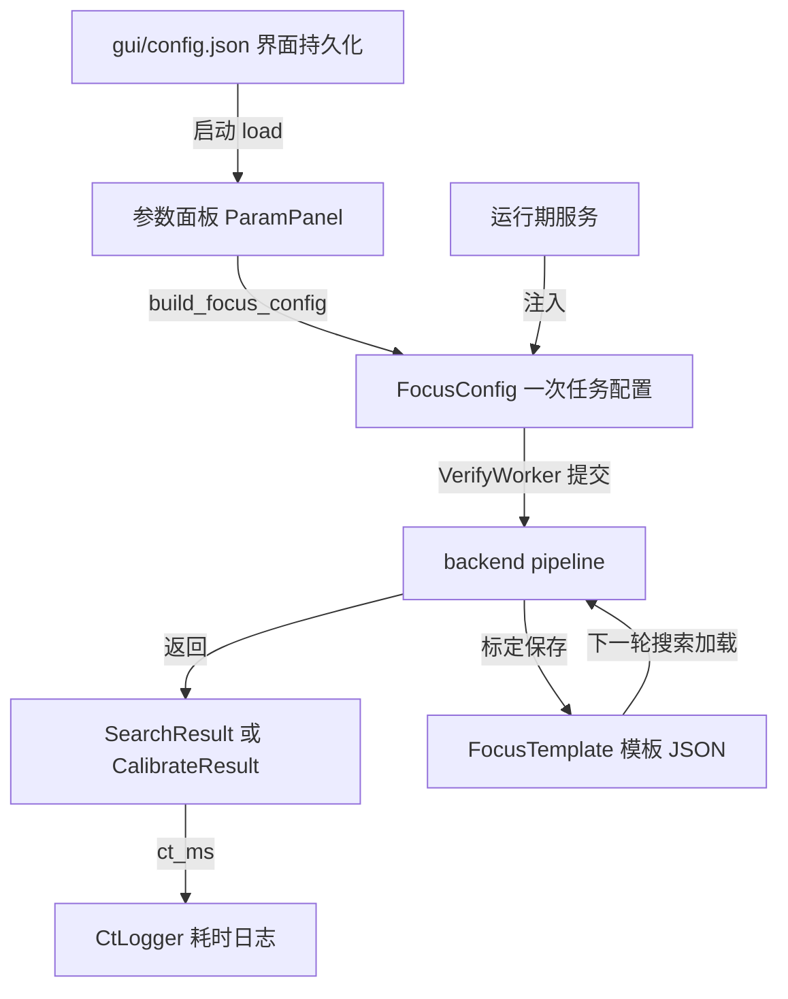

# 07-配置与数据契约

本章是全手册中配置与数据契约的唯一详述处。读完本章你会知道：一次对焦任务从 GUI 传到后端携带哪些参数（FocusConfig 逐字段）；哪些字段是启动后注入而非界面填写；config.json 存了什么、何时读写；后端返回的 SearchResult/CalibrateResult 长什么样；标定模板 FocusTemplate 的 JSON 结构与生成方式；帧序号与 Z 位置的换算约定；常量、模型资产与耗时日志的数据契约。

## 7.1 契约地图：三条数据线

本章覆盖的三条数据线，一条向下（配置）、一条向上（结果）、一条横跨（资产文件）：



【约定】GUI 与后端之间不传散装关键字参数，一律走类型化对象：向下是 `FocusConfig`，向上是 `SearchResult`/`CalibrateResult`。新增参数时先改这两个 dataclass，再改 GUI 的收集/展示代码。

## 7.2 FocusConfig 逐字段表

定义在 app/backend/config.py:20 FocusConfig。界面/CLI 参数与 FocusConfig 基本对应，同一份后端代码既可以被 GUI 驱动，也可以直接命令行运行。但有两点例外（docstring 声称的"一一对应、默认值一致"已与代码脱节，见 app/backend/config.py:22）：其一，dl_model/shot_position_um/dl_max_abs_delta_um 三个 DL 字段仅由 GUI 填写，parser 无对应参数（app/backend/cli.py:12 build_parser）；其二，roi_fallback_size 的 CLI 默认为 1000（app/backend/cli.py:49），与 dataclass 默认 1500（app/backend/config.py:58）不一致，以 FocusConfig 为准。

### 7.2.1 任务与策略组

| 字段 | 类型 | 默认值 | 含义 |
|---|---|---|---|
| action | str | "search" | search 搜索对焦 / calibrate 图像标定 |
| mode | str | "real" | real 真实硬件 / sim 仿真 |
| strategy | str | "ncc" | 搜索策略名，ncc 或 dl |
| template | str | "data/template.json" | NCC 标定模板路径（相对路径按项目根解析） |
| dl_model | str | "assets/models/ai/best_resnet.pt" | DL 回归模型路径（当前 GUI 策略为占位） |
| shot_position_um | Optional[int] | None | DL 策略单帧拍摄的基准 Z 位置 |
| dl_max_abs_delta_um | float | 600.0 | DL 预测位移的合法上限，超出告警 |

### 7.2.2 搜索区间组（NCC）

| 字段 | 类型 | 默认值 | 含义 |
|---|---|---|---|
| camera_index | int | 0 | 海康相机索引 |
| search_start_um | int | 9500 | 粗扫起点（含起点侧的行程基准，帧位置见 7.7） |
| search_span_um | int | 2000 | 搜索跨度 |
| coarse_step_um | int | 100 | 粗扫步距 |
| fine_step_um | int | 5 | 精扫步距 |
| fine_half_steps | int | 5 | 精扫半宽（步数），精扫区间=预测峰±half×fine_step |
| ncc_min_score | float | 0.5 | NCC 匹配质量下限，低于判 mismatch |

### 7.2.3 标定组

| 字段 | 类型 | 默认值 | 含义 |
|---|---|---|---|
| calibrate_step_um | int | 5 | 标定全扫步距 |
| calibrate_start_um | Optional[int] | None | 标定起点，为空时按搜索区间推导 |
| calibrate_span_um | Optional[int] | None | 标定跨度，为空时按搜索区间推导 |
| calibrate_images | Optional[str] | None | 离线标定：直接对已有图片目录评价生成模板，不走硬件 |
| calibrate_downsample | Optional[str] | None | 标定降采样方式，如 "decimation" |
| calibrate_factor | Optional[int] | None | 标定降采样因子，如 4 |

### 7.2.4 相机组

| 字段 | 类型 | 默认值 | 含义 |
|---|---|---|---|
| exposure_us | int | 12000 | 精扫与单点飞拍（定拍）曝光时间，单位 µs |
| coarse_exposure_us | int | 0 | 粗扫曝光，0 表示回落到 exposure_us |
| gain_db | float | 0.0 | 增益 dB |
| coarse_binning | int | 4 | 粗扫 binning（GUI 的 decimation 4x4 映射到此） |
| coarse_downsample | str | "decimation" | 粗扫降采样方式 |
| fine_binning | int | 1 | 精扫 binning |
| detect_model | str | "assets/models/yolo/best.pt" | YOLO 检测模型路径 |
| detect_conf | float | 0.5 | YOLO 置信度阈值 |
| roi_fallback_size | int | 1500 | 检测失败时降级居中 ROI 的边长 |

### 7.2.5 存储与超时组

| 字段 | 类型 | 默认值 | 含义 |
|---|---|---|---|
| save_dir | Optional[str] | None | 图片保存根目录 |
| save_images | Optional[str] | None | 按阶段+序号+位置保存（coarse_0000_14900um.jpg 式命名） |
| save_all | bool | False | 每帧评价后立即保存（img_0000.jpg 式，受帧段起始号影响） |
| flyscan_timeout | float | 600.0 | 一次飞拍的运动+触发整体超时秒数 |
| frame_wait_timeout | float | 60.0 | 单阶段等待全部帧到齐的超时秒数 |
| final_frame_timeout | float | 3.0 | 单点飞拍（定拍）阶段等最终帧的超时秒数 |
| yes | bool | False | 跳过真实运动前的安全确认（GUI 勾选 skip_confirm 映射到此） |

相机方法（set_exposure/set_roi 等）如何消费这些字段 → 详见《04-相机接口调用手册》。

## 7.3 运行期注入的五个字段

下表五个字段默认全为 None，不来自界面，而是在任务启动前后由 GUI 服务层注入。这是 FocusConfig 与 GUI 服务层的边界：**后端只借用这些对象，不负责创建、连接或销毁**（注释见 app/backend/config.py:71-73）。与并发/取消相关的行为契约 → 详见《06-线程模型与并发契约》。

| 字段 | 类型 | 注入方与时机 | 清空时机 |
|---|---|---|---|
| motion_backend | object | app/gui/app/services/focus_run_service.py:53 start()，仅 mode=real 时从 MotionService 取已连接后端 | 任务结束不主动清（对象归 MotionService 持有） |
| cancel_event | object | app/gui/app/services/focus_run_service.py:107 start()，由 controller.new_cancel_event() 新建 | 随任务生命周期结束 |
| detect_model_obj | object | app/gui/app/services/focus_run_service.py:108 start()，取 DetectionModelService 启动时已加载的 YOLO | 随任务引用结束 |
| dl_model_obj | object | **现状：无任何代码赋值**（全仓库仅 app/backend/config.py:70 一处定义） | — |
| preview_callback | PreviewCallback | app/gui/app/workers/verify_worker.py:64 run()，注入 Qt 信号 self.preview.emit | app/gui/app/workers/verify_worker.py:112 finally 中置 None |

要点说明：

- **motion_backend 借用不持有**：Pipeline 拿它执行本轮飞拍，任务结束后连接仍在 MotionService 手里，下一轮任务复用同一连接。连接生命周期 → 详见《05-LCT运控接口调用手册》。
- **detect_model_obj 与 detect_model 是一对**：GUI 注入已加载并预热好的模型对象，pipeline 调 app/backend/detection.py:27 detect_roi() 时优先用注入对象（app/backend/detection.py:40）；CLI 或注入为 None 时才按 detect_model 路径自行加载。模型由 app/gui/app/services/detection_model_service.py:48 DetectionModelService.load() 在 GUI 启动时加载并预热（app/gui/main_window.py:94）。
- **preview_callback 解耦 Qt**：后端只看到四参回调 `(image, phase, sequence, score)`（类型定义 app/backend/config.py:15 PreviewCallback），不导入 PyQt。GUI 侧在后台线程把它置回 None，防止后台持有 Qt 信号引用。回调的发送频率由 FocusConfig.preview_interval_s 节流（app/backend/config.py:78，默认 0.1 秒，即最多每秒发送 10 张预览图）——该字段不是注入对象，是带默认值的普通配置字段，由扫描阶段消费（app/backend/strategies.py:72）。
- **dl_model_obj 如实记录**：注释写着"已加载和预热的AI对焦模型"，但当前无人赋值。GUI 的 DL 策略是占位实现（app/backend/strategies.py:235 DLStrategy，predict_peak 返回 deltaZ=0.0），真实模型 DLDistanceModel 只在独立脚本中演练（app/verify_dl_hybrid.py，遗留，不在主链路）。

## 7.4 gui/config.json 与 ConfigService

### 7.4.1 文件结构

配置文件固定为 app/gui/config.json（路径由 app/gui/main_window.py:343 _config_path() 决定）。它保存的是**界面值**，不是 FocusConfig 的直接序列化。顶层键清单：

| 键 | 示例值 | 说明 |
|---|---|---|
| action | "搜索对焦" | 界面中文值；另有"图像标定" |
| mode | "真实" | 界面中文值：真实 / 仿真 |
| strategy | "ncc" | 内部英文值：ncc / dl |
| skip_confirm | true | 跳过安全确认 |
| exposure_us | 800 | 曝光 µs |
| gain_db | 0.0 | 增益 dB |
| decimation | "4x4" | 界面降采样档位文本 |
| motion | {...} | M60+E4O4 运控配置节，约 30 个键 → 详见《05-LCT运控接口调用手册》 |
| search_start_um / search_span_um | 19600 / 200 | 搜索起点与跨度 |
| fine_step_um / fine_half_steps / coarse_step_um | 5 / 5 / 50 | 步距参数 |
| save_dir | "" | 图片保存目录 |
| template | "data/template_sim.json" | 标定模板路径（相对项目根） |
| calibrate_step_um | 10 | 标定步距 |
| calibrate_downsample | "decimation 4" | 方式+因子合在一个字符串 |
| dl_model | "assets/models/ai/best_resnet.pt" | DL 模型路径 |
| shot_position_um | 12000 | DL 拍摄基准位置 |

注意 action/mode 存的是界面中文值，strategy 存的是内部英文值——这是一种不对称但既成事实的约定，读写两端都要按 app/gui/app/services/config_service.py 的映射表转换，不要直接当成 FocusConfig 字段值使用。

### 7.4.2 ConfigService 的职责与时机

服务类在 app/gui/app/services/config_service.py:63 ConfigService，职责边界如下：

| 方法 | 位置 | 职责 |
|---|---|---|
| collect() | app/gui/app/services/config_service.py:89 | 面板 → 字典（保存前调用） |
| apply() | app/gui/app/services/config_service.py:253 | 字典 → 面板（加载后调用，含中英文值映射） |
| build_focus_config() | app/gui/app/services/config_service.py:120 | 面板 → FocusConfig（每次启动任务时构造新对象） |
| build_motion_config() | app/gui/app/services/config_service.py:232 | 面板+默认值 → LctMotionConfig |
| save() / load() | app/gui/app/services/config_service.py:354 / :374 | JSON 文件读写 |

读写时机：【约定】**启动时 load，退出时 save，运行中不落盘**。load 在 GUI 构造时执行（app/gui/main_window.py:108）；save 在应用关闭流程中执行（app/gui/app/services/application_shutdown_service.py:84）。文件不存在时 load 返回 False 并沿用面板默认值（GUI 启动与关闭链路 → 详见《02-应用启动与GUI服务层》2.1/2.9）。

motion 节的兜底逻辑：_motion_values()（app/gui/app/services/config_service.py:244）以 DEFAULT_MOTION_CONFIG（app/gui/app/services/config_service.py:13，含 DLL/ENI 路径、脉冲、回零等约 30 项）为基础，用 JSON 中存的值覆盖。这样换一台工控机只改 config.json，代码不动。

build_focus_config() 里的几处映射值得注意：界面 decimation 文本 "1x1/2x2/4x4" 映射为 coarse_binning 整数（app/gui/app/services/config_service.py:133）；calibrate_downsample 字符串 "decimation 4" 拆成 calibrate_downsample 与 calibrate_factor 两个字段（app/gui/app/services/config_service.py:220）；template/dl_model 相对路径拼接项目根（app/gui/app/services/config_service.py:157）。

## 7.5 结果契约：SearchResult 与 CalibrateResult

两个类都在 app/backend/result.py，是后端交给 GUI 的唯一返回形态。

### 7.5.1 SearchResult（app/backend/result.py:8）

| 字段 | 类型 | 含义 |
|---|---|---|
| rc | int | 0 成功；非 0 失败 |
| action | str | "search" |
| error | str | 失败原因摘要，成功为空 |
| predicted_peak_um | float | 策略预测峰位置 µm（NCC 相关匹配的输出） |
| ncc_max | float | 最优偏移下的 Pearson 相关值 |
| quality | str | ok / partial / mismatch / boundary / low_contrast / dl_placeholder |
| fine_best | int | 精扫最佳帧序号，无精扫时 -1 |
| final_position_um | float | 最终定位位置 µm（任务结束时丝杆所在处） |
| fine_best_image | Optional[object] | 精扫最佳帧图像（NumPy 数组） |
| final_image | Optional[object] | 单点飞拍（定拍）最终帧图像 |
| coarse_points | list | 粗扫点列 [(位置µm, 分数), ...] |
| fine_points | list | 精扫点列 [(位置µm, 分数), ...] |
| roi / roi_src | tuple / str | 精扫开窗 ROI 及来源（detect / fallback） |
| detect_box | Optional[tuple] | YOLO 原始检测框，降采样坐标系 |
| ct_ms | dict | 各阶段耗时毫秒数，键见 7.10 |

组装点：搜索成功路径在 app/backend/pipeline.py:670（ct_ms=ct 在 :682），仿真分支与异常分支各自组装。

### 7.5.2 CalibrateResult（app/backend/result.py:28）

| 字段 | 类型 | 含义 |
|---|---|---|
| rc / action / error / ct_ms | 同上 | action 固定 "calibrate" |
| peak_position | int | 模板峰的下标序号，失败 -1 |
| peak_width | float | 峰半高宽 FWHM（以采样点数为单位） |
| peak_um | float | 峰的绝对 Z 位置 µm = start + (peak_position+1)×step |

注意 peak_position 是**曲线下标**不是微米；换算绝对位置必须用 7.7 的 +1 公式（组装见 app/backend/pipeline.py:960）。

## 7.6 FocusTemplate：标定曲线模板

定义在 app/focus_template.py:8 FocusTemplate，JSON 序列化到 cfg.template 指定的文件。它是 NCC 策略的核心输入：**搜索时把粗扫实测曲线与模板曲线做相关匹配，找出偏移量**（算法细节见 `app/docs/NCC模板匹配对焦搜索v1实现方案.md`）。

### 7.6.1 字段结构

| 字段 | 类型 | 含义 |
|---|---|---|
| curve | list[float] | 归一化清晰度分数序列，min-max 归一到 0~1（app/focus_template.py:30） |
| peak_position | int | 峰所在下标 |
| peak_width | float | FWHM：左右半高交点线性插值之差，单位为采样点数（app/focus_template.py:36） |
| shape_descriptor | list[float] | 峰附近 ±2×FWHM 的曲线片段（**预留字段，当前无消费方**，app/focus_template.py:62） |
| z_offset | list[int] | shape_descriptor 片段相对峰的整数偏移网格（预留，随 shape_descriptor 一起生成） |
| meta | dict | total_images、roi、score_min、score_max、start_um、step_um |

meta 各键：total_images 总帧数；roi 评价区域（标定为 null）；score_min/score_max 归一化前的原始分数上下限（反归一化要用）；start_um/step_um 标定起点与步距。**start_um/step_um 不在 from_fullscan 里生成**，由标定流程补写：真实全扫在 app/backend/pipeline.py:955，离线图片标定在 app/backend/pipeline.py:822。生成消费关系一句话：NCC 预测用 meta.start_um/step_um 把曲线下标换算成微米（app/backend/ncc.py:44-47）。

### 7.6.2 生成与读写

- from_fullscan(scores, roi, total_images)（app/focus_template.py:20）：输入原始分数序列，依次算峰下标→min-max 归一化→FWHM（向两侧找半高交点并线性插值）→截取 shape_descriptor→组装 meta。
- save(path) / load(path)（app/focus_template.py:97 / :101）：直接 json.dump/load，UTF-8、缩进 2。
- 任务前校验：app/gui/app/services/focus_run_service.py:341 _validate_template 检查文件存在、可解析、点数≥3、峰值下标合法，峰值距任一边界不足 5% 总长（至少 3 点）时给 warning 建议扩大标定范围。
- 标定完成后 GUI 回放曲线：app/gui/app/services/result_presenter.py:249 _plot_template_curve 重新 load 模板文件绘图并标峰。

### 7.6.3 app/data 下的示例模板

| 文件 | 点数 | start_um | step_um | 说明 |
|---|---|---|---|---|
| template_real.json | 40 | 14270 | 10 | 真机标定产物示例 |
| template_sim.json | 40 | 8290 | 10 | 仿真标定产物示例（config.json 默认引用） |
| template.json | 400 | 9500 | 5 | 代码默认路径占位（FocusConfig.template 指向 data/template.json） |
| template_0807.json | 400 | 9500 | 5 | 按日期备份的历史模板 |

目录另有 _test_template.json 与 _test_heavy.json 两个 _test_*.json 测试数据，非标定模板。

模板必须是"含 meta.start_um/step_um 的完整标定产物"才能用于 NCC 搜索，手工裁剪 curve 而不同步 meta 会导致预测峰整体偏移。

## 7.7 【约定】帧序号与位置换算

这是贯穿采集、存储与 NCC 计算的底层约定，改任何一侧都要同步改其余两侧。

**帧序号段起始**（PhaseCollector 的 start_index 参数，用于存图文件名起始编号、避免不同阶段重名，见 app/backend/collector.py:50）：

| 阶段 | start_index | 代码位置 |
|---|---|---|
| calibrate 标定全扫 | 0 | app/backend/pipeline.py:914 |
| coarse 粗扫（NCC 策略内部） | 0 | app/backend/strategies.py:66 |
| fine 精扫 | 100 | app/backend/pipeline.py:511 |
| final 单点飞拍（定拍） | 200 | app/backend/pipeline.py:573 |

save_all 模式的文件名格式为 `img_{start_index+seq:04d}.jpg`（app/backend/collector.py:341）；save_images 模式则是带阶段与位置的 `coarse_0000_14900um.jpg`（app/backend/strategies.py:108 附近）。

**第 k 帧的 Z 位置**（app/backend/camera_utils.py:280 frame_positions）：

```
position(k) = start_um + (k + 1) * step_um，k = 0, 1, 2, ...
帧数 n = (end_um - start_um) // step_um        # 含终点、不含起点
```

即第一帧就位于 start+step 处，扫描**含终点、不含起点**（注释见 app/backend/strategies.py:46-48）。这一约定与 E4O4 线性比较器"从 start 之后才开始按步距触发"的硬件行为对齐，因果链：E4O4 触发从起点之后开始 → 帧位置公式带 +1 → NCC 把模板峰换算成微米时同样用 `(peak_position+1)*cal_step`（app/backend/ncc.py:47）→ CalibrateResult.peak_um 与 GUI 曲线峰标记（app/gui/app/services/result_presenter.py:268）都用同一公式。E4O4 比较触发细节 → 详见《05-LCT运控接口调用手册》。

## 7.8 常量表

全项目唯一的常量模块是 app/backend/constants.py：

| 常量 | 值 | 含义 |
|---|---|---|
| SENSOR_W | 5472 | 20M 相机传感器宽兜底值（app/backend/constants.py:3） |
| SENSOR_H | 3648 | 传感器高兜底值（app/backend/constants.py:4） |

真实模式优先从相机节点读取实际尺寸，读不到才用这组兜底（相机节点读取 → 详见《04-相机接口调用手册》）。新增全局常量应放进该模块而不是散落在使用处。

## 7.9 模型与数据资产

### 7.9.1 assets/models 目录

| 资产 | 大小 | 角色 | 加载方 |
|---|---|---|---|
| app/assets/models/yolo/best.pt | 约 6 MB | YOLO 目标检测，粗扫最佳帧上定位样品 ROI | GUI 启动时由 DetectionModelService 加载+预热（app/gui/app/services/detection_model_service.py:48），经 cfg.detect_model_obj 注入（7.3） |
| app/assets/models/ai/best_resnet.pt | 约 43 MB | ResNet18 单帧离焦回归模型 | DLDistanceModel（app/backend/dl_focus_model.py:93），**当前 GUI 主链路未接线** |
| app/assets/models/ai/results.json | — | 训练配置与验证指标，含 label_scale=600.0 | DLDistanceModel._load_label_scale（app/backend/dl_focus_model.py:147）从模型同目录读取 |

**DL 模型现状如实记录**：DLDistanceModel 完整可用（加载权重、label_scale 反归一、单帧预测 Δz），但 GUI 的 DL 策略是占位（app/backend/strategies.py:235，deltaZ 恒 0），cfg.dl_model_obj 无人赋值（7.3）。真实接线演练只在独立脚本中做过（app/verify_dl_hybrid.py，遗留，不在主链路）。训练与评估工具链：app/prepare_dlfocus_dataset.py 备数据、app/train_dlfocus.py 训练、app/eval_dlfocus.py 评估，一套脚本独立于 GUI 运行。

### 7.9.2 app/data 目录

存放标定模板 JSON（7.6.3）。FocusConfig.template 与 config.json 的 template 键使用相对项目根的路径（如 `data/template_sim.json`），ConfigService 负责拼绝对路径。

## 7.10 耗时数据契约：ct_ms 与 CtLogger

pipeline 在执行过程中向 ct 字典逐阶段写入毫秒耗时（声明 app/backend/pipeline.py:304），策略子耗时经 PeakPrediction.extra 合并（app/backend/pipeline.py:381），最终随 SearchResult.ct_ms / CalibrateResult.ct_ms 返回。GUI 侧由 CtLogger 格式化输出：实例在 app/gui/main_window.py:76 创建，app/gui/app/services/result_presenter.py:240 调用 log(result.ct_ms)。

搜索结果的 ct_ms 由 CtLogger 输出为「五大块」markdown 表格（阶段/耗时/占比/内容，按耗时降序，口径同 docs/对焦CT拆解报告.md §1；五大块与内容列分项定义在 app/gui/app/services/ct_logger.py:19 STAGES，输出逻辑 _log_search_table app/gui/app/services/ct_logger.py:186，触发条件 total_ms+predict_ms 同时存在）。分项归属注意：精扫停流（fine_stop_ms）计时上属单点取证段，内容列挂在"单点取证+回位"行下。标定/模拟等其它 ct_ms 退回逐项一行：键名→中文标签映射 LABELS（app/gui/app/services/ct_logger.py:75），按 CT 总览 / CT 标定分组输出（GROUPS :113，_log_flat :226）。代表性键：camera_setup_ms 相机设置、coarse_ms/ncc_ms 粗扫与 NCC 计算、yolo_ms YOLO 检测、fine_switch_ms 精扫切换、final_ms 定拍总计、cal_flyscan_ms 标定飞拍、template_ms 模板生成、total_ms 总耗时。新增阶段时**先在 pipeline 写键**；若属搜索五大块的分项，把它加进 STAGES 对应行（否则只在耗时列缺席、内容列不显示），其它口径再在 LABELS 补标签（未知键会被完全忽略）。各阶段耗时含义与时序 → 详见《01-系统总览与主链路》与《03-搜索管线与策略》。

## 7.11 契约变更检查清单

改动本章任何一处契约时，按此清单排查受影响方：

| 改动 | 必查位置 |
|---|---|
| FocusConfig 增删字段 | config_service.build_focus_config、verify_ncc_full 的 parser、06 章的 cancel 语义 |
| config.json 增删键 | config_service.collect/apply、DEFAULT_MOTION_CONFIG 兜底、旧文件兼容 |
| SearchResult 增删字段 | result_presenter 展示、verify_worker 透传、CtLogger 标签 |
| FocusTemplate 结构变更 | ncc.py 的 meta 读取、focus_run_service._validate_template、result_presenter 回放、既有模板文件需重新生成 |
| 帧序号段或位置公式 | collector 存图命名、strategies/ncc 的下标换算、05 章的 E4O4 触发配置 |
| ct_ms 新增阶段键 | CtLogger.LABELS 与 GROUPS |
