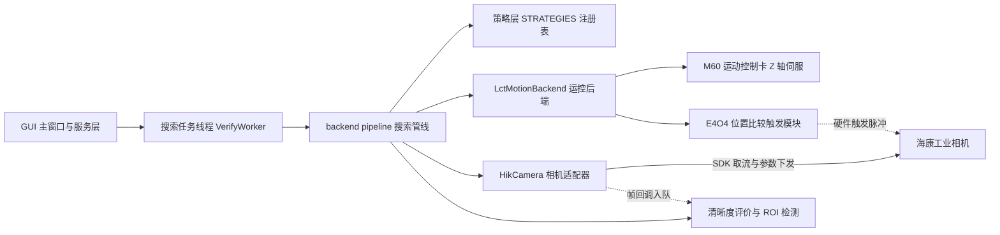

# Autofocus 开发者手册 · 总索引

## 1. 手册定位

本手册面向 Autofocus（工业自动对焦系统：PyQt5 GUI → backend 搜索管线 → LCT 运控（M60 + E4O4）+ 海康相机，飞拍模式）的开发与维护工程师，覆盖**现行主链路**的启动、编排、相机与运控四大专题，共七章，全部基于当前源码撰写并逐条核实行号。相机接口与 LCT 运控接口是本手册的重点，各设独立调用手册（04 / 05 章）。算法原理（NCC 公式、Tenengrad、黄金分割、YOLO 等）不在本手册展开，一律路由到 `app/docs/` 下的既有文档，见第 6 节路由表。遗留与实验代码不入册，清单集中在《01-系统总览与主链路》。

## 2. 阅读路径

| 读者 | 建议路径 |
|---|---|
| 新人入门 | 按序 01 → 02 → 03 → 06 → 07，建立全链路心智模型；再按分工读 04 / 05 |
| 相机开发者 | 01 概览 → 直达《04-相机接口调用手册》；取帧回调线程模型补 06 |
| 运控开发者 | 01 概览 → 直达《05-LCT运控接口调用手册》；config.json 的 motion 节补 07 |
| 排障 | 先看《06-线程模型与并发契约》定位线程与契约违约点，再按现象路由到 03 / 04 / 05 |
| 改参数 / 对接数据 | 《07-配置与数据契约》唯一详述 FocusConfig、结果对象与帧序号换算 |

## 3. 按任务直达

| 我想…… | 去哪 |
|---|---|
| 弄清一次任务端到端发生了什么 | 01 的总时序图 → 03 的七步详解 |
| 新增一个界面参数并传到后端 | 07（FocusConfig 字段与结果对象）→ 02（参数面板与服务收集） |
| 新增 / 替换搜索策略 | 03（STRATEGIES 注册表与 SearchContext 能力接口） |
| 改相机开窗、ROI、曝光、触发模式 | 04 |
| 改飞扫速度、触发窗口、运控参数 | 05（含 config.json 的 motion 节） |
| 排查卡死、帧数不对、关闭报错 | 06 先行，再按现象路由 03 / 04 / 05 |

## 4. 术语速查

| 术语 | 一句话 | 详见 |
|---|---|---|
| 飞拍 | Z 轴不停轴匀速穿过扫描区间，E4O4 按编码器位置输出硬件脉冲触发曝光 | 《05-LCT运控接口调用手册》 |
| 粗扫 / 精扫 | 大步长全跨度扫出响应曲线，NCC 预测峰位后再小步距小范围锁定最佳帧 | 《03-搜索管线与策略》 |
| 单点飞拍（定拍） | 在最佳 Z 位置取证一张最终图，随后回位伺服保持 | 《03-搜索管线与策略》 |
| 模板 FocusTemplate | 离线标定得到的 Z-清晰度焦点响应曲线，NCC 匹配的参照物 | 《07-配置与数据契约》 |
| NCC | 粗扫曲线与模板曲线的互相关平移匹配，直接预测真实峰位（原理见路由表） | 《03-搜索管线与策略》 |
| CT | Cycle Time，一次任务的节拍耗时，由 CtLogger 记录 | 《07-配置与数据契约》 |
| start_index | 阶段帧号起始（0-0-100-200 分段），决定存图文件名编号 | 《07-配置与数据契约》 |

## 5. 章节索引

| 文件 | 标题 | 一句话 | 适合谁读 |
|---|---|---|---|
| 01-系统总览与主链路.md | 系统总览与主链路 | 系统使命、软硬件拓扑、唯一一张端到端总时序图、七步流程概览、遗留代码清单 | 所有人，必读 |
| 02-应用启动与GUI服务层.md | 应用启动与GUI服务层 | 启动链、11 个服务的构建顺序与分工、AppController 状态机、六步安全关闭 | 改 GUI / 服务层的人 |
| 03-搜索管线与策略.md | 搜索管线与策略 | pipeline 三入口、run_search 七步逐步详解、PhaseCollector、策略注册表 | 改搜索流程 / 新增策略的人 |
| 04-相机接口调用手册.md | 相机接口调用手册 | HikCamera 全部方法与 SDK 调用点、句柄生命周期、两条取帧路径与像素转换、开窗编排 | 相机开发 / 调试 |
| 05-LCT运控接口调用手册.md | LCT运控接口调用手册 | M60 + E4O4 双卡架构、LctMotionConfig、LctMotionBackend 全部方法、linear_fly_scan 逐行解剖 | 运控开发 / 调试 |
| 06-线程模型与并发契约.md | 线程模型与并发契约 | 六类线程清单与协作图、三条并发契约：丢帧即失败、cancel_event 贯通、生命周期归属 | 所有人，排障必读 |
| 07-配置与数据契约.md | 配置与数据契约 | FocusConfig 逐字段、config.json、SearchResult / CalibrateResult、FocusTemplate、帧序号换算 | 改参数 / 对接数据的人 |

## 6. 全局约定速览

以下是贯穿全系统的硬性约定，每条在各归属章有完整推导；他章遇到时只一句话带过并指向归属章。

| 约定 | 一句话 | 详见 |
|---|---|---|
| 含终点不含起点 | 飞拍触发窗口与帧数计算均为 `n = (end − start) // step`，起点不触发、终点触发，第 k 帧位置 `start + (k+1)×step` | 《05-LCT运控接口调用手册》（触发窗口）；换算公式见《07-配置与数据契约》 |
| 帧序号分段 0-0-100-200 | 标定与粗扫帧号从 0 起、精扫从 100 起、单点飞拍从 200 起（PhaseCollector 的 start_index），避免存图重名 | 《07-配置与数据契约》 |
| 丢帧即失败 | run_phase 对飞拍结果做严格张数校验，多一帧或少一帧都判整轮失败，绝不带病续算 | 《06-线程模型与并发契约》 |
| cancel_event 贯穿 | 取消事件从 GUI 停止按钮一路传入管线各阶段与运控等待循环，任何长步骤都可被中止 | 《06-线程模型与并发契约》 |
| 运控后端归 GUI | LctMotionBackend 由 GUI 的 MotionService 拥有生命周期（连接创建、断开销毁），后台任务只借用不持有 | 《06-线程模型与并发契约》 |

## 7. 代码引用格式

全手册统一写法：**相对路径 + 冒号 + 行号 + 空格 + 符号名**，例如 `app/backend/pipeline.py:265 run_search()`。项目根为 `C:/Autofocus`，正文引用一律以 `app/` 开头的相对路径并使用正斜杠。【约定】行号是撰写时的源码快照，代码演进后可能漂移：届时按"相对路径 + 符号名"grep 定位，符号名锚点必须保留，禁止只引用裸行号。

mermaid 图两条硬性写法：① 节点标签一律用双引号包裹（`MW["主窗口"]`）——未加引号的标签中出现 `@`、`?`、`=` 等字符会导致 mermaid 11.x 解析失败；② 带文字的边，文字两侧必须留空格（`-. 文字 .->`、`-- 文字 -->`）。

## 8. 算法原理查询路由表

算法原理一律查 `app/docs/` 下的既有文档，本手册不重复展开。

| 文档 | 内容定位 | 备注 |
|---|---|---|
| 自动对焦软件开发文档.md | C++ 移植总体设计 | 总体设计参考 |
| 搜索策略优化.md | 寻优技术总纲 | 策略选型背景 |
| NCC模板匹配对焦搜索v1实现方案.md、NCC搜索流程图.md | NCC 状态机方案 | 现行 ncc 策略的算法依据 |
| 黄金分割算法说明.md | 黄金分割搜索算法原理 | 历史策略原理 |
| 混合自适应对焦搜索v1实现方案.md | 混合自适应方案 | 历史方案，未接入现行主链路 |
| CT时序分析.md | CT 节拍时序分析 | 耗时口径与 CtLogger 配套 |
| 粗扫精扫流程图.md、搜索流程说明.md | 粗扫精扫流程教学 | 流程入门读物 |
| 深度学习单帧对焦验证计划.md | DL 单帧对焦验证计划 | dl 策略路线 |
| 验证方案.md | 系统验证方案 | 测试与验收 |
| 相机适配器开发计划.md | 相机适配器早期设计 | 旧接口名注意，现行接口以 04 章为准 |
| GUI开发课程计划.md | GUI 开发课程 | 教学材料 |
| PLC通信协议.md、自动对焦VA-PLC通讯协议.md、Modbus通信协议.md | 旧 PLC 路线协议 | [遗留]，现行运控走 LCT，见 05 章 |
| 模块结构说明.md | 旧分层结构说明 | [部分过时]，现行结构以 01 / 02 章为准 |

## 9. 主链路一图

图 0-1 主链路一图：GUI → 搜索管线 → 运控 + 相机。完整端到端时序图（含逐步消息与耗时）只在《01-系统总览与主链路》出现一次。
