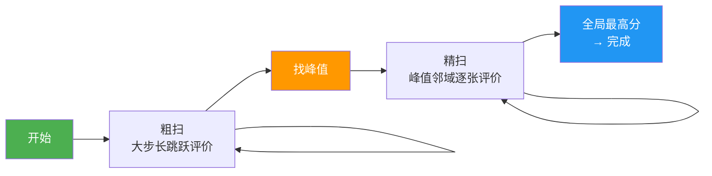
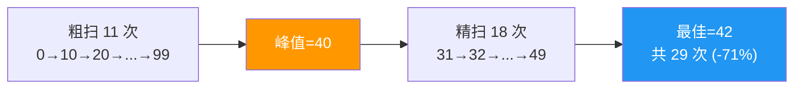

# 粗扫+精扫 流程图

```mermaid
flowchart LR
    A["开始"] --> B["粗扫<br/>大步长跳跃评价"]
    B --> B
    B --> C["找峰值"]
    C --> D["精扫<br/>峰值邻域逐张评价"]
    D --> D
    D --> E["全局最高分<br/>→ 完成"]

    style A fill:#4CAF50,color:#fff
    style C fill:#FF9800,color:#fff
    style E fill:#2196F3,color:#fff
```

## 举例 (N=100, step=10)

```mermaid
flowchart LR
    A["粗扫 11 次<br/>0→10→20→...→99"] --> B["峰值=40"]
    B --> C["精扫 18 次<br/>31→32→...→49"]
    C --> D["最佳=42<br/>共 29 次 (-71%)"]

    style B fill:#FF9800,color:#fff
    style D fill:#2196F3,color:#fff
```