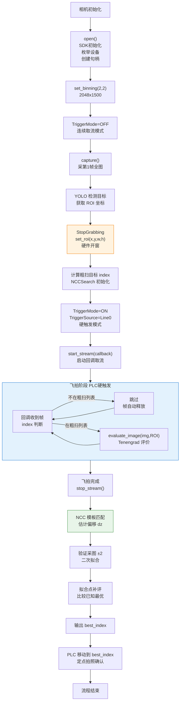

# 自动对焦相机处理流程



## 关键阶段说明

| 阶段 | 取流状态 | 操作 |
|---|---|---|
| capture 单帧 | Start→采1帧→Stop | 全图采图用于检测 |
| set_roi | 已停止 | 改参数需停流 |
| 飞拍 | Start→持续→Stop | 回调取流，PLC硬触发 |

## 帧处理逻辑（回调内部）

```
on_frame(img):
    if frame_index in target_indices:     # 粗扫列表
        score = evaluator.evaluate_image(img, roi)  # ~0.5ms
        scores[frame_index] = score
    # 否则跳过，SDK自动释放帧缓冲
    frame_index += 1
```
